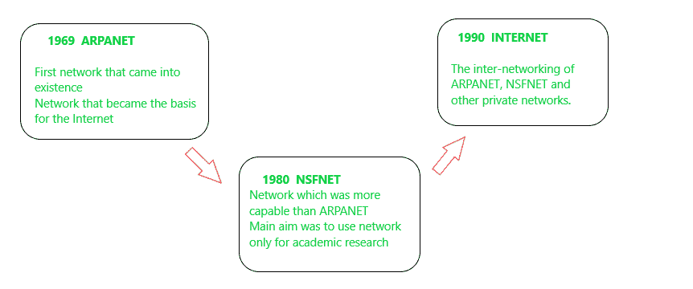

# 网络进化

> 原文:[https://www.geeksforgeeks.org/evolution-of-networks/](https://www.geeksforgeeks.org/evolution-of-networks/)

**网络需求:**一个“网络”还能让相关电脑共享文档和信息以及设备资产，即扫描仪、绘图仪、投影仪和存储设备，从而简化数据收集和管理，并使客户端能够协同工作。

这个系统根本不是在一天之内先进的；相反，花了很长时间才成为一个更加不可思议、高效和可靠的系统。系统管理的进步可以追溯到 1969 年第一个名为 ARPANET 的系统的改进，它促进了网络的改进。在那之后，系统创新每天都在不断升级。该系统经历了以下几个阶段:

**ARPANET(高级研究机构网络):**
ARPANET 是成为互联网基础的网络。这是 1969 年出现的第一个网络，由高级研究计划局(ARPA)和美国国防部(DoD)设计和命名。在那里，许多个人电脑在不同的学院和美国国防部联合起来，共享信息和信息，进行长时间的分离娱乐，并与个人联合起来分享他们的观点。

**NSFNET(国家科学联合会网络):**
80 年代中期，另一个联邦机构 NSFNET(国家科学联合会网络)创建了一个比 ARPANET 更有能力的新网络，并成为商业公共互联网的第一个骨干基础设施。它的主要目的是将网络仅用于学术研究，而不是任何私人商业活动。后来，许多拥有自己专用系统的私营企业加入了阿帕网和国家科学基金会网络，以建立更强大、更广泛的网络——互联网。

```
ARPANET + NSFNET + PRIVATE NETWORKS = INTERNET  
```



**互联网:**
在互联网，这是一个网络的网络，应运而生。互联网是从 ARPANET 发展而来的。互联网是一个全球连接的网络系统，利用 TCP/IP 传输信息。它允许不同类型的计算机交换信息，被称为互联网。互联网是这个星球上的金融通信方式，在这种方式下，可以立即获得以下服务:

*   电子邮件
*   支持 Web 的音频/视频会议服务
*   在线电影和游戏
*   数据传输/文件共享，通常通过文件传输协议
*   即时消息
*   互联网论坛
*   网络社交
*   网络购物
*   金融服务

**interval:**
interval 是一款软件，允许客户端-服务器环境中的多个用户相互通信，发送和接收各种类型的数据，如数据文件、视频、音频和文本数据。星际提供了当今互联网上最特别的交流方式。