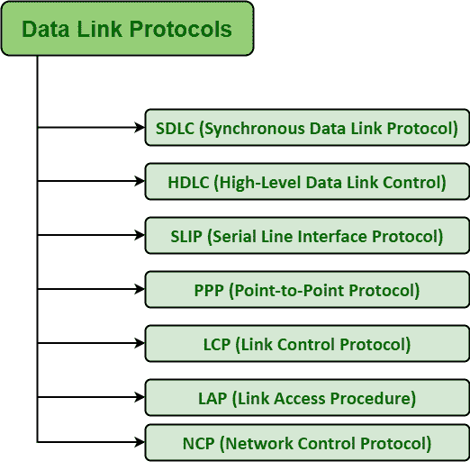

# 数据链路层协议示例

> 原文:[https://www . geesforgeks . org/数据链路层协议示例/](https://www.geeksforgeeks.org/examples-of-data-link-layer-protocols/)

[数据链路层](https://www.geeksforgeeks.org/design-issues-in-data-link-layer/)协议通常负责简单地确保和确认接收到的位和字节与正在传输的位和字节相同。它基本上是一套规范，用于在[开放系统互连(OSI)模型](https://www.geeksforgeeks.org/osi-full-form/)的物理层之上实现数据链路层。

**一些常见的数据链路协议:**
有各种数据链路协议需要用于[广域网(WAN)](https://www.geeksforgeeks.org/wan-full-form/) 和调制解调器连接。逻辑链路控制(LLC)是[局域网](https://www.geeksforgeeks.org/types-of-area-networks-lan-man-and-wan/)的数据链路协议。下面给出了一些数据链路协议:

1.  **[Synchronous Data Link Protocol (SDLC)](https://www.geeksforgeeks.org/sdlc-types-and-topologies/) –**
    SDLC is basically a communication protocol of computer. It usually supports multipoint links even error recovery or error correction also. It is usually used to carry SNA (Systems Network Architecture) traffic and is present precursor to HDLC. It is also designed and developed by IBM in 1975\. It is also used to connect all of the remote devices to mainframe computers at central locations may be in point-to-point (one-to-one) or point-to-multipoint (one-to-many) connections. It is also used to make sure that the data units should arrive correctly and with right flow from one network point to next network point.
2.  **[High-Level Data Link Protocol (HDLC)](https://www.geeksforgeeks.org/basic-frame-structure-of-hdlc/) –**
    HDLC is basically a protocol that is now assumed to be an umbrella under which many Wide Area protocols sit. It is also adopted as a part of X.25 network. It was originally created and developed by ISO in 1979\. This protocol is generally based on SDLC. It also provides best-effort unreliable service and also reliable service. HDLC is a bit-oriented protocol that is applicable for point-to-point and multipoint communications both.
3.  **[串行线路接口协议(SLIP)](https://www.geeksforgeeks.org/slip-full-form/)–**
    SLIP 一般是一种比较老的协议，只是用来在 IP 包的末尾增加一个成帧字节。它基本上是一种数据链路控制设施，通常是在互联网服务提供商和家庭用户之间通过拨号链路传输 IP 数据包所必需的。它是对 TCP/IP 的封装，专门设计用于通过串行端口和几个路由器连接进行通信。这是一些限制，比如它不提供纠错或检错等机制。
4.  **[Point to Point Protocol (PPP)](https://www.geeksforgeeks.org/ppp-full-form/) –**
    PPP is a protocol that is basically used to provide same functionality as SLIP. It is most robust protocol that is used to transport other types of packets also along with IP Packets. It can also be required for dial-up and leased router-router lines. It basically provides framing method to describe frames. It is a character-oriented protocol that is also used for error detection. It is also used to provides two protocols i.e. NCP and LCP. LCP is used for bringing lines up, negotiation of options, bringing them down whereas NCP is used for negotiating network-layer protocols. It is required for same serial interfaces like that of HDLC.
5.  **Link Control Protocol (LCP) –**
    It was originally developed and created by IEEE 802.2\. It is also used to provide HDLC style services on LAN (Local Area Network). LCP is basically a PPP protocol that is used for establishing, configuring, testing, maintenance, and ending or terminating links for transmission of data frames.
6.  **Link Access Procedure (LAP) –**
    LAP protocols are basically a data link layer protocols that are required for framing and transferring data across point-to-point links. It also includes some reliability service features. There are basically three types of LAP i.e. LAPB (Link Access Procedure Balanced), LAPD (Link Access Procedure D-Channel), and LAPF (Link Access Procedure Frame-Mode Bearer Services). It is actually originated from IBM SDLC, which is being submitted by IBM to the ISP simply for standardization.
7.  **网络控制协议(NCP)–**
    NCP 也是由 ARPANET 实现的较旧协议。它基本上允许用户使用远程位置的计算机和一些设备，并在两台或多台计算机之间传输文件。它通常是构成 PPP 一部分的一组协议。对于 PPP 支持的每一个更高层协议，NCP 总是可用的。20 世纪 80 年代，网络控制协议被传输控制协议取代。