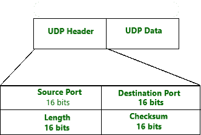

# UDP 报头上的示例

> 原文:[https://www.geeksforgeeks.org/examples-on-udp-header/](https://www.geeksforgeeks.org/examples-on-udp-header/)

[**用户数据报协议**](https://www.geeksforgeeks.org/user-datagram-protocol-udp/) 是传输层协议。UDP 是互联网协议套件的一部分，称为 UDP/IP 套件。与 TCP 不同，它是一种不可靠且无连接的协议。因此，没有必要在数据传输之前建立连接。虽然传输控制协议是大多数互联网服务使用的主要传输层协议；提供有保证的交付、可靠性等等，但是所有这些服务都要花费我们额外的开销和延迟。这里，UDP 进入画面。用于实时服务，如电脑游戏、语音或视频通信、现场会议；我们需要 UDP。由于需要高性能，UDP 允许丢弃数据包，而不是处理延迟的数据包。UDP 中没有错误检查，所以也节省了带宽。
用户数据报协议(UDP)在延迟和带宽方面都更高效。

**UDP 报头:**
UDP 报头是一个 8 字节的固定且简单的报头。前 8 个字节包含所有必要的报头信息，其余部分由数据组成。UDP 端口号字段各有 16 位长，因此端口号的范围定义为 0 到 65535；端口号 0 被保留。端口号有助于区分不同的用户请求或进程。

**示例-1 :**
给定十六进制格式的 UDP 报头的转储 **06 32 00 0D 00 1C E2 17。**找到以下内容:-

1.  源端口号？
2.  目的端口号？
3.  用户数据报的长度？
4.  数据长度？

**解决方案:**

1.  **源端口–**
    源端口是 2 字节长的字段，用于标识源的端口号。源端口号是前四个十六进制数字，即 **06 32** 如果我们将十六进制转换为十进制，我们得到 1586。
2.  **目的端口–**
    这是一个 2 字节长的字段，用于标识目的数据包的端口。目的端口号是第二个四个十六进制数字 **00 0D** 如果我们将十六进制转换为十进制，我们得到 13
3.  **长度–**
    长度是 UDP 的长度，包括报头和数据。这是一个 16 位字段。第三个四个十六进制数字 **00 1C** 如果我们将十六进制转换为十进制，我们得到 16，将整个 UDP 数据包的长度定义为 28
4.  **头–**
    的长度是 8 字节，因为它是固定的。数据长度是整个数据包的长度，即报头长度，即 28–8 = 20 字节。

**示例-2 :**

给定十六进制格式的 UDP 报头的转储 **04 21 00 0B 00 2A E2 17。**找到以下内容:-

1.  源端口号？
2.  目的端口号？
3.  用户数据报的长度？
4.  数据长度？

**解决方案:**

1.  源端口号是前四个十六进制数字，即 **04 21** 如果我们将十六进制转换为十进制，我们得到 1057
2.  目的端口号是第二个四个十六进制数字**00b**如果我们将十六进制转换为十进制，我们得到 11
3.  第三个四个十六进制数字 **00 2A** 如果我们将十六进制转换为十进制，42 将整个 UDP 数据包的长度定义为 28
4.  数据长度是整个数据包的长度，即报头长度，即 28–8 = 20 字节。

**示例-3 :**

给定一个十六进制格式的 UDP 头的 DUMP 03 61 10 1A 10 4C Y2 42。找到以下内容:-

1.  源端口号？
2.  目的端口号？
3.  用户数据报的长度？
4.  数据长度？

**解决方案:**

1.  源端口号是前四个十六进制数字，即 **03 61** 如果我们将十六进制转换为十进制，我们会得到 0865
2.  目的端口号是第二个四个十六进制数字 **10 1A** 如果我们将十六进制转换为十进制，我们得到 4122
3.  第三个四个十六进制数字 **10 4C** 如果我们将十六进制转换为十进制，4172 将整个 UDP 数据包的长度定义为 28
4.  数据长度是整个数据包的长度，即报头长度，即 28–8 = 20 字节。

**注意:**
UDP 报头也包含可变长度的有效载荷数据。使用 UDP 作为隧道协议，隧道端点将另一种协议的数据包封装在 UDP 数据报中，并将其传输到另一个隧道端点，后者对 UDP 数据报进行解封装，并转发有效负载中包含的原始数据包。