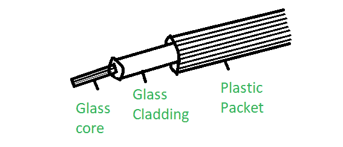
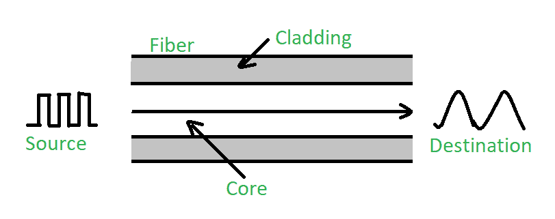
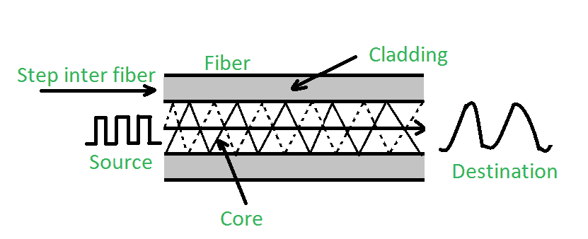
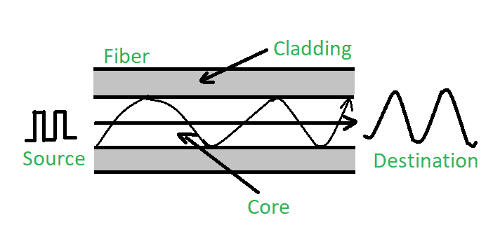

# 光纤和类型

> 原文:[https://www.geeksforgeeks.org/fiber-optics-and-types/](https://www.geeksforgeeks.org/fiber-optics-and-types/)

一根**光纤**是一根圆柱形玻璃纤维，它的尺寸很细，或者是任何透明的电介质。用于光通信的光纤是由透明电介质制成的波导。

**光纤的主要元件:**

1.  **芯:**
    它是由光学透明的电介质制成的非常薄的中心管，将光发射器运送到接收器，芯的直径可能从大约 5um 到 100 um 不等。

*   **包层:**
    包层是围绕纤芯的外部光学材料，其反射指数低于纤芯，在全内反射现象中，包层有助于将光保持在纤芯内。*   **Buffer Coating:**
    It is a plastic coating that protects the fiber made of silicon rubber. The typical diameter of the fiber after the coating is 250-300 um.

    **光纤类型:**
    一般光纤根据:*模数和*折射率分为两类。这些解释如下。

    **1。根据模式数量:**
    将其分为两类:

    *   **(a). Single-mode fiber:**
        In single-mode fiber, only one type of ray of light can propagate through the fiber. This type of fiber has a small core diameter (5um) and high cladding diameter (70um) and the difference between the refractive index of core and cladding is very small. There is no dispersion i.e. no degradation of the signal during traveling through the fiber. The light is passed through it through a laser diode.

        

    *   **(b)。多模光纤:**
        多模光纤允许光线在其中传播的大量模式。纤芯直径一般为(40um)，包层直径为(70um)。相对折射率差也大于单模光纤。多模色散会导致信号降级。由于信号的色散和衰减较大，不适合长距离通信。在多模光纤的基础上有两大类，即**阶跃折射率光纤**和**渐变折射率光纤**。基本上，这些是基于折射率的光纤类型的分类

**2。根据折射率:**
它也分为两种类型:

*   **(a). Step-index optical fiber:**
    The refractive index of core is constant. The refractive index of the cladding is also constant. The rays of light propagate through it in the form of meridional rays which cross the fiber axis during every reflection at the core-cladding boundary.

    

*   **(b). Graded index optical fiber:**
    In this type of fiber, the core has a non-uniform refractive index that gradually decreases from the center towards the core-cladding interface. The cladding has a uniform refractive index. The light rays propagate through it in the form of skew rays or helical rays. it is not cross the fiber axis at any time.

    