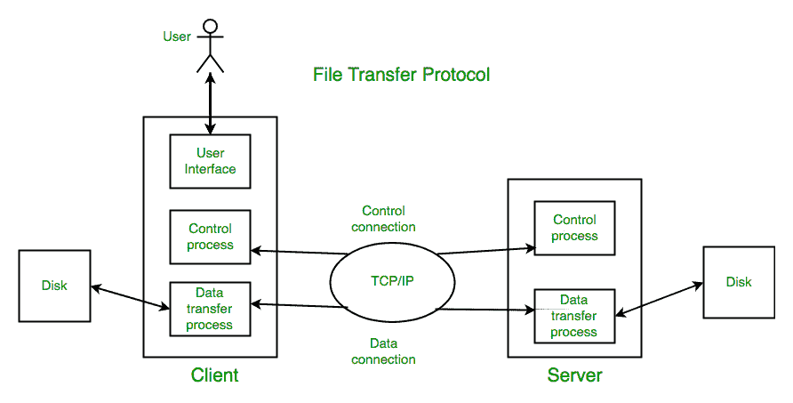

# 应用层的文件传输协议

> 原文:[https://www . geesforgeks . org/file-transfer-protocol-FTP-in-application-layer/](https://www.geeksforgeeks.org/file-transfer-protocol-ftp-in-application-layer/)

前提条件:[应用层协议](https://www.geeksforgeeks.org/protocols-application-layer/)

文件传输协议是在本地和远程文件系统之间移动文件的应用层协议。它运行在 TCP 之上，就像 HTTP 一样。为了传输文件，FTP 并行使用两个 TCP 连接:控制连接和数据连接。

**什么是控制连接？**
用于发送控制信息，如用户标识、密码、更改远程目录的命令、检索和存储文件的命令等。，FTP 利用控制连接。控制连接在端口号 21 上启动。

**什么是数据连接？**
为了发送实际文件，文件传输协议利用了数据连接。在端口号 20 上启动数据连接。
FTP 将控制信息发送到带外，因为它使用单独的控制连接。一些协议在同一个 TCP 连接中发送它们的请求和响应报头行以及数据。由于这个原因，据说他们在带内发送他们的控制信息。HTTP 和 SMTP 就是这样的例子。

**FTP 会话:**
当客户端和服务器之间启动 FTP 会话时，客户端发起与服务器端的控制 TCP 连接。客户端发送控制信息。当服务器收到此消息时，它会启动到客户端的数据连接。一个数据连接只能发送一个文件。但是控制连接在整个用户会话中保持活动状态。正如我们所知，HTTP 是无状态的，即它不必跟踪任何用户状态。但是 FTP 需要在整个会话期间保持一个关于其用户的状态。

**数据结构:** FTP 允许三种类型的数据结构:

1.  **文件结构–**在文件结构中，没有内部结构，文件被认为是连续的数据字节序列。
2.  **记录结构–**在记录结构中，文件由连续记录组成。
3.  **页面结构–**在页面结构中，文件由独立的索引页面组成。

**文件传输协议命令–**一些文件传输协议命令包括:

*用户*–该命令向服务器发送用户标识。
*PASS*–该命令将用户密码发送到服务器。
*CWD*–该命令允许用户使用不同的目录或数据集进行文件存储或检索，而无需更改其登录或记账信息。
*RMD*–该命令导致路径名中指定的目录作为目录被删除。
*MKD*–该命令将路径名中指定的目录创建为目录。
*PWD*–该命令会在回复中返回当前工作目录的名称。
*RETR*–该命令使远程主机启动数据连接，并通过数据连接发送请求的文件。
*【STOR】*–该命令会将文件存储到远程主机的当前目录中。
*列表*–发送显示目录中所有文件列表的请求。
*ABOR*–该命令告诉服务器中止之前的 FTP 服务命令和任何相关的数据传输。
*退出*–该命令终止用户，如果文件传输没有进行，服务器关闭控制连接。

**FTP 回复–**一些 FTP 回复包括:

200 指挥好。
530 未登录。
331 用户名没问题，需要密码。
225 数据连接打开；没有正在进行的传输。
221 服务关闭控制连接。
551 请求的操作中止:页面类型未知。
502 命令未执行。
503 命令顺序错误。
504 没有为该参数执行命令。

**Trivial File Transfer Protocol (TFTP):**

*   它适用于简单的文件传输，例如在引导期间。*   它使用 UDP 作为传输层协议。传输中的错误(数据包丢失、校验和错误)必须由 TFTP 服务器处理。*   它只使用一个通过众所周知的端口 69 的连接。*   TFTP uses a simple lock-step protocol (each data packet needs to be acknowledged). Thus the throughput is limited

    **匿名 FTP :**
    在一些文件可供公众访问的网站上启用了匿名 FTP。用户无需任何用户名或密码即可访问这些文件。相反，默认情况下，用户名设置为匿名，来宾密码设置为匿名。在这里，用户访问非常有限。例如，用户可以复制文件，但不能浏览目录。

    参考:https://en.wikipedia.org/wiki/File_Transfer_Protocol

    本文由**阿契夫·肖汉**供稿。如果你喜欢 GeeksforGeeks 并想投稿，你也可以使用[contribute.geeksforgeeks.org](http://www.contribute.geeksforgeeks.org)写一篇文章或者把你的文章邮寄到 contribute@geeksforgeeks.org。看到你的文章出现在极客博客主页上，帮助其他极客。

    如果你发现任何不正确的地方，或者你想分享更多关于上面讨论的话题的信息，请写评论。