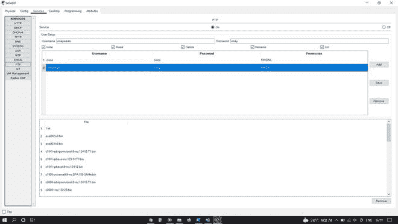
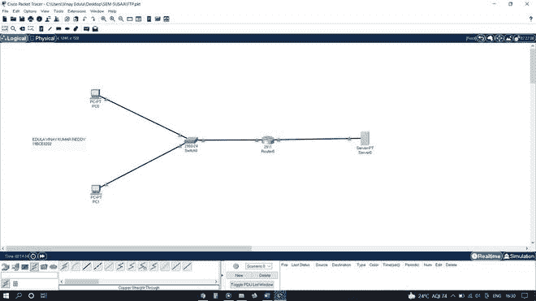
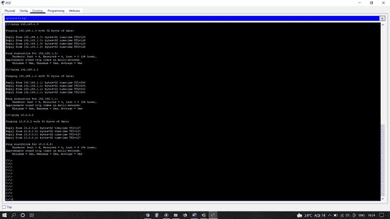
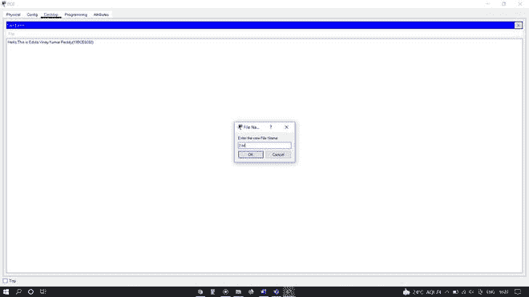
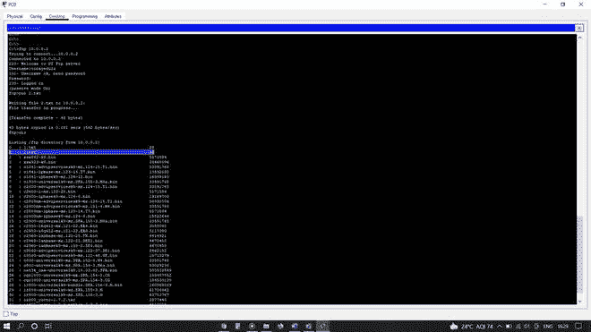

# 使用思科数据包跟踪器配置文件传输协议服务器

> 原文:[https://www . geesforgeks . org/file-transfer-protocol-server-configuration-use-Cisco-packet-tracer/](https://www.geeksforgeeks.org/file-transfer-protocol-server-configuration-using-cisco-packet-tracer/)

在本文中，我们将在 cisco packet tracer 中设计一个文件传输协议服务器配置，并检查从远程 PC 上传和下载文件的连通性。

**目标:**

*   在服务器上配置文件传输协议服务。
*   从远程电脑上传文件到文件传输协议服务器。
*   从远程电脑的文件传输协议服务器下载文件。

### **程序:**

**步骤 1:(配置路由器 0):**

1.  从网络设备中选择一台 2911 路由器，并将其拖放到工作区。
2.  选择路由器 0 并转到配置。
3.  通过将 IP 地址分配为 192.168.1.1 并将子网掩码分配为 255.255.255.0 来配置千兆以太网 0/0，并打开端口状态
4.  通过将 IP 地址分配为 10.0.0.1 并将子网掩码分配为 255.0.0.0 来配置千兆以太网 0/1，并打开端口状态。

**Router0 命令行界面:**

```
Router>enable
Router#
Router#configure terminal
Enter configuration commands, one per line. End with CNTL/Z.
Router(config)#interface GigabitEthernet0/0
Router(config-if)#ip address 192.168.1.1 255.255.255.0
Router(config-if)#exit
Router(config)#interface GigabitEthernet0/1
Router(config-if)#ip address 10.0.0.1 255.0.0.0
Router(config-if)#shutdown
Router(config-if)#
%LINEPROTO-5-UPDOWN: Line protocol on Interface GigabitEthernet0/0, changed state to up
%LINK-5-CHANGED: Interface GigabitEthernet0/1, changed state to up
%LINEPROTO-5-UPDOWN: Line protocol on Interface GigabitEthernet0/1, changed state to up
```

**步骤 2:(配置电脑):**

1.  从终端设备中选择两台个人电脑-个人电脑类型的个人电脑，并拖放到工作区。
2.  选择 PC0，转到配置中的快速以太网 0，并为 PC0 分配 IP 地址和子网掩码，分别为 192.168.1.2、255.255.255.0
3.  选择 PC1，转到配置中的快速以太网 0，并将 PC1 的 IP 地址和子网掩码分配为 192.168.1.3、255.255.255.0
4.  对于两台电脑(PC0、PC1)，转到配置中的全局设置，并将默认网关指定为 192.168.1.1

**步骤 3:(配置服务器 0):**

1.  从终端设备中选择一台服务器，并将其拖放到工作区。
2.  转到配置中的全局设置，并将默认网关指定为 10.0.0.1
3.  转到快速以太网 0，将 IP 地址和子网掩码分配为 10.0.0.2、255.0.0.0
4.  转到服务并打开文件传输协议服务。
5.  转到用户设置并创建用户名和密码。
6.  选择所有权限(写入、读取、删除、重命名、列表)并添加用户。

**用户设置:**



**第 4 步:(配置交换机并建立连接):**

1.  从网络设备中选择一台 2950-24 交换机，并将其拖放到工作区。
2.  使用铜直通电缆将 PC0 的快速以太网 0 端口连接到交换机 0 的快速以太网 0/1 端口。
3.  使用铜质直通电缆将 PC1 的快速以太网 0 端口连接到交换机 0 的快速以太网 0/2 端口。
4.  使用铜直通电缆将交换机 0 的快速以太网 0/3 端口连接到路由器 0 的千兆以太网 0/0 端口。
5.  使用铜直通电缆将路由器 0 的千兆以太网 0/1 端口连接到服务器 0 的快速以太网 0。

**路由器配置表:**

<figure class="table">

| **设备名称** | **IP 地址千兆以太网 0/0** | **子网掩码** | IP 地址千兆以太网 0/1 | **子网掩码** |
| 2911 Router0 |               192.168.1.1 | 255.255.255.0 |                 10.0.0.1 |    255.0.0 0 |

**电脑配置表:**

<figure class="table">

| **设备名称** | **设备类型** | **IP 地址** | **子网掩码** | **默认网关** |
| PC 0 | PC-PT 电脑 | 192.168.1.2 | 255.255.255.0 |   192.168.1.1 |
| PC 1 | PC-PT 电脑 | 192.168.1.3 | 255.255.255.0 |    192.168.1.1 |

### **设计网络拓扑:**



使用命令提示符下的 ping 命令检查从 PC0 到网络中其他主机的连接。



使用命令提示符下的 ping 命令检查从 PC0 到网络中其他主机的连接。


创建一个名为 2.txt 的文件，用于写入(上传)到文件传输协议服务器。



使用 put 2.txt 命令将名为 2.txt 的文件从 PC0 写入(上传)到文件传输协议服务器，并使用 dir 命令验证该文件传输。



使用 get 2.txt 命令从 PC1 读取(下载)存在于文件传输协议服务器中的名为 2.txt 的文件，并使用 dir 命令验证该文件传输。


</figure>

</figure>