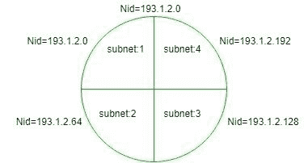

# 查找子网的网络标识(使用子网掩码)

> 原文:[https://www . geesforgeks . org/find-network-id-of-a-subnet-use-subnet-mask/](https://www.geeksforgeeks.org/finding-network-id-of-a-subnet-using-subnet-mask/)

为了找到子网的网络 id (NID)，必须完全熟悉子网掩码。

**子网掩码:**
用于查找哪个 IP 地址属于哪个子网。它是一个 32 位的数字，包含 0 和 1。这里，网络 id 部分和子网 ID 部分由所有 1 表示，主机 ID 部分由所有 0 表示

**例:**
如果一个全网的网络 id = 193 . 1 . 2 . 0(是 C 类 IP)。有关丙类 IP 的更多信息，请参见[有类寻址](https://www.geeksforgeeks.org/ip-addressing-introduction-and-classful-addressing/)。



在上图中，整个网络分为四个部分，这意味着有四个子网，每个子网都有两位用于子网标识部分。

```
Subnet-1: 193.1.2.0 to 193.1.2.63
Subnet-2: 193.1.2.64 to 193.1.2.127
Subnet-3: 193.1.2.128 to 193.1.2.191
Subnet-4: 193.1.2.192 to 193.1.2.255 
```

上面的 IP 是 C 类，所以网络 id 部分有 24 位，主机 id 部分有 8 位，但是你从主机 id 部分选择了 2 位作为子网 id，所以现在子网 id 部分有 2 位，主机 id 部分有 6 位，即，

```
24 bits in network id + 2 bits in subnet id = 26 (1's) and
6 bits in host id = 6 (0's) 
```

因此，

```
Subnet Mask = 11111111.11111111.11111111.11000000
                 = 255.255.255.192
```

如果任何给定的 IP 地址使用子网掩码执行位“与”运算，那么您将获得给定 IP 所属子网的网络 id。
**例-1:**

```
If IP address = 193.1.2.129 (convert it into binary form)
              = 11000001.00000001.00000010.10000001
Subnet mask   = 11111111.11111111.11111111.11000000
Bit Wise AND  = 11000001.00000001.00000010.10000000
Therefore, Nid = 193.1.2.128
```

因此，该 IP 地址属于子网:3，其 Nid = 193.1.2.128
**示例-2:**

```
If IP address = 193.1.2.67 (convert it into binary form)
              = 11000001.00000001.00000010.01000011
Subnet Mask   = 11111111.11111111.11111111.11000000
Bit Wise AND  = 11000001.00000001.00000010.01000000
Therefore, Nid = 193.1.2.64
```

因此，这个 IP 地址属于子网 2，它的 Nid = 193.1.2.64