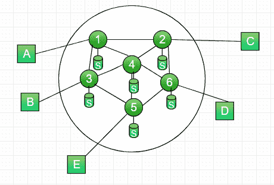
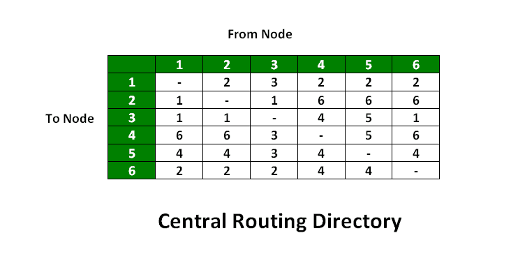
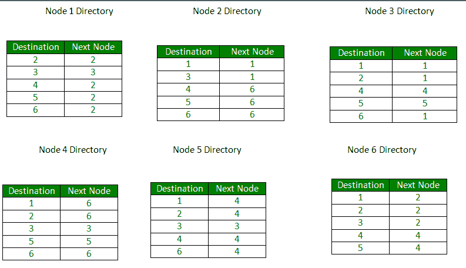

# 固定和泛洪路由算法

> 原文:[https://www . geesforgeks . org/固定泛洪路由算法/](https://www.geeksforgeeks.org/fixed-and-flooding-routing-algorithms/)

在大多数情况下，数据包需要多跳才能到达目的地。路由是分组交换网络设计中最复杂和最关键的方面之一。

**路由算法的理想属性** :-

*   正确性和简单性
*   健壮性:即使在出现故障的情况下，网络也能够通过某种路由传递数据包。
*   稳定性:面对网络中不断变化的条件，算法应该快速收敛到均衡。
*   公平与最优
*   效率:最小的开销。

**路由算法设计参数:**

*   性能标准:跳数、成本(以高带宽路径发送数据包，因为成本较低)、延迟(队列大小)、吞吐量时间(传送的数据包数量/时间)。
*   决定时间:何时决定路由数据包？每个数据包(数据报)或每个会话(虚电路)。
*   决策地点:谁来决定路线？每个节点(分布式)、中心节点(集中式)、起源节点(源)。
*   网络信息来源:无、本地、相邻节点、沿线节点、所有节点。
*   网络信息更新时间:连续、周期性、主要负载变化、拓扑变化。

**路由策略:**

1.  固定路由
2.  洪水泛滥
3.  动态路由
4.  随机路径选择
5.  基于流的路由

**固定路由–**

*   为网络中的每对源节点和目的节点选择一条路由。
*   路线是固定的；仅当网络拓扑改变时才会改变。

固定路由:示例(1)

**图–**一个简单的六节点(路由器)分组交换网络

**图–**基于最小成本路径算法的中心路由表

*   基于存储在网络控制中心的最小成本路径创建中央路由矩阵
*   该矩阵为路由的每个源-目的地显示了路由中下一个节点的标识。
*   缺点:如果网络控制中心出现故障，那么一切都会崩溃。因此它是不可靠的。

固定路由:示例(2)

**图–**存储在网络不同节点的路由表

*   为每个节点创建路由表。这被称为分布式路由算法
*   可以使用最小路径或最小跳数方法创建路由表。两个著名的路径算法
    1.  迪克斯特拉算法
    2.  贝尔曼·福特算法

**优势–**

*   简单的
*   在可靠的网络中工作良好，在可靠的网络中负载稳定
*   虚电路和数据报也是如此

**缺点–**

*   缺乏灵活性
*   对故障或网络拥塞没有反应

**洪水–**

*   不需要网络信息，如拓扑，负载条件，成本差异。小路
*   每个传入节点的数据包都在每个传出节点上发送出去，除了它到达的那个。
*   例如在上图中
    *   到(1)的输入分组被发送到(2)、(3)
    *   从(2)发送到(6)、(4)，从(3)发送到(4)、(5)
    *   从(4)它被送到(6)、(5)、(3)，从(6)它被送到(2)、(4)、(5)，从(5)它被送到(4)、(3)

**特性–**

*   源和目标之间的所有可能路由都已尝试。如果路径存在，数据包总是会通过
*   由于所有路线都尝试过了，所以至少会有一条最短的路线
*   访问所有直接或间接连接的节点

**限制–**

*   泛洪会产生大量重复的数据包
*   必须使用合适的阻尼机构

**跳数–**

*   跳计数器可以包含在分组报头中，在每一跳递减。
    当计数器变为零时，数据包被丢弃
*   发送方初始化跳跃计数器。如果不知道估计值，则将其设置为子网的全直径。
*   使用序列号跟踪导致泛洪的数据包。避免第二次发出去。

选择性泛洪:路由器不会在每条线路上发送所有传入的数据包，只会在那些与目的地方向大致相同的线路上发送。

**洪水优势:**

*   可以发送高度健壮、紧急或即时的消息(如军事应用)
*   在虚拟电路中设置路由
*   洪水总是选择最短的路径
*   向所有节点广播消息

**参考–**
[数据和计算机通信](https://www.amazon.in/Computer-Communications-William-Stallings-Books/dp/0133506487)

阅读下一篇文章–[路由协议集 1(距离矢量路由)](https://www.geeksforgeeks.org/computer-network-routing-protocols-set-1-distance-vector-routing/)