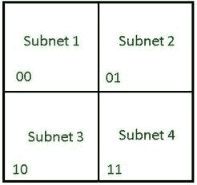
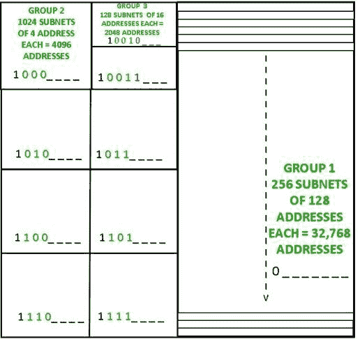

# 固定长度和可变长度子网掩码数字

> 原文:[https://www . geesforgeks . org/定长变长子网掩码-numerical/](https://www.geeksforgeeks.org/fixed-length-and-variable-length-subnet-mask-numericals/)

在开始阅读本文之前，请确保您了解[子网划分](https://www.geeksforgeeks.org/introduction-to-subnetting/)和[无类寻址](https://www.geeksforgeeks.org/ip-addressing-classless-addressing/)的基础知识。

**1。固定长度子网掩码:**
当一个地址块被划分为地址数量相等的子网时，这种子网划分称为固定长度子网划分。此处使用的子网掩码对于所有子网都是相同的，因为每个子网的地址数量是相等的。

**示例–**
考虑地址块 121.37.10.64/26。
如果输入中给出了所需的相等子网数量，则找出每个子网的第一个和最后一个地址。

**输入:**

```
Number of subnets required = 4 
```

**输出:**

```
Subnet-1:
First Address: 121.37.10.64 /28
Last Address: 121.37.10.79 /28

Subnet-2:
First Address: 121.37.10.80 /28
Last Address: 121.37.10.95 /28

Subnet-3:
First Address: 121.37.10.96 /28
Last Address: 121.37.10.111 /28

Subnet-4:
First Address: 121.37.10.112 /28
Last Address: 121.37.10.127 /28 
```

由于需要 4 个子网，我们需要 2 位来标识每个子网。因此，子网掩码现在变为(/28)..
剩余可变位数= 32 -28 = 4 位。因此，每个子网中的地址总数= 2 <sup>4</sup> = 16。



<center>**Figure –** Address space divided into 4 equal sized subnets</center>

有两种接近解的方式:
**法-1:**

1.  要找到第一个地址，请理解前 26 位将与给定的地址相同，因为它们是固定的。如上所述，接下来的 2 位也将是固定的。
2.  在子网拥有的 16 个地址中，要指向其第一个地址，要求所有 4 个(非固定)位都为 0。
3.  So the first address of the 1<sup>st</sup> subnet =

    ```
    121.37.10\. 01  00  0  0  0  0 /28 = 121.37.10.64/28.
    ```

    对于第二个<sup>和第一个</sup>子网=

    ```
    121.37.10\. 01  01  0  0  0  0 /28 = 121.37.10.80/28
    ```

    等等。

4.  要查找最后一个地址，请将(子网中的地址数-1)添加到该子网的第一个地址。在这种情况下，将(16-1)添加到每个子网的第一个地址。所以 1 <sup>st</sup> 子网的最后一个地址是

    ```
     121.37.10.79/28.
    ```

**方法-2(快捷方式):**

1.  To find the first address of the 1<sup>st</sup> subnet, carryout AND operation between the address given and the subnet mask of the 1<sup>st</sup> subnet.
    Performing AND operation :

    ```
        01111001   00100101   00001010   01000000/26
    AND 11111111   11111111   11111111   11110000/28
    -------------------------------------------------------------------------
        01111001   00100101   00001010   01000000 /28 
    ```

    因此，第 1 <sup>个</sup>子网的第一个地址

    ```
    = 01111001  00100101  00001010  01000000  /28 = 121.37.10.64 /28 
    ```

2.  To find the last address of a subnet, perform OR operation between the first address of the subnet and the complement of the subnet mask.
    First address of 1<sup>st</sup> subnet,

    ```
    = 01111001 00100101 00001010 01000000 /28  
    ```

    子网掩码的补充，

    ```
    = 00000000 00000000 0000000 00001111 / 28 
    ```

    执行“或”运算，我们得到 1 <sup>st</sup> 子网的最后一个地址

    ```
    = 01111001  00100101  00001010  00001111  / 28 = 121.37.10.79 /28 
    ```

3.  在前一个子网的最后一个地址上加 1，找到下一个子网的第一个地址。

**注–**
当所需的子网数量无法用 2 的幂计算时，则以子网数量最接近只能用 2 的幂表示的数字的方式划分地址空间。

例如，如果我们需要 14 个子网，那么由于 14 不能仅用 2 的幂表示，因此我们将地址空间划分为 16 个相等的子网。现在可以使用上述方法找到相应的地址。

**2。[可变长度子网掩码](https://www.geeksforgeeks.org/introduction-of-variable-length-subnet-mask-vlsm/) :**
当一个地址块被划分为包含不同数量地址的子网时，这种子网划分被称为可变长度子网划分。
这里使用的子网掩码对于不同的子网可能不一样。

**示例:**
考虑一个起始地址为 112.78.0.0/16 的地址块。查找每个组的第一个和最后一个地址，如果它们所需的子网数量和大小如输入中所示。

**输入:**

```
Group-1:
256 subnets, each needs 128 addresses

Group-2:
1024 subnets, each requiring 4 addresses

Group-1:
128 subnets, each consisting of 16 addresses 
```

**输出:**

```
Group-1:
First Address : 112.78.0.0 /17
Last Address : 112.78.127.255 /17 

Group-2:
First Address : 112.78.128.0 /20
Last Address : 112.78.143.255 / 20 

Group-3:
First Address : 112.78.144.0 /21
Last Address : 112.78.151.255 /21 
```

要了解此类问题，了解修复子网标识中的位并找到每组子网的子网掩码的过程非常重要。

给定地址块中的总地址，

```
= 232-16 = 65,536 
```

了解地址空间的划分，

```
Group-1:
Number of addresses = 256 x 128 =  32, 768  
```

因此，组 1 占据了块中地址的 1/2。因此，固定 1 位来标识这一半，子网掩码变为/17。

类似地，对于**组-2** ，总共 4 位是固定的，子网掩码变为/20。

并且，**组-3** 共固定 5 位，子网掩码变为/21。

然后使用上面提到的方法 2，可以找到各自的开始和结束地址。



为了理解问题，让地址块用一个大方块表示，可以进一步划分出需要的子网。由于块中的地址总数= 65，536，因此可以推断该正方形由 256×256 个地址组成。仔细观察地址空间的划分和地址空间子网标识中初始位的固定。空格加上另外 8 个空格将成为主机标识。

一旦地址空间被适当划分并找到相应的子网掩码，就可以使用上述方法找到所需的地址。