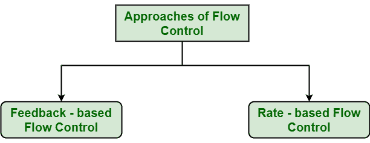
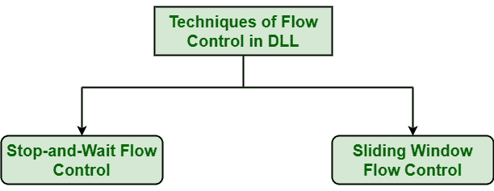

# 数据链路层的流量控制

> 原文:[https://www . geesforgeks . org/数据链路层流量控制/](https://www.geeksforgeeks.org/flow-control-in-data-link-layer/)

**流量控制**是[在数据链路层](https://www.geeksforgeeks.org/design-issues-in-data-link-layer/)的设计问题。这是一种通常观察数据从发送者到接收者的正确流动的技术。这是非常重要的，因为发送方可以以非常快的速度传输数据或信息，因此接收方可以接收并处理这些信息。只有当接收者与发送者相比具有非常高的流量负载时，或者当接收者与发送者相比具有较少的处理能力时，这种情况才会发生。

流量控制基本上是一种技术，它允许两个以不同速度工作和处理的工作站相互通信。数据链路层中的流量控制只是限制和协调发送方在等待接收方确认之前可以发送的帧数或数据量。流量控制实际上是一套程序，它向发送方解释在数据淹没接收方之前，它可以传输多少数据或帧。

接收设备也只包含有限的速度和存储数据的内存。这就是为什么接收设备应该能够告诉或通知发送方在数据达到限制之前暂时停止传输或传送数据。它还需要缓冲区，大块的内存，只存储数据或帧，直到它们被处理。

**流量控制方法:**
流量控制分为两类–

*   **基于反馈的流量控制:**
    在这种控制技术中，发送方简单地将数据或信息或帧传输给接收方，然后接收方将数据传输回发送方，还允许发送方传输更多的数据或告诉发送方接收方是如何处理或做的。这仅仅意味着发送方在收到用户确认后传输数据或帧。
*   **基于速率的流量控制:**
    在这种控制技术中，通常当发送方以更快的速度向接收方发送或传输数据，而接收方无法以该速度接收数据时，协议中称为内置机制的机制只会限制或约束发送方在没有接收方任何反馈或确认的情况下传输或传输数据或信息的整体速率。

**数据链路层流量控制技术:**

控制数据流的技术基本上有两种类型–

**1。停止等待流量控制:**
这种方法是最简单易行的流量控制形式。在这种方法中，基本上消息或数据被分解成各种多个帧，然后接收器指示其准备好接收数据帧。收到确认后，只有发送方会发送或传输下一帧。

这个过程一直持续到发送方发送 EOT(传输结束)帧。在这种方法中，一次只能传输一个帧。如果传播延迟比传输延迟长得多，就会导致效率低下，即生产率降低。

**优势–**

*   这种方法非常简单易行，每一帧都经过检查和确认。
*   它也可以用于有噪声的信道。
*   这个方法也很准确。

**缺点–**

*   这种方法相当慢。
*   在这种情况下，一次只能发送一个数据包或帧。
*   效率非常低，传输过程非常慢。

**2。滑动窗口流量控制:**
这种方法在非常需要数据包或帧的可靠有序传送的地方是必需的，就像在数据链路层一样。它是一种点对点协议，假设在当前数据或帧传输完成之前，没有其他实体尝试通信。在这种方法中，发送方在收到任何确认之前发送或发送各种帧或数据包。

在这种方法中，发送方和接收方就数据帧的总数达成一致，之后需要发送确认。数据链路层需要并使用这种方法，它只允许发送方同时拥有多个未确认的“传输中”数据包。这增加并改善了网络吞吐量。

**优势–**

*   它比停止等待流量控制性能好得多。
*   这种方法提高了效率。
*   多个帧可以一个接一个地发送。

**缺点–**

*   主要问题是发送方和接收方由于传输多个帧而变得复杂。
*   接收器可能会接收序列之外的数据帧或数据包。