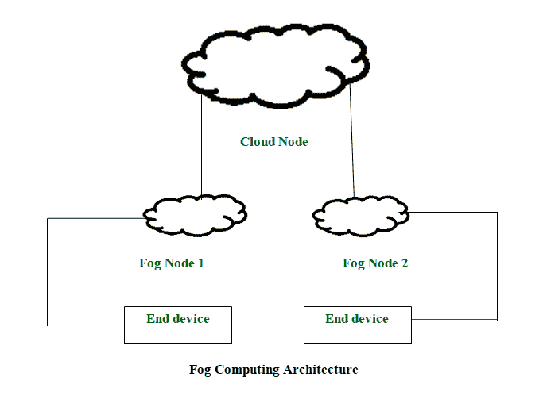

# 雾计算

> 原文:[https://www.geeksforgeeks.org/fog-computing/](https://www.geeksforgeeks.org/fog-computing/)

雾计算是思科创造的术语，指的是将云计算扩展到企业网络的边缘。因此，它也被称为边缘计算或雾化。它促进了终端设备和计算数据中心之间的计算、存储和网络服务的运行。

1.  构成雾基础设施的设备称为雾节点。
2.  在雾计算中，所有的存储能力、计算能力、数据以及应用程序都位于云和物理主机之间。
3.  所有这些功能都更加面向主机。这使得处理速度更快，因为它几乎是在创建数据的地方完成的。
4.  It improves the efficiency of the system and is also used to ensure increased security.

    这是物联网在市场上蓬勃发展的唯一原因。在所有需要快速大量处理的物联网设备中，雾计算发挥着重要作用。

**雾计算的历史**
雾计算这个术语是思科在 2014 年 1 月创造的。这是因为雾被称为接近地面的云，就像雾计算与主机和云之间节点附近的节点相关一样。它旨在使系统的计算能力接近主机。在这获得了一点人气之后，IBM 在 2015 年创造了一个类似的术语，叫做“边缘计算”。

**何时使用雾计算？**
雾计算可用于以下场景:

1.  仅当需要将选定的数据发送到云中时，才使用它。所选数据被选择用于长期存储，主机访问频率较低。
2.  每当需要在不同地理位置的大范围内提供大量服务时，都会使用它。
3.  经受严格计算和处理的设备必须使用雾计算。
4.  使用雾计算的现实例子是物联网设备(如欧洲车对车联盟)、带传感器的设备、摄像机(工业物联网)等。

**雾计算的优势**

*   这种方法减少了需要发送到云的数据量。
*   由于数据传输的距离缩短，因此节省了网络带宽。
*   缩短系统的响应时间。
*   它提高了系统的整体安全性，因为数据位于主机附近。

**雾计算的缺点**

*   由于流量增加(大量数据流)，主机和雾节点之间可能会发生拥塞。
*   当在主机和云之间放置另一层时，功耗会增加。
*   在主机和雾节点之间以及雾节点和云之间调度任务是困难的。
*   数据管理变得乏味，因为随着数据的存储和计算，数据的传输也涉及加密-解密，而加密-解密又会释放数据。

**参考文献:**

https://en.wikipedia.org/wiki/Fog_computing