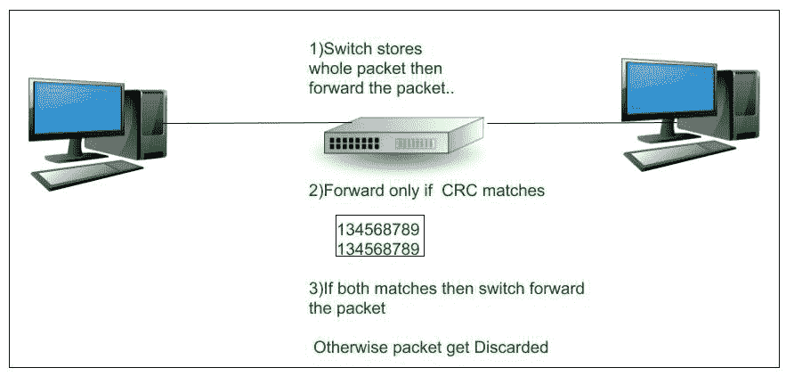
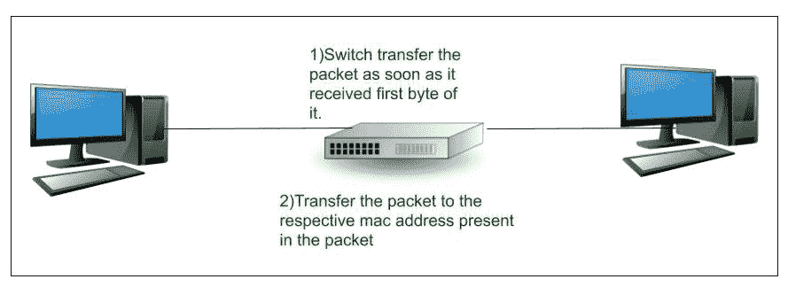

# 交换机上的帧转发方法

> 原文:[https://www . geesforgeks . org/frame-forwarding-methods-on-switches/](https://www.geeksforgeeks.org/frame-forwarding-methods-on-switches/)

所有[交换机](https://www.geeksforgeeks.org/network-devices-hub-repeater-bridge-switch-router-gateways/)在网络端口之间转发帧(交换数据)有两种方法:

1.  存储和转发交换
2.  直通开关

这些解释如下。

**1。存储和转发交换:**
在这种交换技术中，当交换机收到帧时，它会将帧数据存储在缓冲区中，直到收到完整的帧。在此过程中，交换机会分析当前帧以获取有关其目的地的信息。该过程还包括使用由交换机操作的循环冗余校验的另一个错误校验过程。

融合网络的服务质量分析需要这种交换技术，在融合网络中，需要对帧进行分类以确定流量优先级。例如，VoIP 数据流需要比其他类型的流量具有更高的优先级。

循环冗余校验检查帧中的位数(1)，以确定接收到的帧是否有错误。确认帧中没有错误后，该帧将从相应的端口转发到目的地。

当在帧中发现错误时，交换机会丢弃该帧。通过丢弃包含错误的帧，减少了损坏数据消耗的带宽。

**Figure –** Store and forward switching

**2。直通交换:**
在这种交换技术中，交换机一收到数据就对其进行操作，即使没有收到完整的帧(传输未完成)。交换机缓冲足够的帧来读取目的地媒体访问控制地址，以便找到它应该发送数据的端口。交换机从交换表中获取目的 MAC 地址，确定输出接口端口，并通过指定的交换机端口将帧转发到目的地。这种交换技术不涉及交换机的任何错误检查过程。

**Figure –** Cut-through switching

直通交换有两种类型:

1.  **Fast-forward switching –**
    This switching technique provides the lowest level of latency (it is measured from the first bit received to the first bit transmitted) because it immediately forwards a packet after reading the destination address.

    快速转发交换一旦收到数据包的第一个字节就开始转发，可能会有数据包被错误转发的机会。这种情况很少发生，在这种情况下，目的网络适配器会在收到错误数据包时将其丢弃。这种切换是典型的直通式切换方法。

2.  **Fragment-free switching –**
    In this switching technique there is a trade-off between the high latency – high integrity of store and forward switching and the low latency – reduced integrity of fast-forward switching. The switch stores and perform a small error check on the first 64 bytes of the frame before forwarding.

    这种交换技术包括存储和转发交换以及快速转发交换的概念。这种交换技术只存储帧的前 64 个字节，因为大多数网络错误和冲突都发生在前 64 个字节，并通过执行一个小的错误检查来确保在转发帧之前没有发生冲突，从而尝试增强快进交换。