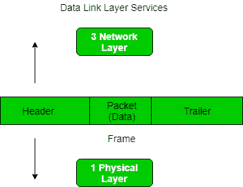
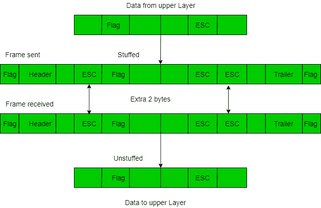
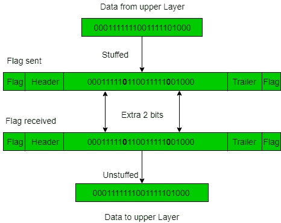

# 数据链路层成帧

> 原文:[https://www.geeksforgeeks.org/framing-in-data-link-layer/](https://www.geeksforgeeks.org/framing-in-data-link-layer/)

帧是数字传输的单位，尤其是在计算机网络和电信中。在光能的情况下，帧相当于称为光子的能量包。时分复用过程中会持续使用帧。

成帧是两台计算机或设备之间的点对点连接，由一条线路组成，数据以比特流的形式在线路中传输。然而，这些位必须被组织成可识别的信息块。成帧是数据链路层的功能。它为发送方提供了一种传输对接收方有意义的一组比特的方式。以太网、令牌环、帧中继和其他数据链路层技术都有自己的帧结构。帧的报头包含错误校验码等信息。

在数据链路层，它从发送方提取消息，并通过提供发送方和接收方的地址将其提供给接收方。使用帧的优点是数据被分解成可恢复的块，可以很容易地检查是否有损坏。

**框架中的问题–**

*   **检测帧的开始:**当帧被发送时，每个站必须能够检测到它。工作站通过寻找标志帧开始的特殊位序列(即 SFD(起始帧定界符))来检测帧。
*   **T2 站如何检测帧:**每个站通过时序电路监听 SFD 模式的链接。如果检测到 SFD，时序电路会提醒工作站。工作站检查目的地址以接受或拒绝帧。
*   **检测帧结束:**何时停止读帧。

**框架类型–**框架有两种类型:

**1。固定大小–**帧的大小是固定的，不需要为帧提供边界，帧本身的长度充当定界符。

*   **缺点:**如果数据大小小于帧大小，则会出现内部碎片
*   **溶液:**填料

**2。可变大小–**在这种情况下，需要定义帧的结束和下一帧的开始来区分。这可以通过两种方式实现:

1.  **长度字段–**我们可以在帧中引入一个长度字段来表示帧的长度。用于**以太网(802.3)** 。这样做的问题是，有时长度字段可能会损坏。
2.  **End Delimiter (ED) –** We can introduce an ED(pattern) to indicate the end of the frame. Used in **Token Ring**. The problem with this is that ED can occur in the data. This can be solved by: 

    **1。字符/字节填充:**当帧由字符组成时使用。如果数据包含 ed，那么将一个字节填充到数据中，以区别于 ED。

    let ED =“{ content }”# x201；–>如果数据包含“{内容}”；在任何地方，都可以使用“\O”字符进行转义。
    –>如果数据包含“\ O { content }”；然后，使用' \ O \ O \ O { content }；($用\O 转义，\O 用\O 转义)。

**缺点–**这是一种非常昂贵且过时的方法。

**2。位填充:**让 ED = 01111，如果数据= 01111
**–>**发送方填充一位来打破模式，即在数据= 0111 **0** 1 中附加一个 0。
**–>**接收器接收帧。
**–>**如果数据中包含 <u>0111</u> 01，接收器将移除 0 并读取数据。

**示例–**

*   If Data –> 011100011110 and ED –> 0111 then, find data after bit stuffing? 

    –> 011**0**100011**0**11**0**0

*   If Data –> 110001001 and ED –> 1000 then, find data after bit stuffing? 

    –> 1100**1**0100**1**1

*   [cs 门 2014](https://www.geeksforgeeks.org/gate-gate-cs-2014-set-3-question-34/)
*   [门 IT 2004](https://www.geeksforgeeks.org/gate-gate-it-2004-question-80/)