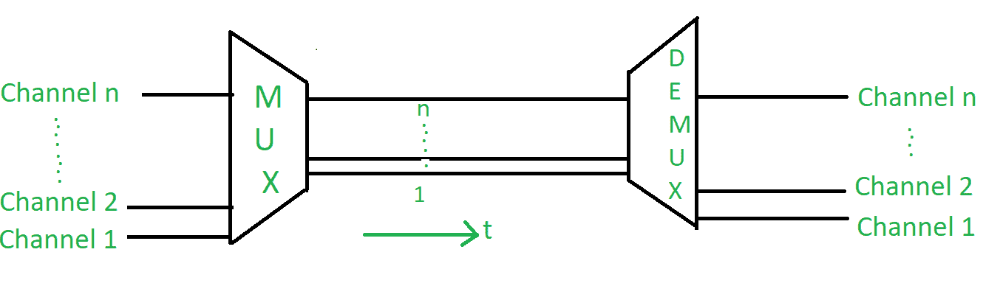
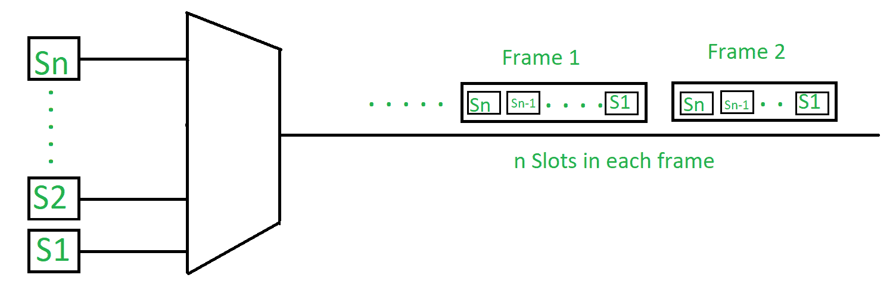
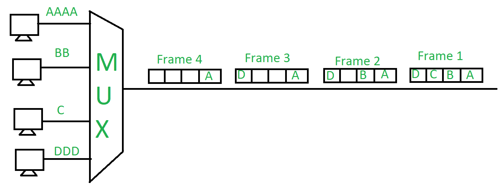
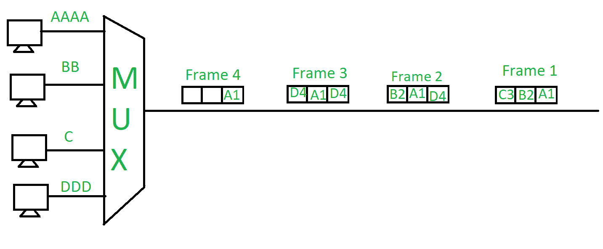

# 频分和时分复用

> 原文:[https://www . geeksforgeeks . org/频分和时分复用/](https://www.geeksforgeeks.org/frequency-division-and-time-division-multiplexing/)

**复用**用于带宽较低的信号和传输介质带宽较高的情况。在这种情况下，发送大量信号的可能性更大。在这种情况下，信号被组合成一个信号，并通过比通信节点具有更大媒体带宽的链路发送。

**1。频分复用(FDM)–**
在这种情况下，多个信号同时传输，每个信号源在分配的频率范围内传输其信号。两个相邻信号之间有一个合适的频率间隙，以避免重叠。由于信号是在分配的频率上传输的，因此这降低了冲突的可能性。频谱被分成几个逻辑信道，每个用户都觉得自己拥有特定的带宽。同时发送多个信号，为每个信号分配单独的频带或信道。它用于广播和电视传输。因此，为了避免两个连续通道之间的干扰，使用了**保护带**。

**2。时分复用(TDM)–**
当媒体的数据传输速率大于信源的数据传输速率，并且每个信号被分配一定的时间时，就会发生这种情况。这些时隙非常小，以至于所有的传输看起来都是并行的。在频分复用中，所有的信号以不同的频率同时工作，但是在时分复用中，所有的信号在不同的时间以相同的频率工作。

它有以下几种类型:

1.  **同步时分复用–**
    时隙是预先分配和固定的。如果源此时没有准备好数据，甚至会给出这个槽。在这种情况下，时隙是空的。它用于多路复用数字化语音流。

2。**异步(或统计)时分复用–**
时隙根据源的速度或其就绪状态动态分配。它根据不同输入信道的需求动态分配时隙，从而节省信道容量。

