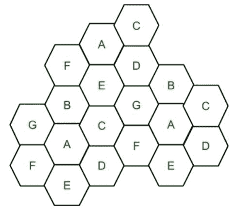
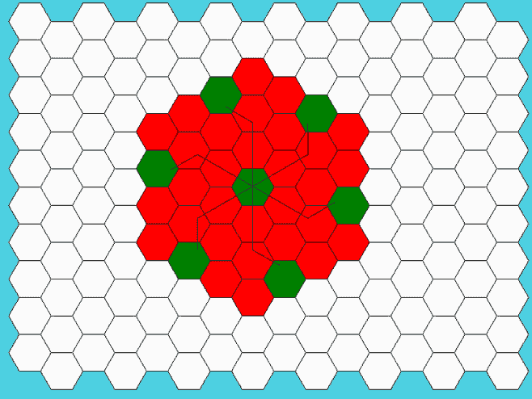

# 频率复用

> 原文:[https://www.geeksforgeeks.org/frequency-reuse/](https://www.geeksforgeeks.org/frequency-reuse/)

**频率复用**是在整个覆盖区域内进行信道分配和复用的方案。每个蜂窝基站被分配一组无线电信道或频率子带，用于被称为小区的小地理区域。细胞的形状是六边形。为系统内所有蜂窝基站选择和分配频率子带的过程称为**频率复用**或**频率规划**。

**使用频率复用的静默特性:**

*   频率复用提高了频谱效率和信号质量。
*   为全球移动通信系统提出的频率复用经典方案提供了抗干扰保护。
*   频率可重复使用的次数取决于附近使用相同频率的发射机的无线电信道的容差能力。
*   在频率复用方案中，总带宽被划分为小区使用的不同子带。
*   频率重用方案允许 WiMax 系统运营商在不同的小区站点重用相同的频率。



具有相同字母的小区使用相同的一组信道组或频率子带。

要查找分配给小区的信道总数:

S =可使用的双工信道总数
k =分配给每个小区的信道(k < S)
N =小区总数或簇大小

那么信道总数将是，

```
S = kN 

Frequency Reuse Factor = 1/N
```

在上图中，集群大小为 7 (A、B、C、D、E、F、G)，因此频率重用因子为 1/7。

n 是共同使用全部可用频率的小区数，称为簇。N 的值通过以下公式计算:

```
N = I2 + I*J + J2 
```

其中 **I** ， **J** = 0，1，2，3……
因此，N 的可能值为 1，3，4，7，9，12，13，16，19 等等。

如果一个集群在蜂窝系统中被复制或重复 M 次，那么容量 C 将是，

```
C = MkN = MS
```

在频率复用中，有几个小区使用同一组频率。这些细胞被称为共通道细胞。这些共信道小区导致干扰。因此，为了避免干扰，使用同一组信道或频率的小区彼此相隔更大的距离。任意两个共信道之间的距离可以通过以下公式计算:

```
 D = R * (3 * N)1/2
```

其中，
R =单元半径
N =给定簇中的单元数

下面是可视化频率重用概念的 Python 代码

```
#!/usr/bin/python

from math import *

# import everything from Tkinter module
from tkinter import *

# Base class for Hexagon shape
class Hexagon(object):
    def __init__(self, parent, x, y, length, color, tags):
        self.parent = parent
        self.x = x
        self.y = y
        self.length = length
        self.color = color
        self.size = None
        self.tags = tags
        self.draw_hex()

    # draw one hexagon
    def draw_hex(self):
        start_x = self.x
        start_y = self.y
        angle = 60
        coords = []
        for i in range(6):
            end_x = start_x + self.length * cos(radians(angle * i))
            end_y = start_y + self.length * sin(radians(angle * i))
            coords.append([start_x, start_y])
            start_x = end_x
            start_y = end_y
        self.parent.create_polygon(coords[0][0],
                                coords[0][1],
                                coords[1][0],
                                coords[1][1],
                                coords[2][0],
                                coords[2][1],
                                coords[3][0],
                                coords[3][1],
                                coords[4][0],
                                coords[4][1],
                                coords[5][0],
                                coords[5][1],
                                fill=self.color,
                                outline="black",
                                tags=self.tags)

# class holds frequency reuse logic and related methods
class FrequencyReuse(Tk):
    CANVAS_WIDTH = 800
    CANVAS_HEIGHT = 650
    TOP_LEFT = (20, 20)
    BOTTOM_LEFT = (790, 560)
    TOP_RIGHT = (780, 20)
    BOTTOM_RIGHT = (780, 560)

    def __init__(self, cluster_size, columns=16, rows=10, edge_len=30):
        Tk.__init__(self)
        self.textbox = None
        self.curr_angle = 330
        self.first_click = True
        self.reset = False
        self.edge_len = edge_len
        self.cluster_size = cluster_size
        self.reuse_list = []
        self.all_selected = False
        self.curr_count = 0
        self.hexagons = []
        self.co_cell_endp = []
        self.reuse_xy = []
        self.canvas = Canvas(self,
                            width=self.CANVAS_WIDTH,
                            height=self.CANVAS_HEIGHT,
                            bg="#4dd0e1")
        self.canvas.bind("<Button-1>", self.call_back)
        self.canvas.focus_set()
        self.canvas.bind('<Shift-R>', self.resets)
        self.canvas.pack()
        self.title("Frequency reuse and co-channel selection")
        self.create_grid(16, 10)
        self.create_textbox()
        self.cluster_reuse_calc()

    # show lines joining all co-channel cells
    def show_lines(self):
        # center(x,y) of first hexagon
        approx_center = self.co_cell_endp[0]
        self.line_ids = []
        for k in range(1, len(self.co_cell_endp)):

            end_xx = (self.co_cell_endp[k])[0]
            end_yy = (self.co_cell_endp[k])[1]

            # move i^th steps
            l_id = self.canvas.create_line(approx_center[0], approx_center[1],
                                        end_xx, end_yy)
            if j == 0:
                self.line_ids.append(l_id)
                dist = 0
            elif i >= j and j != 0:
                self.line_ids.append(l_id)
                dist = j
                # rotate counter-clockwise and move j^th step
                l_id = self.canvas.create_line(
                    end_xx, end_yy, end_xx + self.center_dist * dist *
                    cos(radians(self.curr_angle - 60)),
                    end_yy + self.center_dist * dist *
                    sin(radians(self.curr_angle - 60)))
                self.line_ids.append(l_id)
            self.curr_angle -= 60

    def create_textbox(self):
        txt = Text(self.canvas,
                width=80,
                height=1,
                font=("Helvatica", 12),
                padx=10,
                pady=10)
        txt.tag_configure("center", justify="center")
        txt.insert("1.0", "Select a Hexagon")
        txt.tag_add("center", "1.0", "end")
        self.canvas.create_window((0, 600), anchor='w', window=txt)
        txt.config(state=DISABLED)
        self.textbox = txt

    def resets(self, event):
        if event.char == 'R':
            self.reset_grid()

    # clear hexagonal grid for new i/p
    def reset_grid(self, button_reset=False):
        self.first_click = True
        self.curr_angle = 330
        self.curr_count = 0
        self.co_cell_endp = []
        self.reuse_list = []
        for i in self.hexagons:
            self.canvas.itemconfigure(i.tags, fill=i.color)

        try:
            self.line_ids
        except AttributeError:
            pass
        else:
            for i in self.line_ids:
                self.canvas.after(0, self.canvas.delete, i)
            self.line_ids = []

        if button_reset:
            self.write_text("Select a Hexagon")

    # create a grid of Hexagons
    def create_grid(self, cols, rows):
        size = self.edge_len
        for c in range(cols):
            if c % 2 == 0:
                offset = 0
            else:
                offset = size * sqrt(3) / 2
            for r in range(rows):
                x = c * (self.edge_len * 1.5) + 50
                y = (r * (self.edge_len * sqrt(3))) + offset + 15
                hx = Hexagon(self.canvas, x, y, self.edge_len, "#fafafa",
                            "{},{}".format(r, c))
                self.hexagons.append(hx)

    # calculate reuse distance, center distance and radius of the hexagon
    def cluster_reuse_calc(self):
        self.hex_radius = sqrt(3) / 2 * self.edge_len
        self.center_dist = sqrt(3) * self.hex_radius
        self.reuse_dist = self.hex_radius * sqrt(3 * self.cluster_size)

    def write_text(self, text):
        self.textbox.config(state=NORMAL)
        self.textbox.delete('1.0', END)
        self.textbox.insert('1.0', text, "center")
        self.textbox.config(state=DISABLED)

    #check if the co-channels are within visible canvas
    def is_within_bound(self, coords):
        if self.TOP_LEFT[0] < coords[0] < self.BOTTOM_RIGHT[0] \
        and self.TOP_RIGHT[1] < coords[1] < self.BOTTOM_RIGHT[1]:
            return True
        return False

    #gets called when user selects a hexagon
    #This function applies frequency reuse logic in order to
    #figure out the positions of the co-channels
    def call_back(self, evt):

        selected_hex_id = self.canvas.find_closest(evt.x, evt.y)[0]
        hexagon = self.hexagons[int(selected_hex_id - 1)]
        s_x, s_y = hexagon.x, hexagon.y
        approx_center = (s_x + 15, s_y + 25)

        if self.first_click:
            self.first_click = False
            self.write_text(
                """Now, select another hexagon such 
                   that it should be a co-cell of
                   the original hexagon."""
            )
            self.co_cell_endp.append(approx_center)
            self.canvas.itemconfigure(hexagon.tags, fill="green")

            for _ in range(6):

                end_xx = approx_center[0] + self.center_dist * i * cos(
                    radians(self.curr_angle))
                end_yy = approx_center[1] + self.center_dist * i * sin(
                    radians(self.curr_angle))

                reuse_x = end_xx + (self.center_dist * j) * cos(
                    radians(self.curr_angle - 60))
                reuse_y = end_yy + (self.center_dist * j) * sin(
                    radians(self.curr_angle - 60))

                if not self.is_within_bound((reuse_x, reuse_y)):
                    self.write_text(
                        """co-cells are exceeding canvas boundary.
                           Select cell in the center"""
                    )
                    self.reset_grid()
                    break

                if j == 0:
                    self.reuse_list.append(
                        self.canvas.find_closest(end_xx, end_yy)[0])
                elif i >= j and j != 0:
                    self.reuse_list.append(
                        self.canvas.find_closest(reuse_x, reuse_y)[0])

                self.co_cell_endp.append((end_xx, end_yy))
                self.curr_angle -= 60

        else:
            curr = self.canvas.find_closest(s_x, s_y)[0]
            if curr in self.reuse_list:
                self.canvas.itemconfigure(hexagon.tags, fill="green")
                self.write_text("Correct! Cell {} is a co-cell.".format(
                    hexagon.tags))
                if self.curr_count == len(self.reuse_list) - 1:
                    self.write_text("Great! Press Shift-R to restart")
                    self.show_lines()
                self.curr_count += 1

            else:
                self.write_text("Incorrect! Cell {} is not a co-cell.".format(
                    hexagon.tags))
                self.canvas.itemconfigure(hexagon.tags, fill="red")

if __name__ == '__main__':
    print(
        """Enter i & j values. common (i,j) values are: 
           (1,0), (1,1), (2,0), (2,1), (3,0), (2,2)"""
    )
    i = int(input("Enter i: "))
    j = int(input("Enter j: "))
    if i == 0 and j == 0:
        raise ValueError("i & j both cannot be zero")
    elif j > i:
        raise ValueError("value of j cannot be greater than i")
    else:
        N = (i**2 + i * j + j**2)
        print("N is {}".format(N))
    freqreuse = FrequencyReuse(cluster_size=N)
    freqreuse.mainloop()
```

```
INPUT:
Enter i & j values
i: 2
j: 1

```

输出:
