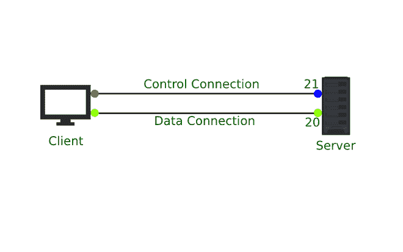

# FTP 服务器工作及其优势

> 原文:[https://www . geesforgeks . org/FTP-服务器-工作及其好处/](https://www.geeksforgeeks.org/ftp-server-working-and-its-benefits/)

FTP 是一组标准协议，允许互连或联网的计算机通过互联网传输文件和通信。

FTP 服务器基本上是一台在互联网上提供访问服务和文件存储的计算机，它处理联网计算机之间的所有数据传输。FTP 服务器等待客户端连接到它，它使用 FTP 协议命令来完成所有任务，如上传、列出目录或下载。

FTP 基于客户端/服务器架构。用户是支持 FTP 协议的客户端，通过该协议可以连接到远程主机上的 FTP 服务器。客户端可以发出命令，这样远程服务器就可以执行它们，在执行命令之后，主机服务器将执行结果返回给客户端。例如，用户提供一个命令并要求服务器转发该文件。服务器将回复请求，并将文件发送给客户端。之后，用户可以将文件放在工作目录中。这些类型的进程由 FTP 服务器执行。

### **FTP 服务器工作:**

FTP 服务是一种基于 TCP 的协议，即它是一种文件传输协议。默认情况下，它使用端口 20(数据端口)和端口 21(命令端口)。用户向网络中的服务器发送服务请求。之后，服务器接收该请求，并回复用户的请求，向用户提供所请求的文件传输服务。FTP 使用连续连接通信方法来保持长控制连接的运行。根据连接模式的类型，数据端口的数量可以不同。



**FTP 中的连接类型:**

通常，在进行文件传输的会话中，FTP 使用两种不同类型的连接，即数据连接和控制连接。

1.  **控制连接:**控制连接用于在用户和服务器之间发送命令。这是主要连接，使用端口 21。
2.  **数据连接:**数据连接仅用于传输数据。它在客户机和服务器的 DTP(数据传输过程)之间建立连接，并使用端口 20。

**连接方式类型:**

文件传输协议服务器可以支持主动模式、被动模式或两种模式。

1.  **活动模式:**在此模式下，用户打开一个端口，并在服务器与其活动连接时进行监听。在这里，客户端可以从任何随机端口连接。
2.  **被动模式:**在这种模式下，服务器打开一个端口，它被动监听，用户也被动连接。被动模式作为安全措施被默认使用。当用户无法接收连接时，即在连接被防火墙阻止的情况下，可以使用被动模式。

**与 FTP 服务器的通信:**

用户可以通过端口 21 使用 telnet 程序与 FTP 服务器通信。

```
>telnet mkcbt.wrt.it 21
Trying 69.198.63.156…
Connected to mkcbt.wrt.it.
Escape character is ‘^]’.
220 ProFTPD server (EV)  [69.198.63.156]
```

下一步是提供用户名和密码。

```
>USER mkcbt
331 password requires for mkcbt.
>PASS [REDACTED]
230 user mkcbt logged in
>PASV
227 entering passive mode (69,198,63,156,116,239).
>telnet mkcbt.wrt.it 29819
Trying 69.198.63.156…
Connected to mkcbt.wrt.it
Escape character is ‘^]’.
>LIST
150 Opening BINARY mode data connection for file list.
226 Transfer complete
drwxrwx---         2 mkcbt       2048                    0 Nov      2     15:12.
drwxrwx---         2 mkcbt       2048                    0 Nov      2     15:12.
-rw-rw----        2 mkcbt       2048                    5 Nov      2     12:52\.     xp_gif
-rw-rw----        2 mkcbt       2048                    5 Nov      2     13:12\.     xc_txt
-rw-rw----        2 mkcbt       2048                    5 Nov      2     13:52\.     xpc_vid
-rw-rw----        2 mkcbt       2048                    5 Nov      2     14:27\.     gmarker
-rw-rw----        2 mkcbt       2048                    5 Nov      2     16:24\.     test
```

如上所述，当客户端提供命令，然后它传递响应时，FTP 服务器就工作了。

**FTP 服务器优势:**

*   FTP 服务器提供了一定程度的安全性。
*   FTP 服务器给予用户一定程度的控制。
*   FTP 服务器允许用户一次发送大文件。
*   它改进了工作流程。
*   它允许数据恢复。
*   它有一个恢复功能，也就是说，它允许文件传输，即使在发生非法连接之后。

**FTP 服务器的缺点:**

*   所有文件、密码和用户名都以未加密的文本形式发送。
*   TLS 1.2 可能不适用于 HTTPS，因为它并不总是受到支持。
*   有可能欺骗服务器，将数据发送到非预期的计算机或随机端口。