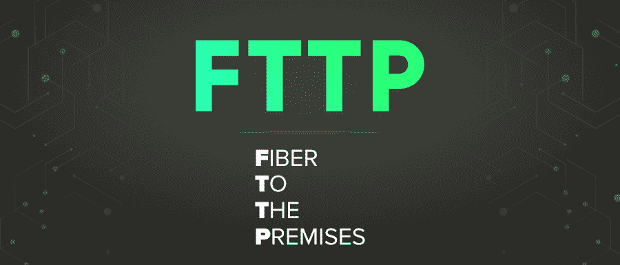

# FTTP 完整版

> 原文:[https://www.geeksforgeeks.org/fttp-full-form/](https://www.geeksforgeeks.org/fttp-full-form/)

**FTTP** 代表**光纤到户**。它是一种光纤电缆传输介质，通过互联网服务提供商直接向用户或用户组提供互联网接入。它主要是指光纤宽带，直接连接到家庭，而不是服务于该地区的办公室。

#### FTTP 历史

它是光纤通信传输的一种类型，1970 年，第一根光纤发布并取代了铜线通信。第一个商用光纤通信系统于 1975 年开发，第二代光纤通信于 1980 年开发，此后随着波长和速度的提高，出现了许多新版本。

#### FTTP 的特点

*   它是由纤维构成的，因此互联网的传输速度很快。
*   这是一种新的超高速宽带，它利用光纤传输到最后一英里，或客户的本地环路
*   它们由光纤电缆组成，能够承载比铜缆多得多的数据，尤其是长距离传输
*   FTTP 可以根据光纤的终点来分类，如 FTTH(光纤到户)和 FTTB(光纤到建筑)

#### FTTP 的优势

*   它提供了卓越的带宽。
*   它还提供所有互联网服务中最高的互联网传输速度。
*   它是可靠和安全的
*   它能抵抗电磁干扰，如加热
*   它更耐用，更坚韧，不易损坏
*   它是可定制的

#### FTTP 的缺点

*   成本很高。
*   很难安装。
*   它需要更长的实施周期
*   互联网连接在工作时间经常离线是一个主要问题。