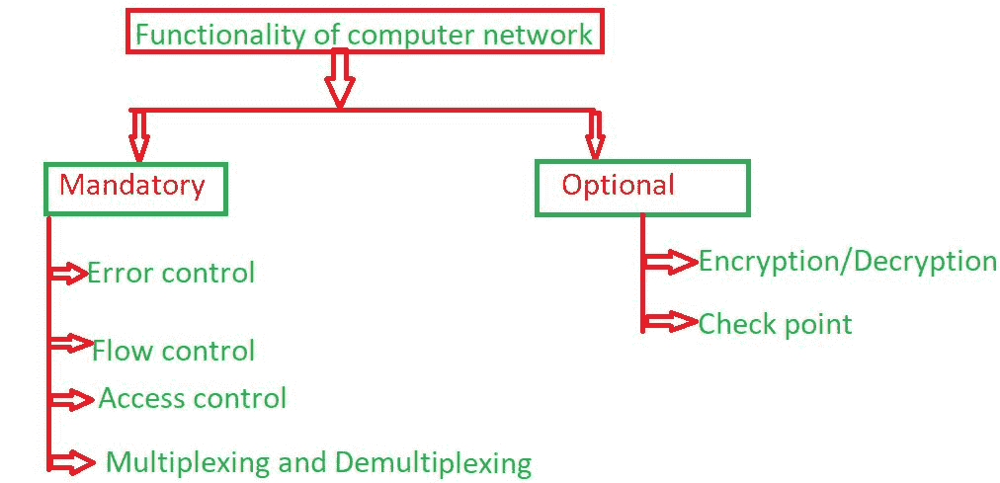

# 计算机网络功能

> 原文:[https://www . geesforgeks . org/计算机网络功能/](https://www.geeksforgeeks.org/functionality-of-computer-network/)

先决条件–[计算机网络基础](https://www.geeksforgeeks.org/basics-computer-networking/)、[网络目标](https://www.geeksforgeeks.org/computer-network-network-goals/)、[OSI 模型的各层](https://www.geeksforgeeks.org/layers-osi-model/)、[传输层职责](https://www.geeksforgeeks.org/computer-network-transport-layer-responsibilities/)
当一台客户机存在于一台机器上，而另一台机器上存在服务器时，在它们之间建立连接，称为计算机网络。计算机网络共享共同的设备、功能和计算机网络的特征，如客户端、服务器、传输介质、共享数据、共享打印机和其他硬件和软件资源、网络接口卡(NIC)、本地操作系统(LOS)和[网络操作系统](https://www.geeksforgeeks.org/operating-system-types-operating-systems-awaiting-author/)。

**计算机网络的功能:**
计算机网络具有两种类型的功能:

1.  强制功能
2.  任选功能

**1。强制功能:**
某些功能在计算机网络中是强制的，当强制功能包含在计算机网络中时，则在计算机网络中执行操作。下面给出了一些强制性功能:

1.  **Error control:**
    The computer network has some responsibility like transmission of data from one device to another device and end to end transfer of data from a transmitting application to a receiving application involves many steps, each subject to error. By using the error control process, we can be confident that the transmitted and received data are identical. Data can be corrupted during transmission. The error must be detected and corrected for reliable communication.

    错误类型-

    *   **(一)。单比特错误:**
        术语单比特错误是指数据单元中只有一个比特从 1 变为 0，从 0 变为 1。
    *   **(b)。突发错误:**
        术语突发错误是指数据单元中的两个或更多位被改变。突发错误也称为分组级错误，即像分组丢失、复制、重新排序这样的错误。
2.  **流量控制:**
    当数据包(第 2 层数据)通过单一介质从一台主机发送到另一台主机时，要求发送方和接收方以相同的速度工作。也就是说，发送方以接收方能够处理和接受数据的速度发送。如果发送方发送太快，接收方可能会过载(淹没)，数据可能会丢失。
3.  **访问控制:**
    网络访问控制是一种通过将网络资源的可用性限制在符合组织安全策略的端点设备上来增强私有组织网络安全性的方法。网络访问控制方案包括两个主要部分，如受限访问和网络边界保护。
4.  **复用和解复用:**
    复用是一种技术，通过它可以在共享链路上同时处理不同的模拟和数字传输流。多路复用将高容量介质分成低容量逻辑介质，然后由不同的流共享。

**2。**
可选功能:有些功能在计算机网络中是可选的，可选功能不需要总是在计算机网络中。下面给出了一些可选功能:

1.  **Encryption and decryption:**
    Decryption and Encryption is a security method in which information is encoded in such a way that only authorized user can read it. Some network uses encryption algorithm to generate ciphertext that can only be read if decrypted.

    加密类型-

    *   **(一)。**对称密钥加密
    *   **(b)。**公钥加密