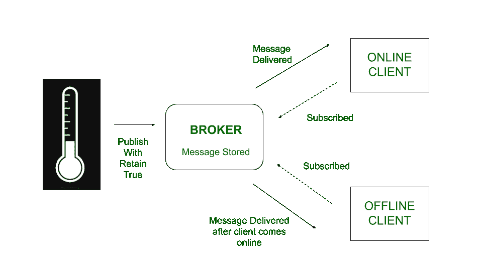
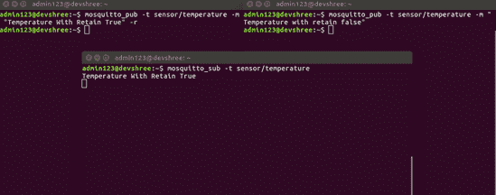

# MQTT 的基本特征|第 2 集

> 原文:[https://www . geesforgeks . org/foundation-features-of-mqtt-set-2/](https://www.geeksforgeeks.org/fundamental-features-of-mqtt-set-2/)

**先决条件–**

*   [消息队列遥测传输协议(MQTT)](https://www.geeksforgeeks.org/introduction-of-message-queue-telemetry-transport-protocol-mqtt/)
*   [MQTT 的基本特征|第 1 集](https://www.geeksforgeeks.org/fundamental-features-of-mqtt/)

**保留消息:**
在 MQTT 中，当客户端向经纪人发布消息时，默认情况下保留标志为 *false* 。在这种情况下，代理只需将消息传递给预定的订阅客户端，然后丢弃该消息。但是如果订阅的客户端当前脱机，那么客户端将永远不会收到消息，因为它已经被代理丢弃了。

为了解决这个问题，使用了*保留标志*。代理将保留以保留标志*为真*发布的消息。因此，即使订户客户端离线，这些消息也将被存储并在预期客户端上线后交付给预期客户端。

对于特定的主题，代理将只存储一条保留的消息。因此，如果在同一主题上发布了另一条消息，并且保留标志为真，那么前一条消息将被新消息替换。这样做是为了让客户端可以轻松获得最后一个已知的 T2 值。

**启用和禁用保留消息:**
要启用此功能，可以将保留标志与发布的消息一起设置。但是，不能通过将标志设置回 false 来禁用保留的消息。客户端需要就同一主题发送一条空消息，并将 retain 标志设置为 true 以禁用此功能。空消息不会干扰正在进行的关于该主题的任何其他通信，因此有助于有效地禁用该功能。

**示例–**
在下面的示例中，传感器向代理发布其当前值，并保留消息为真。在线的客户端会立即收到此消息。由于保留的标志为真，代理存储消息，并在第二个客户端上线后将其传递给第二个客户端。因此，由于这一特性，即使是离线客户端在上线后也会更新最新的传感器值。

**Figure –** Retained Messages

在下图中，客户端在两个消息发布完成后上线。因此，它只接收带有保留标志为真的消息。

**Figure –** Mosquitto Illustration of Retained Messages

**优势:**

*   当脱机客户端联机时，立即向其提供最新的状态更新。
*   如果没有发布关于该主题的新值，那么一旦客户端上线，就会向它们提供最后一个已知值。因此，即使系统中没有新的活动，他们也会知道系统的当前状态。