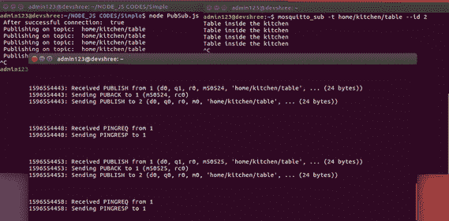
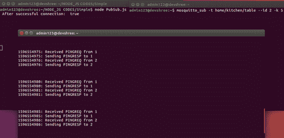

# MQTT 的基本特征|第 4 集

> 原文:[https://www . geesforgeks . org/foundation-features-of-mqtt-set-4/](https://www.geeksforgeeks.org/fundamental-features-of-mqtt-set-4/)

**先决条件–**

*   [消息队列遥测传输协议(MQTT)](https://www.geeksforgeeks.org/introduction-of-message-queue-telemetry-transport-protocol-mqtt/)
*   [MQTT 的基本特征|第 1 集](https://www.geeksforgeeks.org/fundamental-features-of-mqtt/)
*   [MQTT 的基本特征|第 2 集](https://www.geeksforgeeks.org/fundamental-features-of-mqtt-set-2/)
*   [MQTT 的基本特征|第 3 集](https://www.geeksforgeeks.org/fundamental-features-of-mqtt-set-3/)

**保持活动消息:**
在 MQTT 中，当客户端和代理相互通信时，两者之间建立的连接可能会由于各种原因而丢失，例如–

*   其中一个因软件错误而崩溃。
*   其中一个因硬件错误而崩溃。

由于此类软件或硬件故障，两个组件可能会不同步。这种连接称为**半开连接**。因此，为了检查客户端和代理之间的连接是否仍然保持，可以在特定的时间间隔后在它们之间交换 PINGREQ 和 PINGRESP。此消息交换有助于检查两者之间的连接是否仍然打开。

**交换这些消息的时间段称为保活期**。

因此，当客户端向代理发布带有保持活动计时器的消息时，该计时器指示客户端和代理可以保持连接的最长时间，即使没有执行消息传输。

只有在保持活动计时器到期后，客户端才会向代理发送新的 PINGREQ。代理将发送 PINGRESP 作为响应，保活计时器将重新启动(重置为 0)。此消息通信将有助于确保两个组件仍然连接。PINGREQ 和 PINGRESP 消息没有有效载荷。对于保持活动消息，必须考虑以下两个因素–

*   如果客户端没有收到 PINGRESP，它应该关闭连接。
*   如果在保持活动计时器的 1.5 倍内没有从客户端收到 PINGREQ，代理应该关闭连接。

保活定时器的默认值是 60 秒。这个定时器的最大值可以是 18 小时 12 分 15 秒。当保持活动计时器设置为 0 时，表示保持活动机制已被停用。下面是 javascript 程序，指示消息的发布，保活定时器为 5 秒。

## java 描述语言

```
/* jshint esversion : 6 */
"use strict";

// Importing the MQTT package
var mqtt = require('mqtt');

// Creating an instance of the client
var client = mqtt.connect({clientId: "1", keepalive: 5});

// Definiting constants
var topic = "home/kitchen/table";
var message = "Table inside the kitchen";
var options = {retain: false, qos: 1};

// On successful connection
client.on('connect', function () 
{
    console.log(" After successful connection: ", 
    client.connected);

    // If client is connected, then publish on the 
    topic after every 10seconds
    if (client.connected) 
    {
        setInterval(function () 
        {
            console.log(" Publishing on topic: ", topic);
            client.publish(topic, message, options);
        }, 10000);
    }
});
```

In the above program, client with ID: 1 connects with broker with keep-alive timer of 5 seconds. Hence, PINGREQ and PINGRESP will be exchanged between publisher client (ID:1) and broker after every 5 seconds.

另一方面，发布者的客户端将每 10 秒向代理发布一次消息。代理将从客户端 id 1 接收 PUBLISH，并在使用的 Qos 级别为 1 时发回确认。代理还将向订户客户端 2 发送 PUBLISH，订户客户端 2 因此将在每 10 秒钟后接收发布的消息。

**输出–**



<center>**Figure –** Mosquitto Illustration of Keep-Alive Messages</center>

If the publisher client publishes no messages, then after every 5 seconds, only PINGREQ and PINGRESP will be exchanged. Here if subscriber client also specifies keep-alive period, then these PING messages will be exchanged by broker with both clients having IDs 1 and 2 respectively.



<center>**Figure –** Mosquitto Illustration of Keep-Alive Messages</center>