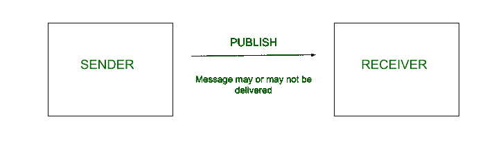
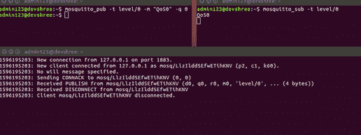
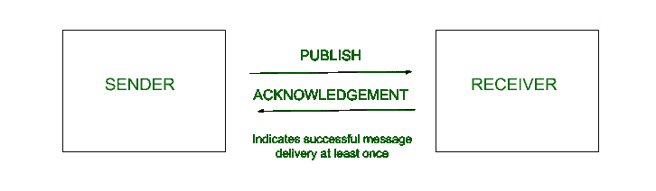
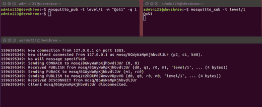
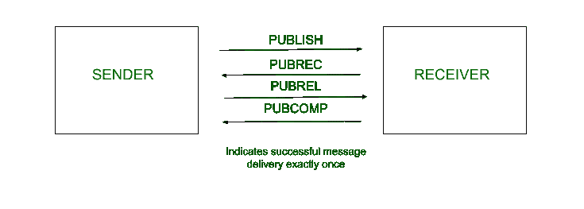
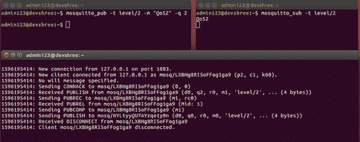

# MQTT 的基本特征

> 原文:[https://www.geeksforgeeks.org/fundamental-features-of-mqtt/](https://www.geeksforgeeks.org/fundamental-features-of-mqtt/)

先决条件–[消息队列遥测传输协议(MQTT)](https://www.geeksforgeeks.org/introduction-of-message-queue-telemetry-transport-protocol-mqtt/)

**服务质量(QoS)等级:**
服务质量是客户和经纪人之间的协议等级。这一级别有助于客户确保消息传递的可靠性。

有 3 个服务质量级别:

*   **QoS 0:最多一次–**
    消息发布时 QoS 等级为 0，消息最多传递一次。换句话说，不能保证消息是否会被传递。如果交付，则最多交付一次。在这种服务质量级别下，发送方只发布一次消息，然后丢弃该消息。在这种情况下，不需要等待确认。因此，如果网络中断，消息可能无法传递。如果网络稳定，消息将只发送一次。

**Figure –** QoS level 0

**什么时候用？**

*   同时开发能够承受少量消息丢失的应用程序。
*   同时开发具有可靠底层网络的应用程序，以便只发布一次的消息就能成功传递。

在上图中，代理只是从发布者客户端接收到*单个* PUBLISH 消息。

*   **QoS 1: At least once –**
    When message is published with QoS level 1, the message will be delivered *at least once*.
    In this QoS level, the sender publishes the message and also stores it until an acknowledgment is received from the receiver. Once an acknowledgment is received, the sender will discard the message. If the acknowledgment is not received in time, the message will be sent again. Hence in this QoS level, the message can be delivered, once and sometimes even more than once, to ensure its successful delivery.

    

    
**Figure –** QoS level 1

    **什么时候用？**

    *   同时开发不能承受消息丢失的应用程序。
    *   同时开发可以处理重复消息传递的应用程序。
    *   同时开发不需要额外通信成本的应用程序。
    *   同时开发没有非常可靠的底层网络的应用程序，因此需要在协议级别实施可靠性措施。

    

    在上图中，代理接收 PUBLISH 消息，并将 PUBLISH 发回给发布者客户端。

    *   **QoS 2: Exactly once –**
    When message is published by the client with QoS level 2, the message will be delivered exactly once. In this QoS level, the sender publishes the message, stores it, and waits for PUBREC. The receiver after receiving the message sends PUBREC to the sender. PUBREC is an indication that the message has been successfully delivered to the receiver. Hence after receiving PUBREC, the message will be discarded by the sender. It then sends PUBREL to the receiver. On receiving PUBREL, the receiver discards the saved states and sends PUBCOMP. When the sender receives the final PUBCOMP, it will also discard the previously saved states. Hence in QoS level 2, the additional messages used for communication ensure the successful delivery of the message exactly once.

    

    
**Figure –** QoS level 2

    **什么时候用？**

    *   同时开发要求每条消息只传递一次的应用程序。
    *   同时开发能够承受额外通信成本的应用程序。
    *   同时开发没有非常可靠的底层网络的应用程序，因此需要在协议级别实施可靠性措施。

    

    在上图中，Broker 接收 PUBLISH，发送 publisher，接收 publisher，然后将 PUBLISHER comp 发送给发布者客户端。

    **发布者和订阅者服务质量等级的区别:**
    发布者客户端(发送者)和代理(接收者)之间消息通信的服务质量等级将由消息发布的等级决定。代理(发送者)和订阅者客户端(接收者)之间的消息通信的服务质量级别将由客户端订阅主题的级别决定。

    通信的整体服务质量水平等于代理两端的两个服务质量水平中的最小值。这一总体水平决定了发布者客户端和订阅者客户端之间消息传递的保证。

    

    | 发布者客户端服务质量 | 用户客户端服务质量 | 通信的整体服务质量 |
    | Zero | Zero | Zero |
    | Zero | one | Zero |
    | Zero | Two | Zero |
    | one | Zero | Zero |
    | one | one | one |
    | one | Two | one |
    | Two | Zero | Zero |
    | Two | one | one |
    | Two | Two | Two |

    
