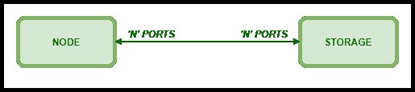
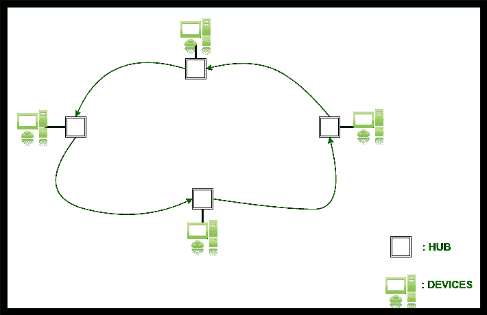
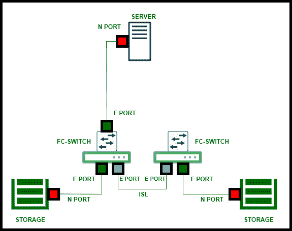

# 光纤通道基础知识

> 原文:[https://www . geesforgeks . org/光纤通道基础/](https://www.geeksforgeeks.org/fundamentals-of-fibre-channel/)

**光纤通道**是一种用于将[服务器](https://www.geeksforgeeks.org/servers-in-computer-network/)连接到数据存储区域网络的高速网络技术。它为许多公司网络上的应用程序处理高性能的磁盘存储。它支持数据备份和复制。
需要光纤通道，因为它非常灵活，能够以更快的速度传输数据。

**带来光纤通道灵活性的[拓扑结构](https://www.geeksforgeeks.org/types-of-network-topology/)是–**

1.  点对点拓扑。
2.  光纤通道仲裁环路。
3.  交换结构拓扑。

**注–**
拓扑是指网络中节点或其他设备的物理/逻辑排列。

**基本[端口](https://www.geeksforgeeks.org/introduction-of-ports-in-computers/)详情，要知道要了解所提到的拓扑–**

| **港口** | **类型** | **关联拓扑** |
| N_port | 结节 | 点对点或织物。 |
| NL _ 端口 | 结节 | 连接到仲裁环路的节点。 |
| F_port | 构造 | 织物端口。 |
| FL_port | 构造 | 连接到仲裁环路的结构。 |
| L_port | 环 | 仲裁环路上的集线器端口。 |
| 升舱 | 环 | 链路控制设施是一种硬件设施，它绑定到链路的每一端，并控制信息的传输和接收。 |
| e 端口 | 结节 | 此交换机间扩展端口用于连接到另一台交换机的 E 端口，以构建更大的结构。 |
| 光纤通道开关 | 转换 | 互连服务器和存储端口的网络交换机。 |

**点对点拓扑:**

*   在这种拓扑中，一条链路连接两个端口。
*   这种拓扑不贵，但不需要集线器。
*   要创建点对点配置，您可以在每个节点上提供多个“N”端口。
*   每个点对点连接都提供“N”个端口支持的全部带宽。根据链路的类型(多模或单模光纤)，这两个节点最多可以相隔 500 米(多模光纤)或 10 公里(单模光纤)。

**光纤通道仲裁环路拓扑[FC-AL] :**

*   这是一种高速光纤通道[FC]拓扑，其中光纤通道端口/集线器使用仲裁来建立点对点电路，并防止多个端口/集线器同时发送帧。
*   这里，设备以单向环连接。因此，当环路拓扑中的端口/集线器有信息要传输时，它们必须发出仲裁信号来决定哪个端口/集线器可以使用该通道。然后，控制信道的端口向目的端口发送“开放”仲裁信号，并传输其信息。由于环路中的所有端口都是连接的，因此每个端口都会看到并传递数据，但会忽略数据，除非数据是发往该特定端口。
*   FC-AL 可以在一个控制器上连接多达 126 个端口。
*   它仍在许多光纤通道交换机内部使用，但现在很少用于将主机连接到存储。
*   光纤通道集线器提供旁路电路，如果一个设备出现故障或被拆除，可以防止环路中断。

**注–**
旁路电路旁路电源的高频成分。

**交换结构拓扑:**

*   这就是现在非常流行的拓扑结构。
*   光纤通道环境中的交换机网络称为结构。
*   一个节点上的端口可以与连接到同一结构的其他节点上的端口通信。使用结构拓扑，一次可以对许多连接发出警报。
*   结构提供的任意对任意连接服务和对等通信服务是光纤通道体系结构的基础。光纤通道可以同时支持通道和网络协议。