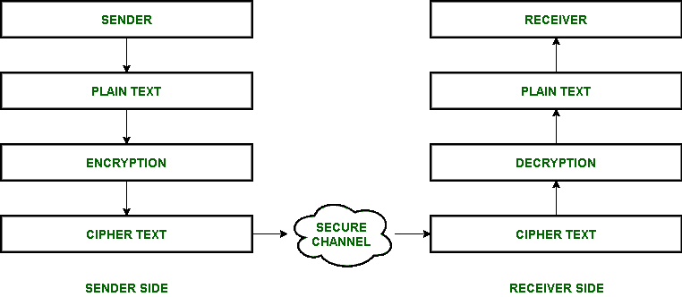

# 通用数据中心安全机制

> 原文:[https://www . geesforgeks . org/general-以数据为中心-安全机制/](https://www.geeksforgeeks.org/general-data-centric-security-mechanisms/)

数据已经成为我们生活的一部分。有如此多的重要数据，其安全性成为我们的一个问题。为了保护数据，我们需要某些以数据为中心的安全机制。

**以数据为中心的安全机制**是一种通过强调数据而不是网络来对抗任何可能发生在数据上的攻击或威胁的方式。

让我们讨论一些以数据为中心的安全措施。

1.  **[密码学](https://www.geeksforgeeks.org/difference-between-cryptography-and-cryptology/)–**
    交流总是发生在双方之间——一方发送信息，另一方接收信息。有时，发送方希望消息只到达接收方，而不是在共享过程中泄露。为了避免其他人查看或理解消息，发送方和接收方执行一些安全措施。密码学是对加密和解密的研究和实现。加密和解密技术用于保护数据。

该消息通过以下步骤发送:

*   发送者有一个可读和可理解格式的消息。该消息被称为*纯文本*。
*   发送者将此消息转换为不可读的格式，这样其他任何接收者都无法理解此消息。这个过程叫做加密，纯文本的信息现在被转换成*密文*。
*   然后，密文将被发送给接收者。这只能通过安全的渠道或媒介来实现。
*   当数据到达接收端时，它是密文形式。
*   然后通过解密过程将密文变成可读格式。解密过程完成后，接收者获得纯文本，这是发送者发送的实际消息。

*   **Data Access Controls and policies –**
    Data Access Controls refer to restrictions on access and use of data. This means that data should be accessible to only people who have proper authorization to use it. This requires knowledge of information, its storage, its importance, and authorized people. Then, controls are set such that other unauthorized people shall not be able to view, use or manipulate data.*   **[Data Masking](https://www.geeksforgeeks.org/data-concealment-methods/) –**
    Data masking is a technique by which data can be hidden within a database relation (table) or cell so that people without access cannot handle it. This can be achieved in many ways such as by duplication or dynamically. This is so done because sensitive information needs to hide from people (developers, unauthorized users, third party, outsourcing vendors, etc.).*   **数据审计–**
    这是指对数据层中的数据控制和活动的评估。应该进行及时的审计，以便发现任何数据安全漏洞。有几家公司缺乏这一重要因素，导致重要数据被窃取或操纵。评估必须定期进行。这种规律性最大限度地减少了数据泄露，并且易于处理。