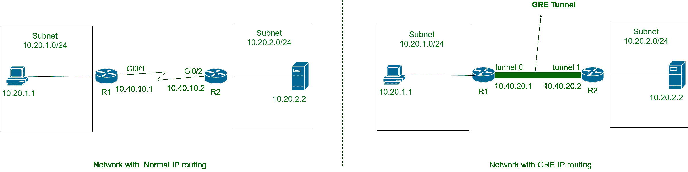
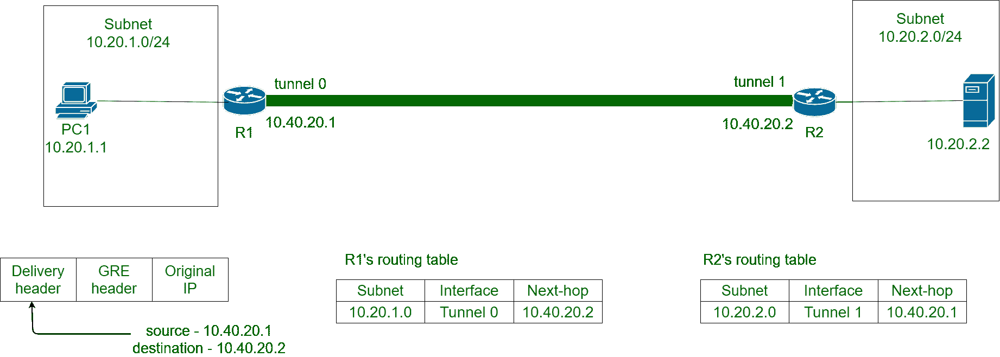

# 通用路由封装(GRE)隧道

> 原文:[https://www . geesforgeks . org/generic-routing-encapsulation-GRE-tunnel/](https://www.geeksforgeeks.org/generic-routing-encapsulation-gre-tunnel/)

**[【通用路由封装】](https://www.geeksforgeeks.org/gre-fullform/)** 是一种将 IP 数据包封装在隐藏原始 IP 数据包的 GRE 报头中的方法。此外，一个名为传递头的新头被添加到包含新的源地址和目的地址的 GRE 头之上。

GRE 报头充当新的 IP 报头，而 Delivery 报头包含新的源地址和目的地址。只有配置了 GRE 的路由器才能解密和加密 GRE 报头。原始的 IP 数据包进入路由器，以加密的形式传输，并从另一个配置了 GRE 的路由器中作为原始的 IP 数据包出现，就像它们通过隧道一样。因此，这个过程被称为 GRE 隧道。

**通过 GRE 隧道路由:**
下图是任何企业网络的一部分。PC1 想要与服务器通信。PC1 将向服务器发送数据包。路由器 R1 将把 IP 数据包从其 Gi0/1 接口转发到 R2 的 Gi0/2 接口，数据包将到达其目的服务器(10.20.2.2)。但是当 GRE 在路由器上配置时，它们使用称为隧道接口的虚拟接口，而不是普通路由器的接口。此虚拟接口使用新的 IP 地址，而不是最初配置的路由器接口 IP 地址。这些新地址来自公司的 IP 地址池列表。

**Figure –** GRE Tunneling

在路由器上完成 GRE 配置后，当 PC1 向子网 10.20.2.0/24 中的服务器发送数据包时。路由器 R1 接收该 IP 数据包，将原始 IP 数据包封装在 GRE 报头中，在传送报头中添加新的隧道接口 IP 地址 10.40.20.1 作为源地址& 10.40.20.2 作为目的地址，并将其发送出隧道接口(隧道 0)。

GRE 数据包现在通过由各种路由协议定义网络路径传输，并到达 R2 的隧道接口(隧道 1)。R2 收到 GRE 包后，解密该包，即删除交付和 GRE 头。R2 现在根据原始目的地地址将 IP 数据包转发到服务器。启用 GRE 的路由器的 IP 路由表也会发生变化，并包含如图所示的信息。

**Figure –** GRE Tunneling
