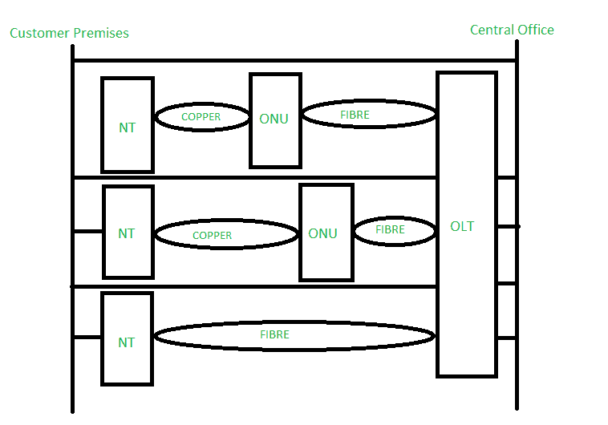
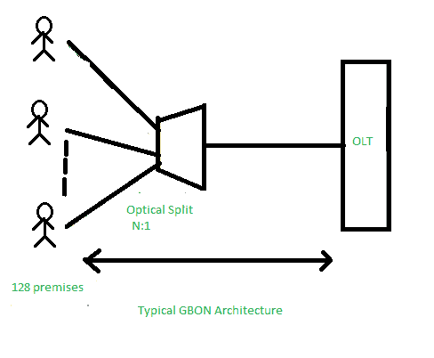
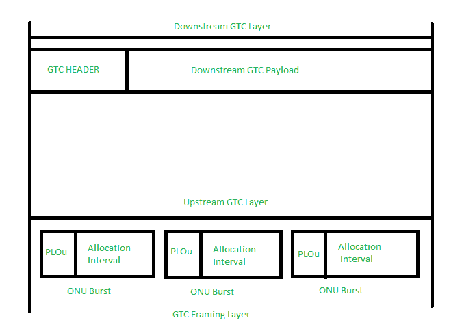

# 千兆无源光网络(GPON)基础知识

> 原文:[https://www . geesforgeks . org/gigabit-无源光网络-GPON-基本面/](https://www.geeksforgeeks.org/gigabit-passive-optical-networks-gpon-fundamentals/)

GPON 是千兆无源光网络的缩写，由 ITU-T 推荐定义为系列 G.984.1 到 G.984.6。千兆无源光网络可以通过自动柜员机、时分复用(PSTN、ISDN、E1 和 E3)和以太网传输流量。GBON 各种 FTTx 架构的网络架构如下。

格本

上面显示的图 1 显示了从 OLT 到无源光分路器的单根光纤。它的位置在用户点附近。无源光分路器中的无源字表示不需要任何电源即可工作。分光器的作用是将光功率分成 N 条独立的路径到达用户。它在 2 到 128 之间变化。在光分路器部分，一根单模光纤向每个用户延伸。

**典型的 GBON 架构描述如下:**
该图 2 显示了如下两种复用机制。

1.  **下游方向:**
    说明从 OLT 到用户的复用机制。这意味着数据以广播方式传输。它支持加密(AES)，用于防止窃听。

*   **In upstream direction :**
    It states the multiplexing mechanism from users to OLT. It enables data packets are transmitted in a TDMA manner.

    GBON 体系结构

    **GPON 关键技术:**

    *   **ONU 标识符(ONU-ID) :**
        ONU 标识符定义为 8 位标识符。其主要目的是在 ONU 激活期间通过 PLOAM 消息由 OLT 分配 8 位号码给 ONU。ONU id 保持唯一 ONU 被 OLT 关闭或停用。
    *   **分配标识符(ALLOC_ID) :**
        ONU 标识符定义为 12 位标识符。它将 12 位数字分配给 ONU。它用于识别承载流量的实体，也称为 T-CONT。
    *   **传输容器(T-CONT) :**
        传输容器(T-CONT)是一种光网络单元，用于表示作为单个实体出现的一组逻辑连接。表示背后的目的是在无源光网络上进行上行带宽分配。例如，在给定的光网络单元中，支持的传输控制的数量是固定的。
        要激活 T-CONT 实例，OLT 必须通过 PLOAM 消息在 T-CONT 之间建立映射。

    **可以分配给用户的五种类型的 T-cont 如下:**

    *   **类型 1–**
        用于 VOIP 等高代理。它具有高频带宽，用于对延迟敏感的服务。
    *   **类型 2 和类型 3–**
        其主要用途在优先级较高的视频业务和数据业务。
    *   **类型 4–**
        这被定义为尽力而为时间，并投入使用数据服务，如互联网和服务。
    *   **类型 5–**
        它被定义为混合类型，因为它是所有带宽类型和所有承载服务的混合。

    **动态带宽分配(DBA) :**
    光网络单元(ONU)的主要职责是将上行带宽分配给 ONUs。如果它们在随机时间传输，也可能发生碰撞。ONUs 的距离位置可能不同，因此每个 ONU 的传输延迟是唯一的。为了测量上行传输的时间间隔，使用许可。

    动态带宽分配(DBA)是一种方法，允许用户根据当前流量需求快速进行带宽分配。它能够管理突发的上游流量。此外，数据库管理员的上游时隙根据上游流量负载而缩小和增长。

    **GPON 传输汇聚(TC)层:**
    GPON 传输汇聚(TC)层用于指定媒体访问控制协议、OAM 进程和信息加密方式。下图 3 描述了下游和上游方向的 GTC 框架结构。它还包括物理控制块下游和 GTC 有效载荷部分。

    在 GPON 传输汇聚层下游，无源光网络的 GTC 帧提供了公共时间参考。它还为上游提供公共控制信令。

    