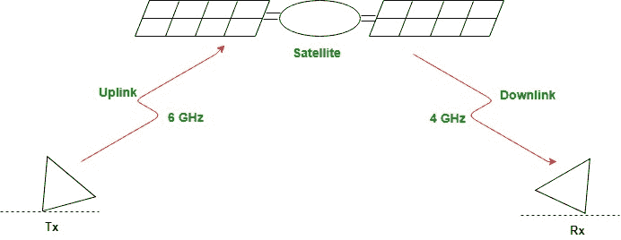
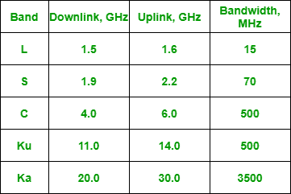
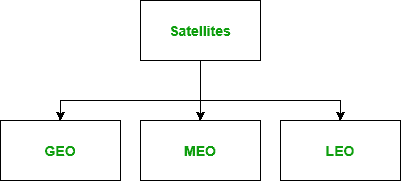

# 全球移动卫星系统

> 原文:[https://www . geesforgeks . org/global-mobile-satellite-system/](https://www.geeksforgeeks.org/global-mobile-satellite-system/)

GMSS 代表**全球移动卫星系统**。以通信为目的放置在环绕地球轨道上的人造物体被称为**通信卫星**。GMSS 是一个由各种人造通信卫星组成的系统，这些卫星以通信为目的绕地球运行。

卫星网络是节点的组合，提供从地球上一点到另一点的通信。网络中的节点可以是卫星、地球站或最终用户终端或电话。卫星网络就像蜂窝网络，它们把地球分成细胞。

为卫星微波通信保留的频率在千兆赫范围内。每颗卫星通过两个不同的波段发送和接收信号。从地球到卫星的传输称为上行链路。从卫星到地球的传输称为下行链路。

卫星频带

上行和下行频率必须不同，以避免干扰。现在，地球上的站点比卫星有更多的能源，因为它只有太阳能。此外，更高的频率会导致更高的衰减，因此需要更多的功率来进行补偿。所以，上行使用更高的频率穿透环境。

**卫星轨道:**

#### 

轨道

人造卫星需要有一个轨道，即它绕地球运行的路径。轨道可以是赤道的、倾斜的或极地的。

#### 脚印

卫星用双向天线处理微波。因此，来自卫星的信号通常瞄准一个被称为足迹的特定区域。

#### 卫星类别

根据轨道的位置，卫星可分为以下三类

**GEO** :

*   地球同步轨道代表地球静止轨道。
*   这个轨道上的通信卫星运行在距离地球表面约 36000 公里的地方，它们的轨道时间周期约为 24 小时。
*   地球静止轨道卫星用于无线电广播。
*   为了确保持续的通信，卫星必须以与地球相同的速度移动，这样它就似乎保持固定在某一点上。所以这种卫星被称为地球静止卫星。
*   一颗地球静止卫星不能覆盖整个地球。轨道上的一颗卫星与大量的站点有视线接触，但是地球的曲率仍然使地球的大部分看不见。在地球静止轨道上，至少需要三颗彼此等距的卫星才能提供全全球传输。

**MEO** :

*   中轨道代表中地球轨道。
*   这个轨道上的通信卫星在距离地球表面约 5000 至 12000 公里的地方运行。
*   这些卫星位于两条范艾伦带之间。在这个轨道上的卫星大约需要 6 到 8 个小时来环绕地球。
*   中东轨道卫星系统的一个例子是全球定位系统，由美国国防部建造和运营，在地球上方约 18，000 公里的高度运行。
*   该系统由 24 颗卫星组成，用于陆地、海洋和空中导航，为车辆和船只提供时间和位置。
*   每个轨道上卫星的轨道和位置是这样设计的，即在任何时候，从地球上的任何一点都可以看到四颗卫星。全球定位系统接收器有一个历书，告诉每个卫星的当前位置。
*   全球定位系统基于一种称为三边测量(有时也称为三角测量)的原理。原理指出“在一个平面上，如果我们知道我们离三点的距离，我们就能准确地知道我们在哪里。”

**LEO:**

*   低地球轨道代表低地球轨道。
*   该轨道上的通信卫星在离地球表面约 500 至 1200 公里的距离上运行，它们的轨道时间周期一般在 95 至 120 分钟之间。该卫星的速度为 20，000 至 25，000 公里/小时。低轨道卫星使全球无线电覆盖成为可能。
*   低地球轨道系统是由一群卫星组成的，它们作为一个网络一起工作，每颗卫星都充当一个开关。相互靠近的卫星通过星间链路连接在一起。移动系统通过用户移动链路与卫星通信。卫星也可以通过网关链路(GWL)与地球站(网关)通信。
*   低地球轨道卫星可分为三类:小低地球轨道卫星、大低地球轨道卫星和宽带低地球轨道卫星。
*   小狮子座在 1 千兆赫以下运行。它们主要用于低数据速率的消息传递。
*   大型低地球轨道运行在 1 到 3 千兆赫之间。全球之星和铱星系统是大低地球轨道的例子。
*   宽带低地球轨道提供类似于光纤网络的通信。第一个宽带低地球轨道系统是 Teledesic。

**铱星:**

*   铱星系统是一个由 77 颗卫星组成的网络，这一概念是由摩托罗拉于 1990 年提出的。这个项目花了 8 年时间才实现。
*   最终在 1998 年，这项服务由 66 颗卫星启动。最初的名字铱，来自第 77 种化学元素的名字。更合适的名字是镝(第 66 元素的名字)。
*   该系统有 66 颗卫星，分为 6 个轨道，每个轨道上有 11 颗卫星。轨道高度为 750 公里。
*   铱星旨在使用手持终端提供直接的全球语音和数据通信，这种服务类似于蜂窝电话，但在全球范围内。

**环球之星：**

*   Globalstar 是一个低地球轨道卫星系统，使用六个极地轨道上的 48 颗卫星，每个轨道上有八颗卫星。这些轨道位于近 1400 公里的高度。
*   全球之星系统与铱星系统相似，主要区别在于中继机制。
*   铱星系统中两个不同用户之间的通信需要几颗卫星之间的中继。
*   Globalstar 通信需要卫星和地面站，这意味着地面站可以产生更强大的信号。

**电话：**

*   Teledesic 是一个提供类似光纤通信的卫星系统。
*   其主要目的是为世界各地的用户提供宽带互联网接入。它有时被称为“天空中的互联网”。
*   该项目由克雷格·麦考夫和比尔·盖茨于 1990 年启动，后来其他投资者也加入了这个财团。Teledesic 在 12 个低地球轨道上有 288 颗卫星，每颗卫星的高度为 1350 公里。
*   类似的铱星和全球之星企业和其他系统的商业失败，以及破产保护的填补，是停止这一项目的主要因素，Teledesic 于 2002 年 10 月 1 日正式暂停其卫星建造工作。