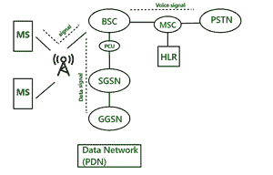

# 无线通信中的 GPRS 架构

> 原文:[https://www . geesforgeks . org/GPRS-无线通信架构/](https://www.geeksforgeeks.org/gprs-architecture-in-wireless-communication/)

**GPRS** 代表 [**通用分组无线业务**](https://www.geeksforgeeks.org/general-packet-radio-service-gprs/) 。是 GSM 架构业务的修改版。在 GSM 架构中，我们只能传输语音信号。但是如果信号由数据组成，那么只有 GSM 架构不能使用。为此，还使用了两个软件组件，SGSN(服务 GPRS 支持节点)和 GGSN(网关 GPRS 支持节点)。

**架构:**

GPRS 架构

在 GSM 架构中，有一个组件叫做基站控制器。但是在 GPRS 中，有一个组件被添加到称为 PCU 的基站控制器中。PCU 代表分组控制单元。如果信号到达基站控制器，并且该信号包含数据，那么 PCU 路由到 SGSN。BSC 和 PCU 之间使用的接口是 FRI 接口。信号到达 SGSN 后，将数据包传送到 GGSN。GGSN 将数据包路由到数据网络(PDN-预定义数据网络)。

**SGSN 任务:**

1.  包裹递送
2.  移动性管理
    *   应用/签署终端
    *   本地化
3.  逻辑链路控制管理
4.  证明
5.  演员表

**GGSN 任务:**

1.  主干网和外部数据网络之间的 GPRS 中介。
2.  保存参与者的 SGSN 地址的当前数据以及他们的个人资料和用于身份验证和发票的数据。