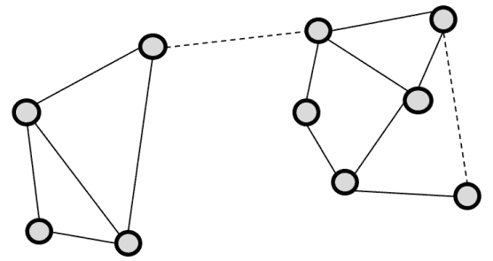
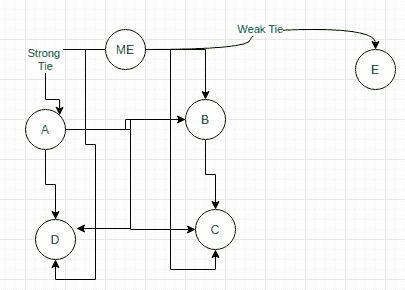

# 格兰诺维特在社交网络中弱关系的强度

> 原文:[https://www . geeksforgeeks . org/granovetters-社交网络中弱关系的强度/](https://www.geeksforgeeks.org/granovetters-strength-of-weak-ties-in-social-networks/)

**先决条件–**[社交网络简介](https://www.geeksforgeeks.org/introduction-to-social-networks-using-networkx-in-python/)

在社交网络中，有两种关系或纽带:

*   **强关系:**
    关系密切的成员之间存在强关系，互动或会议频繁。例子——家庭成员和亲密的朋友会产生紧密的联系。
*   **弱关系:**
    弱关系是由遥远的社会关系和非常不频繁的会议或互动造成的。例子——熟人和陌生人会导致关系变弱。

在一个场景中，有一个人，他有 4 个朋友，其中 3 个在同一家公司，1 个朋友在不同的公司工作。现在如图所示，出现了两个社区，一个是 Z 和他的 3 个朋友工作的社区，另一个是朋友工作的社区。

 

**Figure –** Strong and Weak Ties

In the above figure, the dotted line represents a weak tie and the plain line represents a strong tie. Now, in 1973 a Stanford professor published a paper called the **Strength of Weak Ties**. According to Granovetter’s paper, the strength of weak ties is said that each tie has its different perspective and advantages as well and everyone talks about the advantages of strong ties but there are also some advantages of weak ties as well which is absent in strong ties.

**例:**
在 10 个人中，有 9 个人是通过朋友的朋友或任何其他熟人的介绍，而不是他们的密友，找到了工作或换了工作。这样做的原因不是因为他们的亲密朋友不愿意，而是真正有效的原因是所有的亲密朋友或者我们可以说牢固的联系仍然和你在同一个群体中。

就像如果你在 XYZ 公司工作，那么很可能你所有的密友都在同一家公司工作，但是你的熟人很可能在不同的公司工作。因此，在更换公司时，你的熟人可以很容易地为你提供推荐。

假设我有 5 个朋友 A、B、C、D 和 E，这 5 个朋友中有 4 个(A、B、C、D)在我工作的同一个地方工作，E 在不同的公司工作。现在几乎所有 A、B、C、D 的信息我都已经知道了，因为我们生活在同一个世界。

但是 E 来自一个不同的世界，这就是为什么 E 拥有的每一个信息对我来说都是新的，尽管 E 和我的联系很弱。所以 E 是帮助我获得关于不同世界的新信息的人，这增加了我的知识。

 

**Figure –** Example of Strong and Weak Ties

So strong ties are weak when it comes to information related to new jobs or job switch and weak ties are strong in the same scenario.