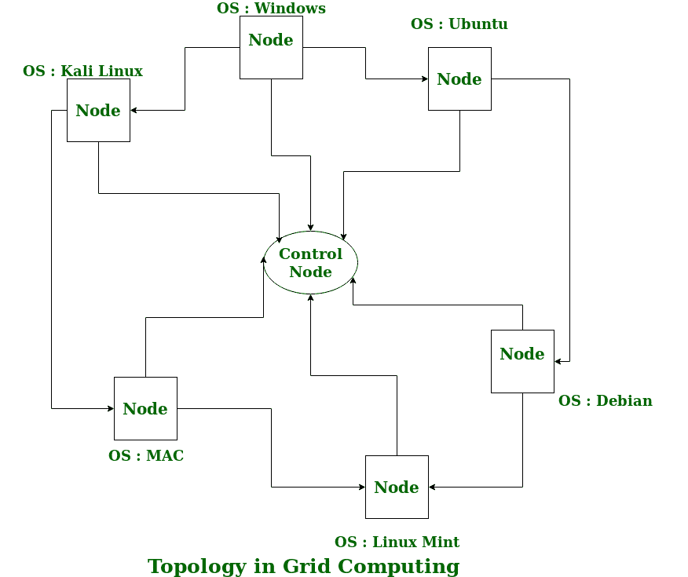

# 网格计算

> 原文:[https://www.geeksforgeeks.org/grid-computing/](https://www.geeksforgeeks.org/grid-computing/)

**网格计算**可以定义为一个由计算机组成的网络，这些计算机一起工作来执行一项对单台机器来说相当困难的任务。该网络上的所有机器都在同一协议下工作，就像一台虚拟超级计算机。他们从事的任务可能包括分析庞大的数据集或模拟需要高计算能力的情况。网络上的计算机为网络贡献了处理能力和存储容量等资源。

网格计算是分布式计算的一个子集，其中虚拟超级计算机由网络上的机器组成，这些机器通过一些总线连接，大多数是以太网，有时是互联网。它也可以被视为[并行计算](https://www.geeksforgeeks.org/introduction-to-parallel-computing/)的一种形式，在这种形式中，一台机器上没有许多 CPU 内核，而是包含分布在不同位置的多个内核。网格计算的概念并不新鲜，但它还没有完善，因为没有标准的规则和协议被人们建立和接受。

**工作:**
网格计算网络主要由这三种机器组成

1.  **控制节点:**
    一台计算机，通常是一台服务器或一组服务器，管理整个网络，并保存网络池中资源的账户。
2.  **提供者:**
    在网络资源池中贡献其资源的计算机。
3.  **用户:**
    使用网络上资源的计算机。

当计算机向控制节点请求资源时，控制节点会让用户访问网络上可用的资源。当它不使用时，它应该理想地将其资源贡献给网络。因此，节点上的普通计算机可以根据需要在用户和提供者之间摇摆。节点可以由使用相同操作系统的平台相似的机器组成，称为同构网络，或者由运行在不同操作系统上的平台不同的机器组成，称为异构网络。这是网格计算区别于其他分布式计算架构的地方。

为了控制网络及其资源，使用了一种软件/网络协议，通常称为**中间件**。它负责管理网络，而控制节点只是网络的执行者。由于网格计算系统应该只使用计算机中未使用的资源，因此控制节点的工作是确保任何提供者都不会因任务而过载。

中间件的另一项工作是授权网络上正在执行的任何进程。在网格计算系统中，提供者允许用户在其计算机上运行任何东西，因此这对网络是一个巨大的安全威胁。因此，中间件应该确保网络上没有不需要的任务。

根据伊恩·福斯特和卡尔·凯塞尔曼在 1999 年出版的《网格:新计算基础设施的蓝图》，网格计算一词的含义多年来一直在变化，其思想是消耗计算能力，就像电力从电网中消耗一样。这个想法类似于当前的云计算概念，而现在网格计算被视为一个分布式协作网络。目前，网格计算正被各种机构用来解决许多数学、分析和物理问题。

**网格计算的优势:**

1.  它不是集中式的，因为不需要服务器，除了控制节点，它只是用于控制而不是处理。
2.  多个异构机器，即具有不同操作系统的机器可以使用单个网格计算网络。
3.  任务可以跨不同的物理位置并行执行，用户不必为此付费(用钱)。