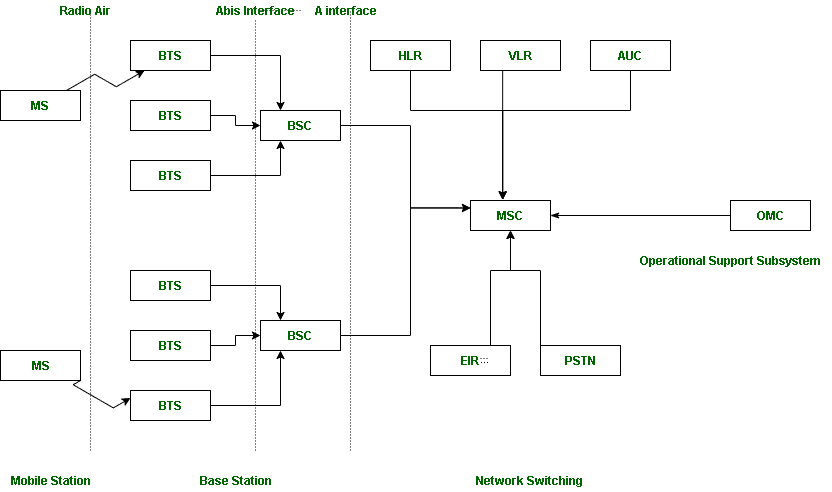

# 无线通信中的 GSM

> 原文:[https://www . geesforgeks . org/GSM-in-wireless-communication/](https://www.geeksforgeeks.org/gsm-in-wireless-communication/)

[**GSM**](https://www.geeksforgeeks.org/gsm-full-form/) 代表**全球移动通信系统。** GSM 是一种用于移动通信的开放式数字蜂窝技术。它使用 4 个不同的频带，分别为 850 兆赫、900 兆赫、1800 兆赫和 1900 兆赫。它使用 FDMA 和时分多址的组合。本文包括了 GSM 架构的所有概念及其工作原理。

**GSM 使用 4 种不同大小的小区:**

1.  宏:在这个大小的小区里，安装了基站天线。
2.  微:在这个尺寸的小区里，天线高度小于平均屋顶高度。
3.  皮科:直径几米的小细胞。
4.  伞:它覆盖阴影(填充单元格之间的间隙)区域。

**GSM 的特点是:**

1.  支持国际漫游
2.  清晰的声音清晰
3.  支持多种手持设备的能力。
4.  频谱/频率效率
5.  低功耗手持设备。
6.  接入网络案例
7.  国际 ISDN 兼容性。

GSM 只不过是一个更大的系统，分为另外 3 个子系统。

1.  **BSS :** BSS 代表基站子系统。BSS 处理移动电话和网络交换子系统之间的流量和信令。BSS 有两个组成部分 **BTS** 和 **BSC。**
2.  **NSS :** NSS 代表网络与交换子系统。NSS 是 GSM 的核心网络。为网络中的移动电话执行呼叫和移动性管理功能。NSS 有不同的组成部分，如 **VLR，HLR** 和 **EIR。**
3.  **OSS :** OSS 代表操作子系统。开放源码软件是网络运营商监控系统的功能实体。 **OMC** 是 OSS 的一部分。

假设有 3 个移动站与该塔连接，该塔通过 TRX 连接到基站，然后进一步连接到基站控制器和移动交换中心。让我们了解不同组件的功能。

**1。MS :** MS 代表移动系统。移动台包括与移动网络通信所需的用户设备和软件。移动站=移动设备+用户识别模块。现在，这些移动站连接到塔上，塔通过 TRX 与基站相连。TRX 是一个收发信机，包括发射机和接收机。收发器有发送和接收两种性能。

**2。BTS :** BTS 代表基站收发信台，便于用户设备和网络之间的无线通信。每个塔都有基站。

**3。BSC :** BSC 代表基站控制器。BSC 有多个 BTS。您可以将基站控制器视为您所在区域的本地交换机，该区域有多个塔，多个塔有基站。

**4。MSC :** MSC 代表移动交换中心。MSC 与通信交换功能相关联，例如呼叫建立、呼叫释放和路由。呼叫跟踪、呼叫转移所有功能都在 MSC 级别执行。摩根士丹利资本国际还拥有 VLR、HLR、澳柯德、EIR 和 PSTN 等其他组件。

*   **VLR :** VLR 代表游客位置登记。VLR 是一个数据库，其中包含当前在 MSC 服务区域内的所有移动用户的准确位置。如果你要从一个州去另一个州，那么你的条目会被标记到 VLR 的数据库中。
*   **HLR :** HLR 代表归属位置寄存器。HLR 是一个包含被授权使用 GSM 网络的用户的相关数据的数据库..如果你在 HLR 购买 SIM 卡。HLR 就像一个家，里面包含了所有的数据，比如你的身份证明，你正在采取的计划，你正在使用的调音台等等。
*   **OMC :** OMC 代表运维中心。OMC 监控和维护 GSM 系统中每个移动台、基站控制器和移动交换中心的性能。
*   **AUC :** AUC 代表认证中心。AUC 认证想要在网络中连接的移动用户。
*   **EIR :** EIR 代表设备身份注册。EIR 是一个数据库，保存网络中所有允许或禁止的记录。如果你在网络中被禁止，你就不能进入网络，也不能打电话。
*   **PSTN :** PSTN 代表公共交换电话网。PSTN 与 MSC 连接。PSTN 最初是固定线路模拟电话系统的网络。现在其核心网络几乎完全数字化，包括移动和其他网络以及固定电话。我们家早期的固定电话除了 PSTN 什么都没有。

三个子系统基站、NSS 和开放源码软件通过一些接口相互连接。总共有三个接口:

1.  **空中接口:**空中接口又称 UM 接口。MS 和 BTS 之间的接口被称为 UM 接口，因为它是 ISDN 的 U 接口的移动模拟。
2.  **Abis 接口:**是连接 BTS 和 BSC 的 BSS 内部接口。
3.  **一个接口:**提供 BSS 和 MSC 之间的通信。

因此，这是 GSM 组件的完整架构和功能。