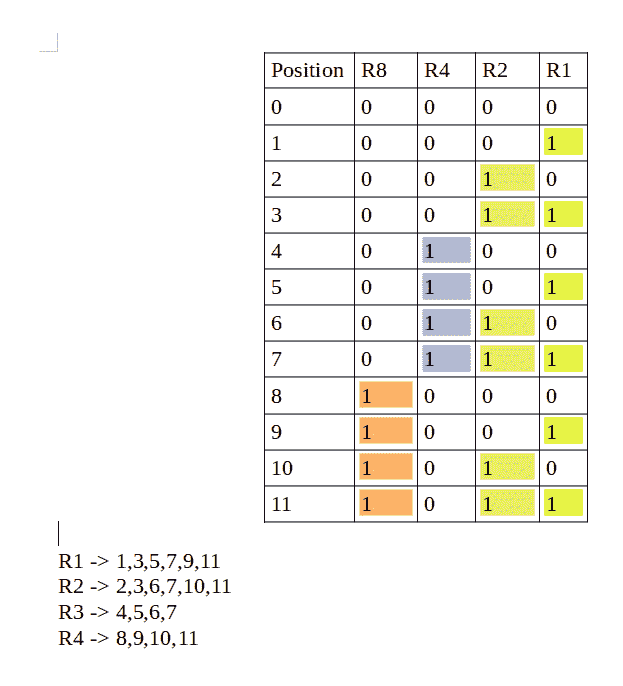
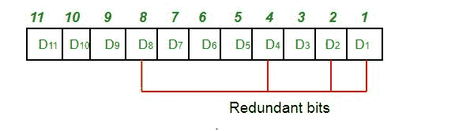
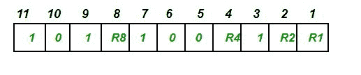
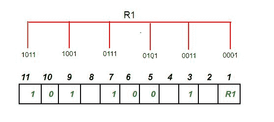
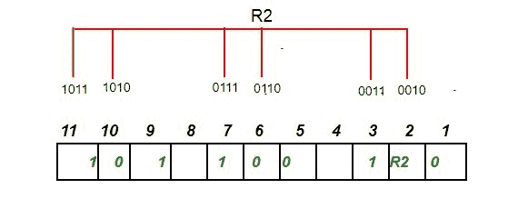
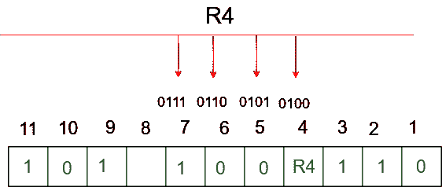
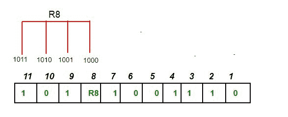
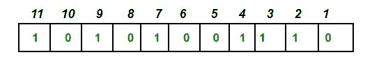
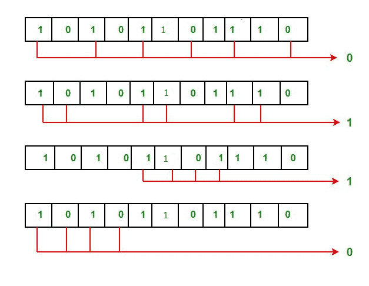

# 计算机网络中的汉明码

> 原文:[https://www . geesforgeks . org/hamming-code-in-computer-network/](https://www.geeksforgeeks.org/hamming-code-in-computer-network/)

汉明码是一组纠错码，可用于**检测和纠正数据从发送方移动或存储到接收方时可能出现的错误**。是海明研发的**纠错技术**。

**冗余位–**

冗余位是额外的二进制位，生成并添加到数据传输的信息携带位，以确保在数据传输过程中没有位丢失。
冗余比特的数量可以使用以下公式计算:

```
 2^r ≥ m + r + 1 
 where, r = redundant bit, m = data bit

```

假设数据位的数量为 7，则冗余位的数量可以使用以下公式计算:
= 2^4 ≥ 7 + 4 + 1
因此，冗余位的数量= 4

**奇偶校验位–**
奇偶校验位是附加在二进制位数据上的一个位，用于确保数据中 1 的总数是偶数还是奇数。奇偶校验位用于错误检测。奇偶校验位有两种类型:

1.  **偶校验位:**
    在偶校验的情况下，对于给定的一组位，1 的个数被计数。如果该计数是奇数，奇偶校验位值被设置为 1，使得出现 1 的总计数是偶数。如果给定的一组位中 1 的总数已经是偶数，则奇偶校验位的值为 0。
2.  **奇校验位–**
    在奇校验位的情况下，对于给定的一组位，计算 1 的数量。如果该计数是偶数，奇偶校验位值被设置为 1，使得出现 1 的总计数是奇数。如果给定的一组位中 1 的总数已经是奇数，则奇偶校验位的值为 0。

**汉明码的一般算法–**
汉明码只是使用额外的奇偶校验位来识别错误。

1.  以二进制形式从 1 开始写入位位置(1、10、11、100 等)。
2.  所有 2 的幂的位位置都标记为奇偶校验位(1、2、4、8 等)。
3.  所有其他位位置都标记为数据位。
4.  每个数据位都包含在一组唯一的奇偶校验位中，以二进制形式确定其位位置。
    **a.** 奇偶校验位 1 覆盖所有二进制表示在最低有效
    位置(1、3、5、7、9、11 等)包含 1 的位位置。
    **b.** 奇偶校验位 2 覆盖所有二进制表示包括从
    最低有效位(2、3、6、7、10、11 等)第二个位置的 1 的位位置。
    **c.** 奇偶校验位 4 覆盖所有二进制表示包括从
    最低有效位(4–7、12–15、20–23 等)第三个位置的 1 的位位置。
    **d.** 奇偶校验位 8 覆盖所有二进制表示包括从
    开始的第四个位置的 1 的位位置(8–15、24–31、40–47 等)。
    **即**一般来说，每个奇偶校验位覆盖奇偶校验位置和位位置的按位“与”为
    非零的所有位。

*   因为我们检查偶数奇偶校验，所以如果它检查的位置中的 1 的总数为
    奇数，则将奇偶校验位设置为 1。*   Set a parity bit to 0 if the total number of ones in the positions it checks is even.

    

    **确定冗余位的位置–**
    这些冗余位被放置在对应于 2 的幂的位置。
    如上例所示:

    1.  数据位的数量= 7
    2.  冗余位数= 4
    3.  总位数= 11
    4.  冗余位被放置在对应于 2- 1、2、4 和 8 的幂的位置

    

    假设要传输的数据是 1011001，这些位的位置如下:

    

    **确定奇偶校验位–**

    1.  R1 bit is calculated using parity check at all the bits positions whose binary representation includes a 1 in the least significant position.

        R1:第 1、3、5、7、9、11 位

        

        为了找到冗余位 R1，我们检查偶校验。由于对应于 R1 的所有比特位置中的 1 的总数是偶数，所以 R1 的值(奇偶校验位的值)= 0

    2.  R2 bit is calculated using parity check at all the bits positions whose binary representation includes a 1 in the second position from the least significant bit.

        R2:第 2、3、6、7、10、11 位

        

        为了找到冗余位 R2，我们检查偶校验。由于对应于 R2 的所有比特位置中的 1 的总数是奇数，所以 R2 的值(奇偶校验位的值)=1

    3.  R4 bit is calculated using parity check at all the bits positions whose binary representation includes a 1 in the third position from the least significant bit.

        R4:第 4、5、6、7 位

        

        为了找到冗余位 R4，我们检查偶校验。由于对应于 R4 的所有比特位置中的 1 的总数是奇数，所以 R4 的值(奇偶校验位的值)= 1

    4.  R8 bit is calculated using parity check at all the bits positions whose binary representation includes a 1 in the fourth position from the least significant bit.

        R8:第 8、9、10、11 位

        

        为了找到冗余位 R8，我们检查偶校验。由于对应于 R8 的所有比特位置中的 1 的总数是偶数，所以 R8 的值(奇偶校验位的值)=0。

        因此，传输的数据是:

        

**错误检测和纠正–**
假设在上面的例子中，在数据传输期间，第 6 位从 0 变为 1，那么它给出二进制数中的新奇偶校验值:

'

这些位给出的二进制数为 0110，其十进制表示为 6。因此，位 6 包含一个错误。为了纠正错误，第 6 位从 1 变为 0。