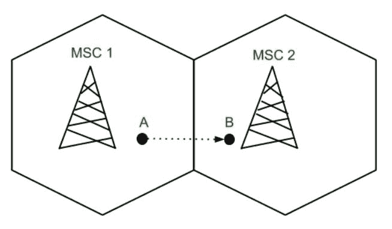
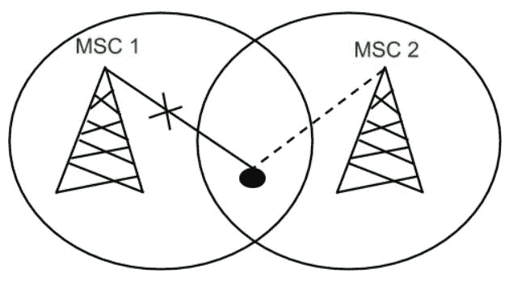
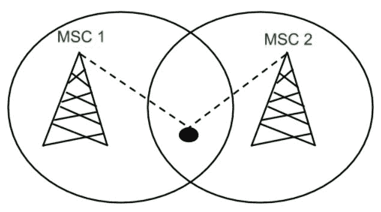

# 蜂窝电信中的切换

> 原文:[https://www . geeksforgeeks . org/蜂窝电信切换/](https://www.geeksforgeeks.org/handoff-in-cellular-telecommunications/)

在蜂窝电信中，术语**切换**或**切换**是指将正在进行的呼叫或数据连接从一个基站转移到另一个基站的过程。当一个移动站在通话过程中移动到不同的小区时，移动交换中心将呼叫转移到属于新基站的新信道。

当移动用户 A 从一个小区移动到另一个小区时，移动用户 A 的 BSC 1 信号强度损失，而 BSC 2 的信号强度增加，因此移动用户正在进行的呼叫或数据连接继续进行而不会中断。

**切换类型:**

1.  **Hard Handoff:**
    When there is an actual break in the connectivity while switching from one Base Station to another Base Station. There is no burden on the Base Station and MSC because the switching takes place so quickly that it can hardly be noticed by the users. The connection quality is not that good. Hard Handoff adopted the ‘break before make’ policy.

    

2.  **Soft Handoff:**
    In Soft Handoff, at least one of the links is kept when radio signals are added or removed to the Base Station. Soft Handoff adopted the ‘make before break’ policy. Soft Handoff is more costly than Hard Handoff.

    