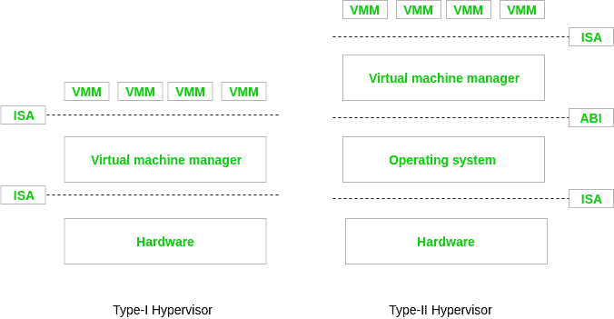

# 基于硬件的虚拟化

> 原文:[https://www . geesforgeks . org/基于硬件的虚拟化/](https://www.geeksforgeeks.org/hardware-based-virtualization/)

先决条件–[云计算中的虚拟化和类型](https://www.geeksforgeeks.org/virtualization-cloud-computing-types/)、[服务器虚拟化类型](https://www.geeksforgeeks.org/computer-network-types-server-virtualization/)、[虚拟机管理程序](https://www.geeksforgeeks.org/hypervisor/)
一种平台虚拟化方法，允许借助硬件功能(主要来自主机处理器)实现高效的完全虚拟化，该方法被称为计算中基于硬件的虚拟化。为了模拟完整的硬件环境或虚拟机，使用了完全虚拟化，其中不变的客户操作系统(使用公共指令集作为主机)在复杂的隔离中执行。

基于操作系统的虚拟化的不同逻辑层，其中虚拟机首先安装到完整的主机操作系统中，然后用于生成虚拟机。

可以运行客户操作系统的计算机硬件方面的抽象执行环境，称为硬件级虚拟化。在这种情况下，操作系统代表来宾，物理计算机硬件代表主机，其仿真代表虚拟机，虚拟机管理程序代表虚拟机管理器。当虚拟机被允许与硬件交互而没有来自主机操作系统的任何中间动作要求时，通常使得基于硬件的虚拟化更加有效。硬件虚拟化的一个基本组件是虚拟机管理程序，即虚拟机管理程序(VMM)。

基本上，有两种类型的虚拟机管理程序，描述如下:

*   **第一类虚拟机管理程序:**
    它运行在硬件的顶端。这就是为什么它们取代了操作系统。它们直接与底层硬件公开的 ISA 接口交互。
*   **Type-II 虚拟机管理程序:**
    要提供虚拟化服务，需要操作系统的支持。程序由操作系统管理，操作系统通过 ABI 与第二类虚拟机管理程序交互，并为客户操作系统模拟虚拟硬件的 ISA。

虚拟机管理程序有一个简单的用户界面，需要一些存储空间。它作为软件的薄层而存在，为了建立虚拟化管理层，它执行硬件管理功能。对于虚拟机的配置，设备驱动程序和支持软件得到了优化，但许多标准操作系统功能并未实现。本质上，为了提高允许多个虚拟机与同一硬件平台交互的协调所固有的性能开销，使用了这种类型的虚拟化系统。

硬件兼容性是基于硬件的虚拟化的另一个挑战。虚拟化层直接与主机硬件交互，这导致所有相关的驱动程序和支持软件必须与虚拟机管理程序兼容。因为其他操作系统可用的硬件设备驱动程序可能同样不适用于虚拟机管理程序平台。此外，主机管理和管理功能可能不包含操作系统共有的高级功能。

**基于硬件的虚拟化的优势–**
它减少了半虚拟化的维护开销，因为它减少(理想情况下，消除)了对客户操作系统的修改。获得增强的性能也非常方便。VMware 工程师和 Virtual Iron 提到了基于硬件的虚拟化的一个实际优势。

**基于硬件的虚拟化的缺点–**
基于硬件的虚拟化需要主机 CPU 中的明确支持，这在所有 x86/x86_64 处理器上可能不可用。一种“纯”的基于硬件的虚拟化方法，包括整个未修改的客户操作系统，涉及许多虚拟机陷阱，因此会出现 CPU 开销的快速增加，这限制了服务器整合的可扩展性和效率。使用半虚拟化驱动程序可以减轻这种性能损失；这种结合被称为“混合虚拟化”。