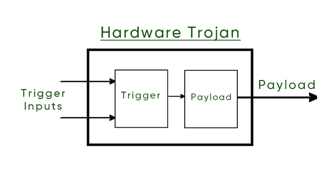
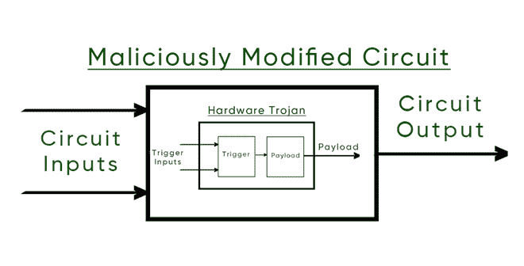

# 硬件木马

> 原文:[https://www.geeksforgeeks.org/hardware-trojan/](https://www.geeksforgeeks.org/hardware-trojan/)

就**硬件安全**而言，是对 IC 芯片电路的恶意修改。这是在芯片的设计或制造过程中完成的(即芯片在设计者可能不知道的情况下被修改。)

它有时也被称为**【HT】**。硬件木马或 HT 是隐藏在另一个更大的硬件中的东西，一个硬件。它在不可预测的时间醒来，并做一些对用户来说再次不可预测的事情。

**硬件木马(HT)分为两类–**

1.  物理表示(即它的行为、外观)
2.  它的行为(即它是如何出现的，它的影响是什么)

**硬件木马的属性–**

1.  它可以发生在制造前或制造后。
2.  它是由一些智力上的对手插入的。
3.  硬件开销极小。
4.  它是隐形的，几乎不可能被发现
5.  它导致集成电路在现场发生故障。

**如果硬件木马位于芯片内部，则会影响硬件木马–**

1.  潜在的灾难性后果。
2.  人命或财产的损失。

每当 **HT** 醒来，木马执行或执行的整个活动被称为**负载**。

**硬件木马的组件**–

它包含一个**触发器**和一个**有效载荷**

1.  触发器–触发器决定硬件特洛伊木马或超线程何时唤醒
2.  有效负载–有效负载决定特洛伊木马唤醒时会发生什么。

典型电路

硬件木马

恶意修改的电路

它被恶意放置在原始电路中。用户不知道这一点，因为大多数时候电路会表现正常，但有时它会在醒来时表现得不可预测/恶意。如上图所示。

**它可能被插入芯片的原因**–

1.  基于知识产权核心的设计盛行。
2.  电子设计自动化厂商对计算机辅助设计工具的日常使用。
3.  无工厂制造模型(即我们自己不设计它，我们给别人设计它，可能会发生一些事情)
4.  失去对设计和制造等的控制。

**硬件木马真的存在吗？**

1.  尚未获得硬件木马的具体证据。
2.  在晶圆厂篡改掩模并不容易，这是一个复杂的过程。
3.  单个集成电路的逆向工程可能需要数月时间

**但有一些证据表明它们确实存在–**

1.  无数可疑的军事/商业案件(早在 1976 年！！)
2.  集成电路的逆向工程被认为是由知名公司广泛实施的(IBM 拥有专利)