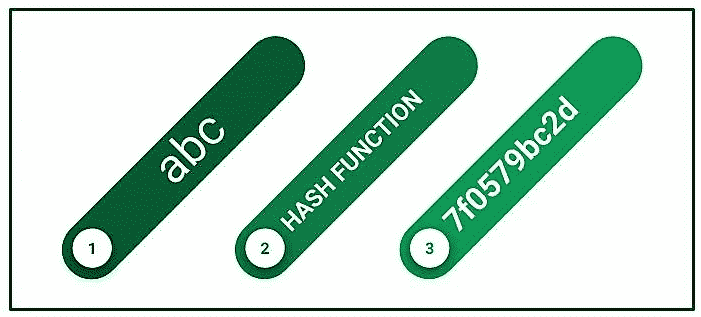
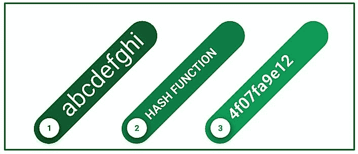
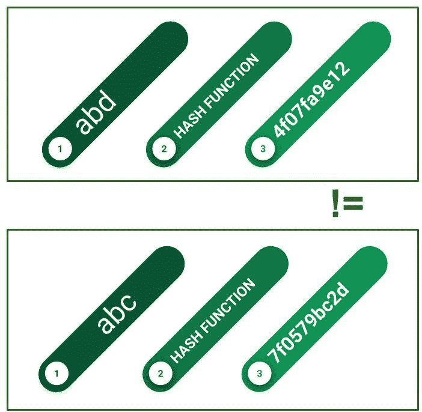
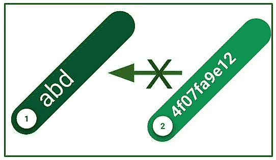

# 系统安全中的哈希函数

> 原文:[https://www . geesforgeks . org/hash-functions-system-security/](https://www.geeksforgeeks.org/hash-functions-system-security/)

哈希函数是一个在使系统安全方面具有巨大作用的函数，因为它将提供给它的正常数据转换为固定长度的不规则值。我们可以想象它是我们家里的一个摇床。
当我们把数据放入这个函数时，它输出一个不规则的值。它输出的不规则值被称为**“哈希值”**。哈希值只是数字，但通常用十六进制表示。计算机以二进制形式管理值。哈希值也是数据，通常用二进制管理。

哈希函数基本上是在计算机中执行一些计算。作为其输出的数据值是固定长度的。长度总是根据哈希函数而变化。即使有大值或小值，值也不会改变。

如果给定相同的输入，两个散列函数总是会产生相同的输出。即使输入的输入数据相差一位，它们的输出值也会发生巨大的变化。即使输入的输入数据差异很大，产生的哈希值完全相同的可能性也非常小。如果它们相等，则称为**“散列碰撞”。**

将哈希代码转换为其原始值是一项不可能完成的任务。这是加密作为散列函数的主要区别。

