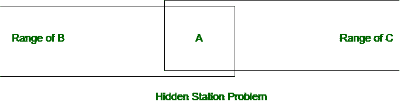
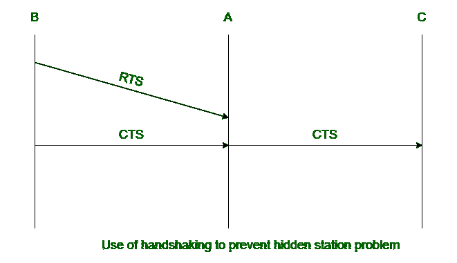

# 无线局域网中的隐藏站问题(HSP)

> 原文:[https://www . geesforgeks . org/hidden-station-problem-HSP-in-wireless-LAN/](https://www.geeksforgeeks.org/hidden-station-problem-hsp-in-wireless-lan/)

无线[局域网](https://www.geeksforgeeks.org/types-of-area-networks-lan-man-and-wan/)用于在不使用连接介质的情况下将数据从一台设备传输到另一台设备。无线局域网通常有几个问题。其中之一就是隐站问题(HSP)。

**隐藏站问题(HSP) :**
当两个站相互隐藏，即不在对方的范围内，同时向第三个站发送信号时，考虑第三个站是空闲的。它会在第三个站点引起冲突，这就是所谓的隐藏站点问题。由于冲突的可能性，它降低了网络的容量。下面是无线局域网中隐藏站问题的图示。

**HSP 是如何产生的？**
在上图中，B 站和 C 站都覆盖了自己范围内的 A 站。每个站 B 和 C 可以分别向站 A 发送数据。站点 B 和站点 C 都在彼此的范围之外。假设站 B 正在向站 A 发送数据，并且在传输的中间站 C 也必须向站 A 发送数据。由于站 B 和站 C 在彼此的范围之外，因此站 C 认为站 A 是空闲的。站 C 向站 A 发送数据，站 A 发生冲突

**如何预防 HSP？**
使用握手帧可以防止隐藏站问题(HSP)。

在下图中，来自 B 的 RTS 消息到达 A 而不是 C。然而，B 和 C 都在 A 的范围内。包含从 B 到 A 的数据传输持续时间的 CTS 消息到达 C。因此，C 知道一些隐藏站正在使用信道，并且直到该持续时间结束才传输。

**注意–**
握手的 CTS 帧防止来自隐藏站的碰撞。

**RTS :** 请求发送
T3】CTS:清除发送