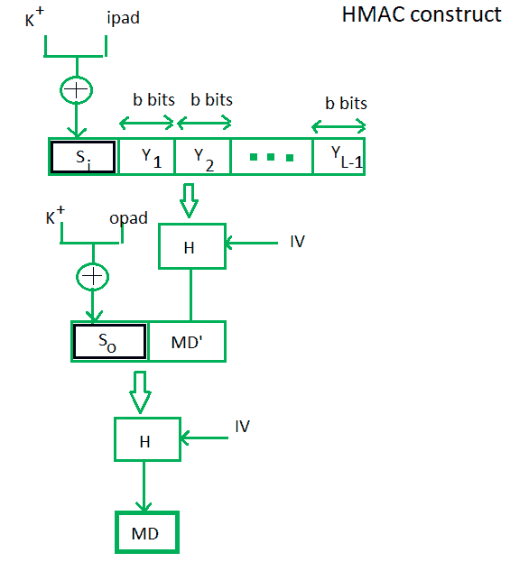
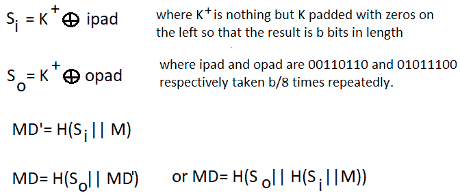

# 计算机网络中的 HMAC 算法

> 原文:[https://www . geesforgeks . org/hmac-计算机网络算法/](https://www.geeksforgeeks.org/hmac-algorithm-in-computer-network/)

**HMAC 算法**代表哈希或基于哈希的[消息认证码](https://www.geeksforgeeks.org/computer-network-message-authentication-code-works/)。这是从加密散列函数中开发媒体访问控制的工作成果。HMAC 对密码分析攻击有很强的抵抗力，因为它两次使用哈希概念。HMAC 由哈希和媒体访问控制的双重优势组成，因此比任何其他认证码都更安全。RFC 2104 已经发布了 HMAC，HMAC 已经被强制要求在知识产权安全中实施。FIPS 198 NIST 标准也发布了 HMAC。

**目标–**

*   作为哈希函数，HMAC 的目标也是单向的，即容易从输入生成输出，但反过来又很复杂。
*   它旨在比哈希函数更少地受到冲突的影响。
*   HMAC 重复使用 MD5 和 SHA-1 等算法，并检查以更安全的散列函数替换嵌入的散列函数，以防万一。
*   HMAC 试图以更简单的方式处理钥匙。

**HMAC 算法–**
HMAC 的工作开始于获取包含长度为 *b* 位的块的消息 M。一个输入签名被填充到消息的左边，整个签名作为散列函数的输入，给我们一个临时的消息摘要。“MD”再次被附加到一个输出签名上，并且整体再次被应用一个散列函数，结果是我们最终的消息摘要 MD。

这是 HMAC 的简单结构:

这里，H 代表 hashing 函数，
M 是原始消息
Si 和 So 分别是输入和输出签名，
Yi 是原始消息 M 中的第 I 个块，其中 I 的范围从[1，L)
L = M 中的块的计数
K 是用于 Hashing 的密钥
IV 是初始向量(某个常数)
输入签名和输出签名的生成分别是 *Si* 和 *So* 。

对于普通的散列函数，HMAC 在处理中添加了一个压缩实例。这种结构实现对于较短的媒体访问控制值保持了效率。