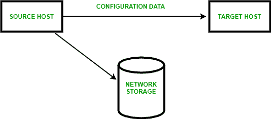
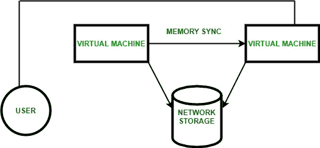

# 冷热迁移

> 原文:[https://www.geeksforgeeks.org/hot-and-cold-migrations/](https://www.geeksforgeeks.org/hot-and-cold-migrations/)

**1。冷迁移:**
断电的虚拟机被转移到单独的主机或数据存储。虚拟机的电源状态为关闭，不需要公共共享存储。缺少 CPU 检查，短缺时间长。日志文件和配置文件从源主机迁移到目标主机。

第一台主机的虚拟机将关闭，并在下一台主机上再次启动。在将应用程序和操作系统移动到物理设备之前，它们会在虚拟机上终止。用户可以选择将相关磁盘从一个数据存储移动到另一个数据存储。

**2。热迁移:**
通电的虚拟机从一台物理主机移动到另一台物理主机。源主机状态被克隆到目标主机，然后该源主机状态被丢弃。完成状态转移到目标主机。网络被移动到目标虚拟机。

需要一个公共共享存储，并投入使用 CPU 检查。短缺时间很少。在不中断操作系统或应用程序的情况下，它们会从虚拟机转移到物理机。物理服务器被释放用于维护目的，工作负载(位于物理服务器之间)被动态平衡，以便在优化的级别上运行。客户停机是很容易避免的。

挂起第一台主机的虚拟机，然后跨中央处理器和内存的寄存器克隆它，稍后在第二台主机上再次恢复。此迁移在源系统运行时运行。

*   **阶段-0:**
    是迁移前阶段，主主机上有正常运行的虚拟机。
*   **阶段-1:**
    是在目标主机上初始化容器的保留阶段。
*   **阶段-2:**
    是迭代预拷贝阶段，在此阶段启用卷影分页，并连续克隆所有脏页。
*   **阶段-3:**
    是停止和复制，其中第一台主机的虚拟机被挂起，所有剩余的虚拟机状态在第二台主机上同步。
*   **阶段-4:**
    是承诺，其中第一台主机上的虚拟机状态最小化。
*   **阶段-5:**
    是激活阶段，第二台主机的虚拟机启动并与所有本地计算机建立连接，恢复所有正常活动。

