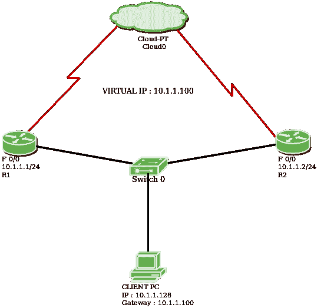

# 热备用路由器协议(HSRP)

> 原文:[https://www . geesforgeks . org/热备用-路由器-协议-hsrp/](https://www.geeksforgeeks.org/hot-standby-router-protocol-hsrp/)

热备用路由器协议(HSRP)是思科专有协议，为本地子网提供冗余。在 HSRP，两台或两台以上的路由器会给人一种虚拟路由器的错觉。

HSRP 允许您将两台或多台路由器配置为备用路由器，一次只将一台路由器配置为活动路由器。单个 HSRP 组中的所有路由器共享一个 MAC 地址和 IP 地址，该地址充当本地网络的默认网关。*活动路由器*负责转发流量。如果出现故障，*备用路由器*将承担活动路由器的所有责任，并转发流量。

#### 与 HSRP 有关的一些重要术语:

1.  **虚拟 IP :** 来自本地子网的 IP 地址被分配为网络中所有本地主机的默认网关。
2.  **虚拟 MAC 地址** : MAC 地址由 HSRP 自动生成。前 24 位将是默认的 CISCO 地址(即 0000.0c)。接下来的 16 位是 ***HSRP ID*** (即 07.ac)。接下来的 8 位将是十六进制的组号。例如，如果组号是 10，那么最后 8 位将是 0a。

    虚拟媒体访问控制地址示例–

    ```
    0000.0c07.ac0a
    ```

3.  **Hello 消息:**活动路由器和备用路由器定期交换的消息。这些消息每 3 秒交换一次，告知路由器的状态。
4.  **按住定时器:**其默认值为 10 秒，即约为 hello 消息值的 3 倍。这个计时器告诉我们关于路由器的信息，如果没有按时收到 hello 消息，备用路由器将等待多长时间。

    > **注意:**如果活动路由器出现故障,那么备用路由器将成为活动路由器

5.  **优先级:**默认情况下，优先级值为 100。当活动路由器在故障后返回时很有帮助，我们可以将备用路由器(在原来的活动路由器停机后成为活动路由器)的优先级更改为小于 100，因此它再次成为备用路由器。

    > **注意:**优先级较高的路由器将成为活动路由器

6.  **抢占:**是备用路由器自动成为活动路由器的状态。

#### 工作:

具有相同组标识的成员是同一组的成员。组中的一个成员将被选为活动路由器，而其他成员仍将作为备用路由器。虚拟 IP 被配置为本地子网中所有主机的默认网关，活动路由器负责转发本地主机的流量。如果活动路由器出现故障，则活动路由器和备用路由器之间不会交换 hello 消息，因此备用路由器会一直等待，直到保持计时器计时结束。一旦保持时间结束，备用路由器将成为活动路由器，并承担活动路由器的所有责任。这就是所谓的抢占。
如果原来的活动路由器回来了，那么我们可以降低备用路由器的优先级，让它再次成为备用路由器。

#### 热备用路由器协议(HSRP)有**2-版本**:

**版本 1 :** 消息在 224.0.0.2 组播，使用 UDP 端口 1985。此版本允许组号范围从 0 到 255。
**版本 2 :** 消息在 224.0.0.102 组播，使用 UDP 端口 1985。此版本允许组号范围从 0 到 4095。

#### 配置:


考虑上面给定的拓扑。有 2 台名为 **R1** 和 **R2** 的路由器。R1 (f 0/0)的 IP 地址为 10.1.1.1/24，R2 (f 0/0)的 IP 地址为 10.1.1.2/24。

**为路由器 R1 分配 IP 地址。**

```
r1#(config) int fa0/0
r1#(config-if)ip add 10.1.1.1 255.255.255.0
```

**为路由器 R2 分配 IP 地址。**

```
r2#(config) int fa0/0
r2#(config-if)ip address 10.1.1.2 255.255.255.0
```

现在，让我们提供虚拟 IP 地址(10.1.1.100)、组名 *HSRP_TEST* 、组号 1 和优先级 110。此外，抢占已启用，即如果活动路由器关闭，备用路由器将自动成为活动路由器。

```
r1#(config-if) standby 1 ip 10.1.1.100
r1#(config-if) standby 1 name HSRP_TEST
r1#(config-if) standby 1 priority 110
r1#(config-if) standby 1 preempt
```

现在，我们将提供虚拟 IP 地址(10.1.1.100)、组名 *HSRP_TEST* 和优先级 100。此外，组号 1 和抢占已启用。

```
r2#(config) int fa0/0
r2#(config-if) standby 1 ip 10.1.1.100
r2#(config-if) standby 1 name HSRP_TEST
r2#(config-if) standby 1 priority 100
r2#(config-if) standby 1 preempt
```

**注意:**由于我们为 r1 提供了优先级 110，因此它将成为活动路由器。