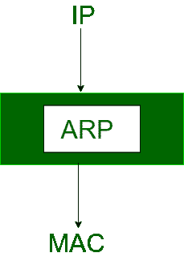
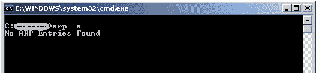
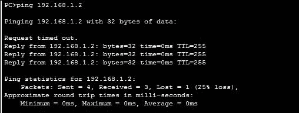
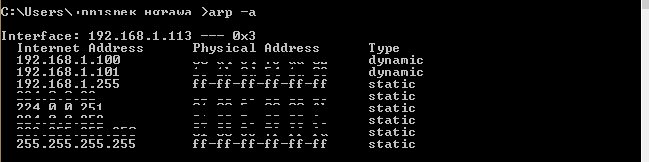

# 地址解析协议(ARP)是如何工作的？

> 原文:[https://www . geesforgeks . org/how-address-resolution-protocol-ARP-works/](https://www.geeksforgeeks.org/how-address-resolution-protocol-arp-works/)

大多数计算机程序/应用程序使用**逻辑地址(IP 地址)**来发送/接收消息，然而，实际通信发生在**物理地址(MAC 地址)**上，即来自 OSI 模型的第 2 层。因此，我们的任务是获取目的 MAC 地址，这有助于与其他设备通信。这就是 ARP 出现的原因，它的功能是将 IP 地址转换成物理地址。



首字母缩写 ARP 代表**地址解析协议**，它是 OSI 模型中网络层最重要的协议之一。
**注意:** ARP 从主机已知的 IP 地址中找到主机的硬件地址，也称为媒体访问控制(MAC)地址。


让我们看看 ARP 是如何工作的。

想象一下，一台设备想要通过互联网与另一台设备进行通信。ARP 是做什么的？它是否向源网络的所有设备广播数据包。
网络设备将数据链路层的报头从**协议数据单元(PDU)** 的被叫帧中剥离出来，并将数据包传输到网络层(OSI 的第 3 层)，在网络层，数据包的网络标识与数据包的目的 IP 的网络标识进行验证，如果相等，那么它将使用目的 MAC 地址响应源，否则数据包将到达网络网关，并将数据包广播到与其连接的设备，并验证它们的网络标识

上述过程一直持续到路径中的第二个最后一个网络设备到达目的地，在那里它得到验证，而 ARP 反过来用目的地 MAC 地址进行响应。

**ARP:** ARP 代表( **地址解析协议**)它负责从已知的 IP 地址中找到主机的硬件地址有三个基本的 **ARP** 术语。
与 **ARP** 相关的重要术语有:

㈠反向 ARP

(二)代理 ARP

(三)逆向 ARP

1.  **ARP 缓存:**解析完 MAC 地址后，ARP 会将其发送到源端，并存储在表中以备将来参考。后续通信可以使用表中的媒体访问控制地址
2.  **ARP 缓存超时:**表示 ARP 缓存中的 MAC 地址可以驻留的时间
3.  **ARP 请求:**这只不过是通过网络广播一个数据包，以验证我们是否遇到了目的 MAC 地址。
    1.  发件人的实际地址。
    2.  发件人的 IP 地址。
    3.  接收器的物理地址是 FF:FF:FF:FF:FF:FF:FF 或 1
    4.  接收方的 IP 地址
4.  **ARP 响应/回复:**是源从目的地接收的 MAC 地址响应，有助于数据的进一步通信。

*   **CASE-1:** 发送方是一台主机，想要向同一网络上的另一台主机发送数据包。
    *   使用 ARP 查找另一台主机的物理地址
*   **CASE-2:** 发送方是主机，想要向另一个网络上的另一台主机发送数据包。
    *   发送方查看其路由表。
    *   找到此目的地的下一跳(路由器)的 IP 地址。
    *   使用 ARP 查找路由器的物理地址
*   **CASE-3:** 发送方是路由器，接收到目的地为另一网络主机的数据报。
    *   路由器检查它的路由表。
    *   找到下一台路由器的 IP 地址。
    *   使用 ARP 查找下一台路由器的物理地址。
*   **CASE-4:** 发送方是收到目的地为同一网络中主机的数据报的路由器。
    *   使用 ARP 查找该主机的物理地址。

**注意:**ARP 请求是广播，ARP 响应是单播。

**测试自己:**


用交叉电缆连接两台电脑，比如 A 和 B。现在，您可以通过键入以下命令来查看 ARP 的工作情况:

```
1\. A > arp -a
```

餐桌上不会有任何条目，因为他们从未交流过。



```
2\. A > ping 192.168.1.2

IP address of destination is 192.168.1.2
Reply comes from destination but one packet is lost because of ARP processing.
```



现在，通过键入命令可以看到 ARP 表的条目。
这就是 ARP 表的样子:



本文由 **Vivek Reddy** 供稿。如果你喜欢 GeeksforGeeks 并想投稿，你也可以使用[write.geeksforgeeks.org](https://write.geeksforgeeks.org)写一篇文章或者把你的文章邮寄到 review-team@geeksforgeeks.org。看到你的文章出现在极客博客主页上，帮助其他极客。

如果你发现任何不正确的地方，或者你想分享更多关于上面讨论的话题的信息，请写评论。