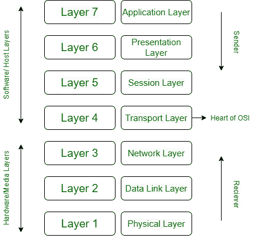
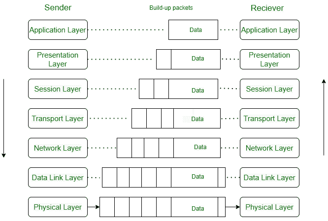

# 如何使用现场视察模型进行通信

> 原文:[https://www . geesforgeks . org/how-communication-once-use-OSI-model/](https://www.geeksforgeeks.org/how-communication-happens-using-osi-model/)

[开放系统互连(OSI)模型](https://www.geeksforgeeks.org/layers-of-osi-model/)是由国际标准化组织(ISO)创建的标准“**参考模型”**，用于描述网络通信中涉及的软件和硬件组件如何分工合作并相互作用。

现场视察模型定义了一组七层功能元素，从第 1 层(物理层)到第 7 层(应用层)的物理相互关系。传输控制协议和互联网协议是定义互联网的两个网络标准。IP 定义了计算机如何在一组相互连接的网络上相互接收数据。TCP 定义了这样的网络如何拥有更可靠的通信通道。

**现场视察模型中的层需求:**

1.  在两个设备之间建立通信和共享信息的链接的方法是复杂的。产生有利可图的交流需要很多任务。需要开发一个网络架构来执行所有这些功能。
2.  在网络体系结构中，各种任务和功能被分为相关的和可管理的集合，称为 LAYERS。网络体系结构可以定义为描述每一层如何工作的一组协议。协议隐藏在现场视察模型中，很容易随着技术的变化而改变。
3.  中间系统只需要几层，而不是所有层。协议分层使我们能够设计连续层放置到的系统或设备。它还允许服务不同于实现。

七层现场视察/国际标准化组织参考模型

**使用网络架构的原因和优势如下:**

1.  分层体系结构为更新和扩展网络服务提供了可变性。
2.  新服务和网络基础设施的管理变得更加容易。它消除了设计过程中的复杂性，因为每一层的功能及其协商是可区分的。
3.  分配给它们的层数、名称和功能可能因网络而异。但是对于所有的网络，总是下层提供一些上层的服务。
4.  分层架构的概念是看待网络的一种新方式。
5.  逻辑分段允许不同团队同时并行处理不同的任务。
6.  由于分段(分层结构)，有可能将复杂的问题分解成简单且更可行的任务。

**T2**现场视察/国际标准化组织模型中的通信过程:

使用国际标准化组织/开放系统互连模型的交换

1.  在较高层中，发送方的每一层都将其信息添加到从该层上方接收的消息中，并将整个包移到该层的正下方，如图所示。
2.  每一层都以标题的形式添加了信息。邮件头是在邮件级别(6、5、4、3 和 2)添加的。在数据链路层(第 2 层)添加报头。
3.  在物理层，通信是直接的，即发送方向接收方发送比特流。在物理层(第 1 层)，整个包被转换成可以传输到接收器的形式。在接收端，每个进程都伴随着一层一层地接收和删除消息数据。
4.  上层现场视察层总是在软件中实现(传输层、会话层、表示层、应用层(4、5))，下层是硬件和软件的组合(第 2、3 层)，除了主要是硬件的物理层。第 1 层、第 2 层和第 3 层(即物理层、数据链路层和网络层)是网络支持层。它们处理将数据从一台设备移动到另一台设备的物理方面，如电气规格、物理连接、物理地址以及传输时间和可靠性。第 4 层，传输层端到端确保可靠的数据传输。
5.  并非所有应用程序都需要使用七层。下面三层对于大多数应用来说已经足够了。每一层都由电子电路和/或软件组成，并且与其余层分开存在。
6.  假设每一层都处理来自其上面或下面的层的消息或数据。这是通过遵循协议规则来完成的。
7.  因此，每一层从相邻层获取数据，根据这些规则对其进行处理，然后将处理后的数据发送到另一侧的下一层。