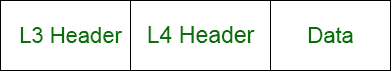
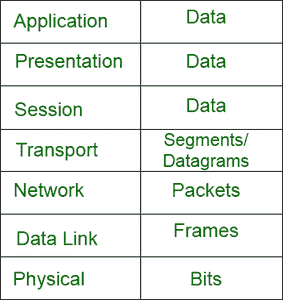
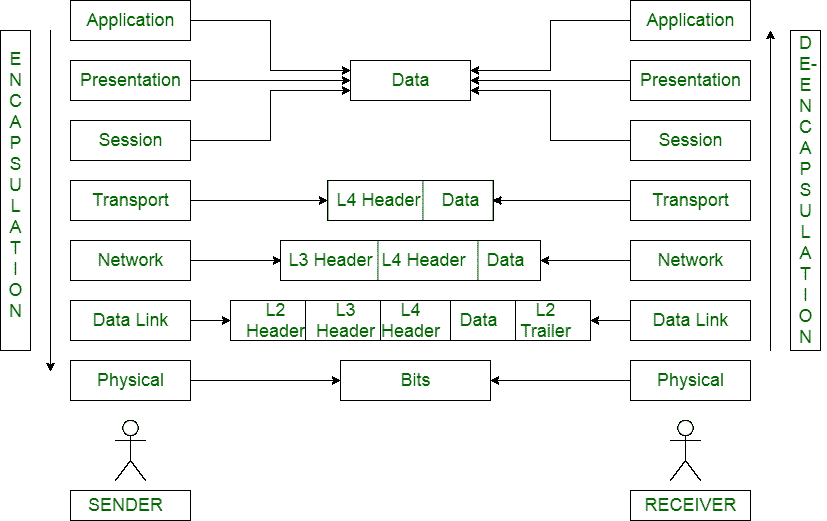

# 数据封装&解封装是如何工作的？

> 原文:[https://www . geesforgeks . org/how-data-encapsulation-de-encapsulation-works/](https://www.geeksforgeeks.org/how-data-encapsulation-de-encapsulation-works/)

**数据封装:**
封装是数据在 OSI 或 TCP/IP 模型中传输时添加附加信息的过程。附加信息已添加到发送方，从应用层开始到物理层。

**封装工作:**

*   在 TCP/IP 模型的应用层或现场视察模型的应用、演示、会话层，用户数据中不会添加额外的信息。
*   然后会话层将数据发送到传输层。
*   在传输层，数据被分成不同的部分。它在每个中断的数据中添加报头，其中包含源端口、目的端口、序列号等信息。现在，一切都组合成一个新的形式。
*   传输层中封装的数据称为数据段或数据报。如果传输使用 TCP，那么它被称为数据段，或者 UDP 被称为数据报。

*   现在，数据将向下传输并到达网络层。这里，添加了第 3 层报头。它包含源 IP、目标 IP 等信息。这些信息组合成一种新的形式。网络层中封装的数据称为数据包。

*   现在，网络层将数据包发送到数据链路层。当数据包进入数据链路层时，会添加一个新的报头(第 2 层)。
*   另外，还添加了一个预告片。它包含源媒体访问控制地址、目的媒体访问控制地址等信息。拖车用于错误检查。数据链路层中封装的数据称为帧。

*   物理层从数据链路层获取帧。物理层中封装的数据称为位。
*   封装就是这样发生的。

**协议数据单元(PDU) :**
封装的数据在向下传输到下面的层时会被称为不同的名称。这些名称被称为协议数据单元。下表显示了每个层中封装数据的名称。

协议数据单元

**解封装:**
解封装是与封装完全相反的过程。发送方添加的附加信息(在封装过程中)在接收方从物理层传输到应用层时会被移除。

**解封装工作:**

*   物理层获取这些位，并将其解封装成帧，然后将其发送到上层。
*   数据链路层接收帧并检查媒体访问控制地址是否匹配。如果一切匹配，也没有发现错误。然后移除第 2 层报头和第 2 层尾部。它对发送到上层的数据和数据包进行解封装。
*   网络层从数据链路层接收数据包。它会检查 IP 地址。如果匹配，则删除第 3 层的标头。现在，解封装的数据包被传送到传输层。
*   现在，传输层从网络层获取数据段/数据报，并删除第 4 层报头。
*   在通过会话层、表示层和应用层之后，解封装的数据被发送到接收器。
*   这就是解封装的过程。

**封装&解封装**