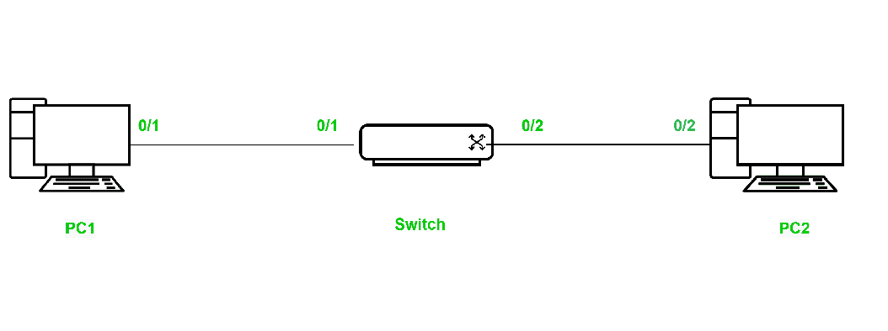
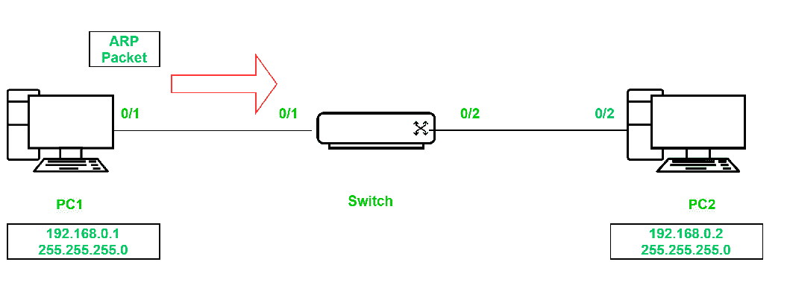
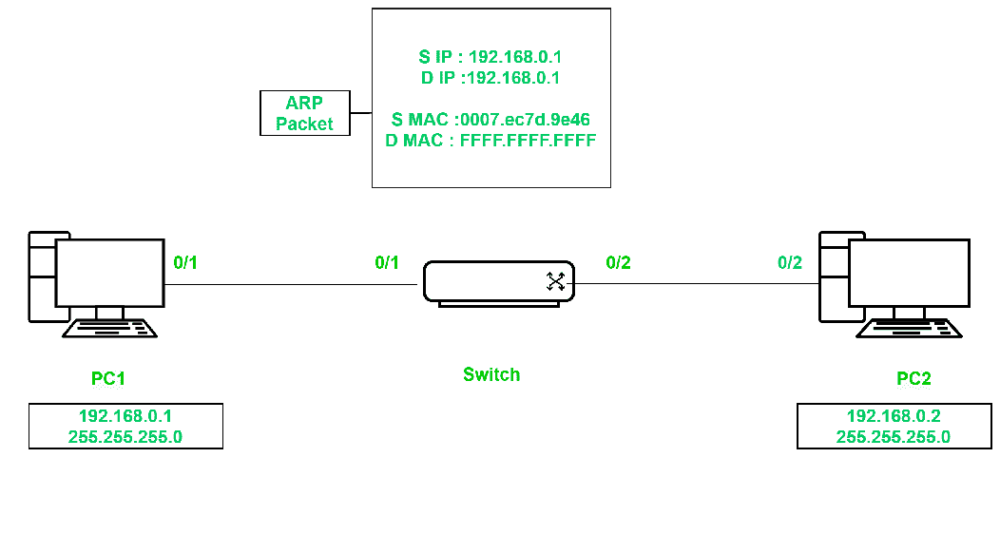
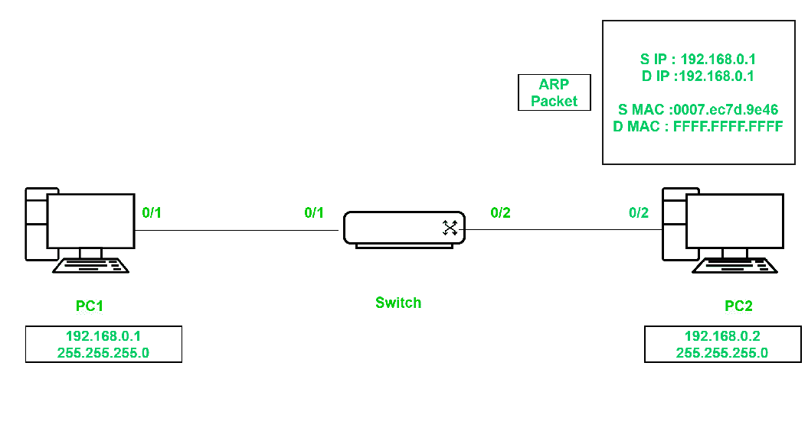

# 交换机如何在 PING 过程之前获知个人电脑的媒体访问控制地址？

> 原文:[https://www . geeksforgeeks . org/交换机如何在 ping 进程之前学习 PC MAC 地址/](https://www.geeksforgeeks.org/how-does-a-switch-learn-pc-mac-address-before-the-ping-process/)

交换机具有一定的智能，其网络设备在现场视察模型的第 2 层数据链路层运行。在这里，我们将看到交换机如何在交换机和个人电脑之间的 PING 过程之前获知终端设备个人电脑的媒体访问控制地址。

让我们以两台连接到交换机的电脑为例。注意:电脑没有分配 IP 地址。



中间有一个交换机，两台电脑连接到交换机以太网端口。两台电脑都有媒体访问控制地址，交换机维护媒体访问控制地址表，它将学习网络中的所有媒体访问控制地址。

通常，交换机以周期性的时间间隔发送第 2 层协议帧，如 STP(生成树协议)、CDP(思科发现协议)和 DTP(动态中继协议)。这些帧有一个多播目的地媒体访问控制地址，因此这些帧将被泛洪到两台电脑**。**

如您所知，PC 是第 3 层设备，它没有接受第 2 层协议帧的服务。因此它将**丢弃**帧，并且永远不会发送回回复开关。所以没有机会通过交换机学习 PC MAC 地址。

此时，当我们在 switch 中运行该命令时，您将在 MAC 地址表中看不到任何条目。

**媒体访问控制地址表**

```
Switch#show mac-address-table  
         Mac Address Table
-------------------------------------------

Vlan    Mac Address       Type        Ports
----    -----------       --------    -----
```

假设将 IP 地址 **192.168.0.1 255.255.255.0** 分配给 PC1。它会立即生成一个带有广播目的 mac 地址 **FFFF 的 ARP 数据包。FFFF.FFFF** 和目的地 IP 地址及其自己的 IP 地址 **192.168.0.1** 。

另请注意，在此数据包中，您可以看到 PC1 的源 MAC 地址和源 IP 地址。



既然是广播帧，就会被淹没到网络上。交换机收到数据包后，会获知 **PC1、**的 MAC 地址，并在 MAC 地址表中更新。



现在，如果您在交换机中运行该命令，您将在 MAC 地址表中看到 **PC1** MAC 地址条目。

**媒体访问控制地址表**

```
Switch#show mac-address-table  
         Mac Address Table
-------------------------------------------
Vlan    Mac Address       Type        Ports
----    -----------       --------    -----
  1    0007.ec7d.9e46    DYNAMIC     Fa0/1
```

**PC2** 也收到数据包，会先检查目的 MAC 地址。由于它是广播媒体访问控制地址，它将接受并发送到第 3 层。在第 3 层，它将检查目的地 IP 地址。目的 IP 地址必须是一个 **PC2** IP 地址，但是这里它有 **PC1** IP 地址，所以它会**丢弃**数据包。



因此，交换机甚至在数据流量或 PING 过程之前就能获知个人电脑的媒体访问控制地址。