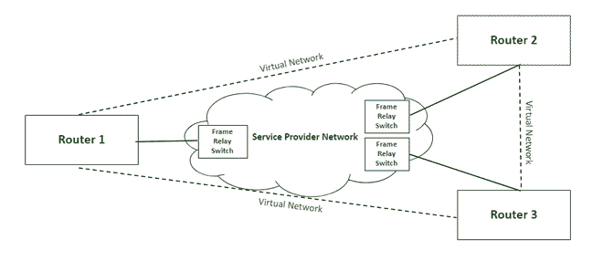

# 帧中继是如何工作的？

> 原文:[https://www.geeksforgeeks.org/how-does-frame-relay-work/](https://www.geeksforgeeks.org/how-does-frame-relay-work/)

帧中继是一种分组交换网络协议，设计用于网络的数据链路层。它用于连接局域网，并通过广域网传输数据。它是点对点网络的更好替代方案，用于连接需要在每对节点之间建立单独专用链路的多个节点。它允许传输不同大小的数据包和动态带宽分配。此外，它还提供了一种拥塞控制机制，以减少因拥塞而导致的网络开销。它没有错误控制和流管理机制。

帧中继网络

### **工作:**

帧中继交换机建立虚拟电路来连接多个局域网以构建广域网。帧中继通过将数据划分为称为帧的数据包，并通过网络传输这些数据包，从而在广域网上的局域网之间传输数据。它支持通过共享物理链路或专用线路与多个局域网通信。

帧中继网络建立在局域网边界设备(如路由器)和连接所有局域网的服务提供商网络之间。每个局域网都有一条接入链路，将局域网的路由器连接到由帧中继交换机端接的服务提供商网络。接入链路是用于通过广域网与其他局域网通信的专用物理链路。帧中继交换机负责终止接入链路并提供帧中继服务。

对于数据传输，局域网的路由器(或其他与接入链路相连的边界设备)通过接入链路发送数据包。帧中继交换机检查局域网发送的数据包，以获得指示数据包目的地的数据链路连接标识符(DLCI)。帧中继交换机已经拥有连接到网络的局域网地址信息，因此它可以通过查看数据包的 DLCI 来识别目的局域网。DLCI 基本上识别了源网络和目的网络之间的虚电路(即节点之间并不真正存在的逻辑路径)。它配置数据包并将其传输到目的局域网的帧中继交换机，后者再通过各自的接入链路将数据包发送到目的局域网。因此，通过这种方式，一个局域网与多个其他局域网通过共享一条物理链路来进行数据传输。

帧中继还处理网络中的拥塞。以下方法用于识别网络中的拥塞:

1.  **前向显式拥塞网络(FECN)–**
    FECN 是帧头的一部分，用于通知目的地网络中的拥塞。每当帧在传输过程中遇到拥塞时，目的网络的帧中继交换机都会设置数据包的 FECN 位，以允许目的地识别该数据包在传输过程中遇到了一些拥塞。
2.  **反向显式拥塞网络(BECN)–**
    BECN 是帧头的一部分，用于通知源网络中的拥塞。每当一个帧在传输过程中遇到拥塞时，目的地会将一个带有设置的 BECN 位的帧发送回源，这样源就可以识别出发送的数据包在到达目的地时遇到了一些拥塞。一旦源识别出虚拟电路中的拥塞，它就会减慢传输速度，以避免网络开销。
3.  **丢弃资格(DE)–**
    DE 是帧头的一部分，用于指示丢弃数据包的优先级。如果源在某个虚拟网络上产生大量流量，那么它可以设置不太重要的数据包的 DE 位，以指示在网络开销的情况下丢弃数据包的高优先级。在网络拥塞的情况下，设置了去重位的数据包会先于未设置去重位的数据包被丢弃。

### 类型:

1.  **永久虚电路(PVC)–**
    这些是帧中继节点之间长期存在的永久连接。即使不在使用中，它们也总是可用于通信。这些连接是静态的，不会随着时间而改变。
2.  **交换虚拟电路(SVC)–**
    这些是帧中继节点之间的临时连接，在节点相互通信期间存在，通信后关闭/丢弃。这些连接是根据需求动态建立的。

### 优点:

1.  高速的
2.  可攀登的
3.  减少网络拥塞
4.  经济高效
5.  安全连接

### 缺点:

1.  缺乏错误控制机制
2.  数据包传输延迟
3.  不太可靠