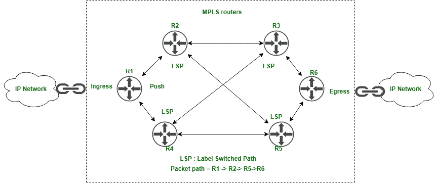

# 多协议标签交换(MPLS)路由是如何工作的？

> 原文:[https://www . geesforgeks . org/how-do-multi-protocol-label-switching-MPLS-routing-work/](https://www.geeksforgeeks.org/how-does-multiprotocol-label-switching-mpls-routing-work/)

**多协议标签交换(MPLS)** 是一种流量路由机制，它比传统的基于 IP 的路由机制具有显著的优势，MPLS 用于电信网络中，它在节点之间形成数据包传输。

在传统的基于 IP 的路由中，IP 数据报包由路由器进行分析，并根据它已经被路由器处理和转发的包所包含的源地址和目的地址(通过使用[路由表](https://www.geeksforgeeks.org/routing-tables-in-computer-network/)进行包转发)，该数据报沿着由路由协议(例如([【OSPF】](https://www.geeksforgeeks.org/open-shortest-path-first-ospf-protocol-states/)[【BGP】](https://www.geeksforgeeks.org/border-gateway-protocol-bgp/)、EGP)建立的路径，并完成定义的路由到达目的节点。

IP 地址是网络的标识和子网掩码，当路由器转发数据包时，路由表用于确定转发机制，数据包通过注册了包含最短优化路径的路由的接口发送到目的地。如果路由表中没有找到数据包的路由，则使用默认路由将数据包传输到目的地。

MPLS 于 1990 年末引入，它是一种比传统的基于 IP 的路由方法更有效的路由机制。

**描述:**
在 MPLS 中，每个路由器都需要在赋予自己的路由表之前，通过检查数据包目的地址来确定数据包的下一个路由器或下一个节点/希望(数据包需要在此传输)，对于实时应用中的音频和视频传输等实时场景，这一过程在时间消耗和性能方面都很慢且性能下降。

在传统的分组交换网络中，通过 IP 路由，数据包通过网络希望来决定自己的路由路径。这意味着数据报到目的地的动态路径流既不是预先确定的，也不是可预测的。在电路交换电信网络中，在源和目的地之间建立专用的电路路径，每个分组沿着这个预先确定的路由路径通过多个交换中心到达目的地 hope。发送方和接收方通过请求和确认已建立的电路来开始通信。该电路可以承载网络流量，例如数据、语音和视频流，但是这是可预测的和预先确定的路由路径，但是由于需要开发电路基础设施，因此成本极高并且难以扩展到大型网络。

为了克服这些困难，引入了多协议标签交换路由机制，通过建立动态路径来实现对动态网络路由路径的更多控制，动态路径看起来像是希望在网络基础设施内部建立连接。但是使用 MPLS 的动态路由是逻辑路径而不是物理路径。

**MPLS 是如何工作的？**
MPLS 路由机制适用于几乎所有类型的网络协议和传输通道，如 IP(互联网协议)、 [ATM(异步传输模式)](https://www.geeksforgeeks.org/asynchronous-transfer-mode-atm-in-computer-network/)、[以太网](https://www.geeksforgeeks.org/ethernet-frame-format/)。

数据报分组通过路由器被重定向，通过在电信网络中被称为标签交换路径(LSP)的每一个路由器传递给每个分组分配标签。该标签与整个 hope 网络中预先确定的路由相关联，当 hope 收到数据报时，它会动态地将该标签分配给数据报数据包，以将其传递给其他即将到来的跳。这意味着与分组交换网络相比，控制标签更高。

交换中使用的标签充当 MPLS 网络中的传输路径，由信令协议建立，这些补丁将语音和数据分组引导到网络中的最终目的地。

让我们通过一个例子来理解它的工作原理，当 pos 办公室将工作分配给邮递员来搜索、分类和查看每个包裹以了解其收件人的地址时，它会由于手动工作而使过程变慢，相反，如果它将使用自动传送带分类系统来搜索、分类包裹，通过扫描包裹顶部的条形码棒，由于自动系统处理，它将大大提高包裹处理和分类的速度，并且持续时间更长。

LSP 通过让数据包通过网络上的路由器，让每台路由器快速确定数据包的去向，从而提高速度并优化数据包传输过程。

当数据包通过 MPLS 网络时，它的标签被路由器交换。当数据包通过 MPLS 主干网的边界时，它会被检查、分类并分配一个标签。之后，这些数据包被转发到预设标签交换路径(LSP)的下一步。当数据包通过路径时，路径上的每台路由器都会使用该标签来确定数据报应该重定向路由到哪里。

**MPLS 优缺点:**

1.  与传统的 IP 路由相比，PLS 是动态的、可扩展的、通用的，具有更好的性能、更好的带宽利用率、减少网络流量拥塞。
2.  MPLS 是一个虚拟专用网，它本身不提供加密，它与公共互联网是分开的。这就是原因，MPLS 是数据分组相当安全的传输方式。并且不容易受到 DOS 攻击，从而影响基于 IP 的路由。
3.  另一方面，多协议标签交换是一种需要购买载波频率才能在网络中使用的机制，这就是为什么它比通过公共网络完成的传输成本更高的原因。
4.  只要组织扩大基础设施，就很难找到全球覆盖服务的 MPLS 服务提供商。这可能是昂贵且耗时的。
5.  MPLS 旨在当多个分支机构接收流量并将流量发送回主总部或数据中心时使用，它不适合分支机构直接希望访问云上可用数据的情况。

企业网络架构应该足够耐用，以确定 MPLS 的昂贵和更快的性能与公共互联网/内部网的更便宜和不太通用的性能之间的服务和风险。