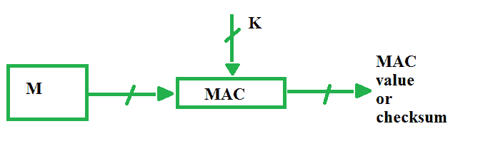
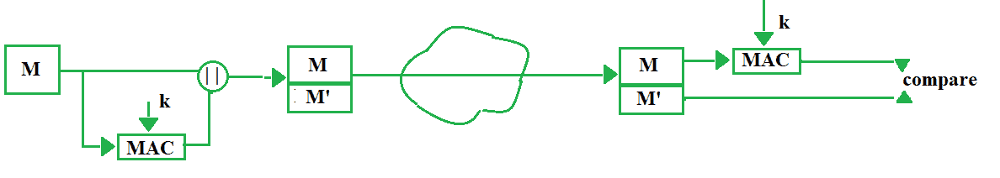
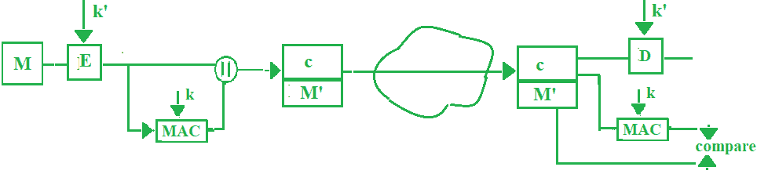

# 消息认证码是如何工作的？

> 原文:[https://www . geesforgeks . org/how-message-authentication-code-works/](https://www.geeksforgeeks.org/how-message-authentication-code-works/)

先决条件–[消息认证码](https://www.geeksforgeeks.org/message-authentication-codes/)
除了入侵者之外，两个人之间的消息传递还面临着噪音等其他外部问题，这些问题可能会改变发送者构建的原始消息。为了确保信息不被改变，有一个很酷的方法。



媒体访问控制代表消息认证码。在媒体访问控制中，发送方和接收方共享相同的密钥，发送方生成一个固定大小的输出，称为加密校验和或消息认证码，并将其附加到原始消息中。在接收者方面，接收者也生成代码，并将其与他/她收到的内容进行比较，从而确保消息的原创性。这些是组件:

*   消息
*   钥匙
*   媒体访问控制算法
*   媒体访问控制值

消息认证码有以下不同类型的模型:

1.  **没有加密的 MAC–**
    这个模型可以提供身份验证，但不能提供保密性，因为任何人都可以看到消息。
    
2.  **Internal Error Code –**
    In this model of MAC, sender encrypts the content before sending it through network for confidentiality. Thus this model provides confidentiality as well as authentication.

    ```
    M' = MAC(M, k)
    ```

    

3.  **External Error Code –**
    For cases when there is an alteration in message, we decrypt it for waste, to overcome that problem, we opt for external error code. Here we first apply MAC on the encrypted message ‘c’ and compare it with received MAC value on the receiver’s side and then decrypt ‘c’ if they both are same, else we simply discard the content received. Thus it saves time.

    ```
    c = E(M, k')
    M' = MAC(c, k)
    ```

    

**MAC 中的问题–**
如果我们做逆向工程，我们可以达到纯文本甚至是关键。在这里，我们已经将输入映射到输出，为了克服这一点，我们继续使用“单向”散列函数。

**注意–**符号“E”表示对称密钥加密。