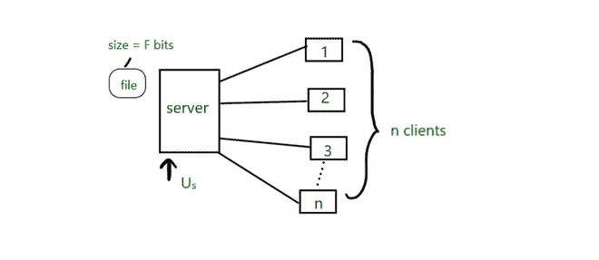
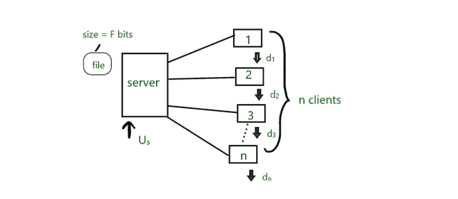
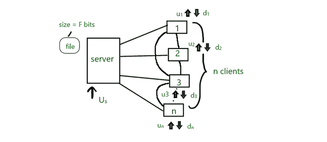
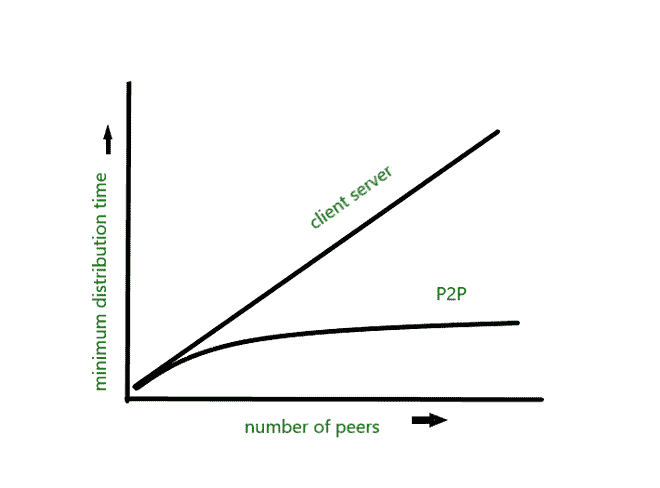

# P2P 如何自我扩展

> 原文:[https://www.geeksforgeeks.org/how-p2p-can-scale-by-itself/](https://www.geeksforgeeks.org/how-p2p-can-scale-by-itself/)

在本文中，我们将讨论客户端-服务器和对等的概述，并通过示例来理解两者，还将讨论 P2P 如何在这两种情况下自行扩展。我们一个一个来讨论。

**概述:**
要了解对等网络如何扩展，以及为什么它在某些方面比客户机-服务器架构更好，让我们首先了解什么是客户机-服务器。

[**客户端-服务器**](https://www.geeksforgeeks.org/client-server-model/) **:**
把服务器当成源，把客户端当成接收器。无论接收者想要什么，都可以询问消息来源，在大多数情况下，消息来源都会回复。但是如果被任何其他接收者(客户端)询问，这个接收者不能回复相同的查询。因此，这里的源(服务器)单独处理来自不同客户端的所有这些查询。现在，客户端要求的这些东西不需要仅仅是一些文本，而是可以是大尺寸的文件，可能是 GBs。现在事情会变得有点有趣。让我们借助一些图形来试着理解。



这会有一点帮助

**示例–**

*   假设有 n 个客户端，每个客户端同时想要一个 F 位大小的文件(为了简单起见)，该文件位于服务器上。服务器上传文件的速度是 Uₛ比特/秒。因此，服务器将上传 n × F 位，因为它将同时上传到每个连接的链接。

```
So, under ideal condition time taken = (n × F / Uₛ) sec...... equation-1
```

*   上面我们已经讨论了服务器在连接的每个链接上上传所需的时间。但是如果服务器的上传速度不是问题，而是客户端的下载速度呢。让我们再次使用一些图形。



与上面相同，增加了客户端的下载速度

*   现在假设服务器的上传速度超过了要求。现在所花费的时间将由客户端下载速度决定(表示为 d₁、d₂、d₃、…。我们图表中的 dₙ)准确地说是最低下载速度。

```
i.e. Dₘᵢₙ = min (d₁, d₂, d₃, ….dₙ)
```

*   要下载 F 位大小的文件，最慢的下载速度客户端(最慢)将

```
Take time = (F/Dₘᵢₙ) sec……………...equation-2
```

*   现在，这两个观察将帮助我们计算从服务器到客户端分发文件所需的时间。

```
Distribution time for client-server 
(D ꜀₋ₛ) ≥ max {n × F / Uₛ, F/Dₘᵢₙ}sec.
This means max 
{n × F / Uₛ, F/Dₘᵢₙ} 
will give the lower bound.
```

*   或者换句话说，我们可以说向所有客户端分发文件的最短时间不会少于 f/dₘᵢₙ}.uₛ的最长时间
*   由此我们可以得出结论，分发文件所需的时间将随着同时下载文件的客户端数量的增加而线性增加，由(n × F/ Uₛ).给出因此，如果假设有一天有 100 个人同时下载同一文件，这需要 t 时间，如果有一天有 1000 个人，这将需要 10 × t 时间(或更多)。

[**【点对点】**](https://www.geeksforgeeks.org/what-is-p2ppeer-to-peer-process/) **:**
如果你理解客户机-服务器架构，那么这并不难。我们这里也有一个服务器，它会启动一个新的连接。现在，让我们再用一个图形来让事情变得更清楚。



对等架构

示例–

*   从上面，我们可以看到，在对等网络中，每个客户端也与一些其他客户端连接，这显然表明它们也可以相互共享，这与客户端-服务器中所述的相反，在客户端-服务器中，每个客户端都向服务器请求文件。客户端，这里我们也称之为对等体(对等体和客户端可以互换使用)看起来它们也将作为服务器工作，通过向其他对等体发送它们收到的数据来解决一些流量，否则只有服务器端必须处理这些流量。此外，U₁、U₂、……uₙ展示了这些同行的上传速度。
*   从再次驻留在服务器上的文件开始，服务器只将每个位发送到链接中一次(在理想情况下)。所以，我们可以说，从这一端开始的最小分配时间将是(F/ Uₛ)(至少不小于这个)……(3)
*   现在下载速度最慢的对等机也不能在小于(F/Dₘᵢₙ)的时间内获得所有 f 位的文件。(4)
*   最后观察总的上传速度，这将是服务器的上传速度以及每个连接的个体对等体的上传速度。
*   即 Uₜₒₜₐₗ = Uₛ + U₁ + U₂+….+ Uₙ此外，整个系统上传的合并文件大小也将是 n × F 位，因此，每个对等点都会收到该文件的一个副本。这个分配时间不会小于(n × F / Uₜₒₜₐₗ)….(5)
*   现在，将观察 3、4 和 5 放在一起

```
Distribution time(Dₚ₂ₚ) ≥ max {F/ Uₛ, F/Dₘᵢₙ, n × F / Uₜₒₜₐₗ}.
```

*   为了进一步比较这两种体系结构，让我们将每种体系结构的最小分布时间等于它们的下限

```
i.e. D ꜀₋ₛ = max {n x F / Uₛ , F/Dₘᵢₙ} - for client server
Dₚ₂ₚ = max {F/ Uₛ, F/Dₘᵢₙ, n x F / Uₜₒₜₐₗ} - for peer to peer
```

*   为了简单起见，让我们再次开始做一些假设——如果 Dₘᵢₙ足够大，并且在对等情况下，Uₛ足以非常快地将整个文件上传到 link，那么它就不是问题。现在，如果我们在对等体(客户端)的数量和最小分发时间之间绘制一个图表，我们将得到如下结果



客户端-服务器与对等

*   从上图中我们可以看到，随着对等体数量的增加，客户端服务器中的最小分发时间呈线性增长，而对等体中，随着对等体数量的增加，最小分发时间会自行扩展。此外，我们还可以观察到，在客户端服务器中，最小分发时间是无界的，而在 p2p 的情况下，曲线是有界的，也就是说，无论有多少对等体，它都不会超过这个限制。p2p 的这种可扩展性是由于对等体同时是消费者和再分配者。

**参考文献:**
我用来参考的那本书——《计算机网络:一种自上而下的方法》——第 6 版，作者:詹姆斯·f·库罗斯和基思·w·罗斯。