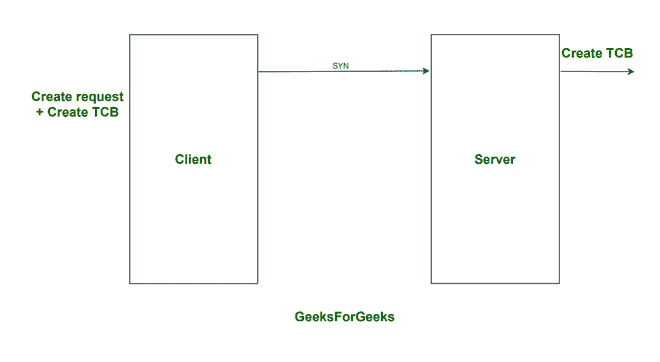
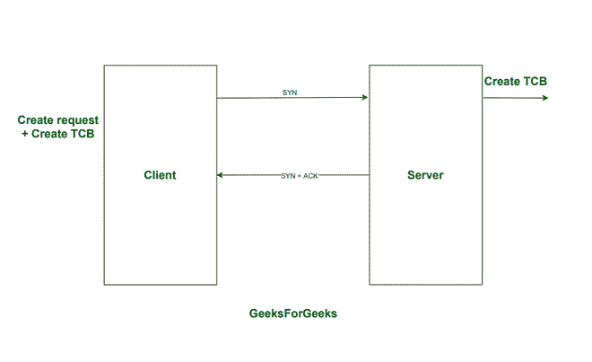
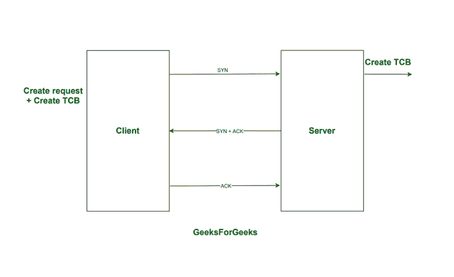
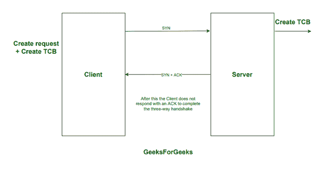
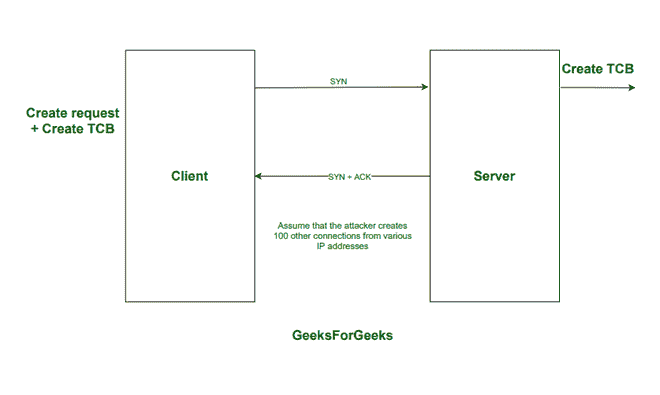
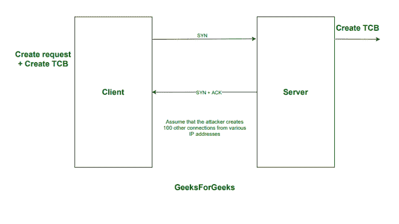

# 如何使用 SYN cookies 来防止 SYN Flood 攻击

> 原文:[https://www . geeksforgeeks . org/how-syn-cookies-被用来防止 syn-flood-attack/](https://www.geeksforgeeks.org/how-syn-cookies-are-used-to-preventing-syn-flood-attack/)

在谈论 SYN cookies 以及它们如何用于防止 SYN Flood 攻击之前，让我们先来看看 TCP 连接是如何建立的，直到 20 世纪 90 年代中期。

**如何建立 TCP 连接:**
当 [TCP](https://www.geeksforgeeks.org/tcp-3-way-handshake-process/) 实体打开一个 TCP 连接时，创建一个 TCP(传输控制块)，一个 TCP 包含整个连接状态。连接状态包含:

1.  本地序列号。
2.  远程客户端发送的序列号。

直到 20 世纪 90 年代中期，为了避免实体内存被 TCP 溢出，对“半开”TCP 连接(SYN RCVD 状态下的 TCP 连接)的数量有一个限制，最常见的是 100 个。因此，一台服务器只能有 100 个“半开放”的 TCP 连接。当达到限制时，传输控制协议实体将停止接受任何新的同步段。

一个 TCP 实现必须为每个建立的 TCP 连接维护一个传输控制块。TCB 必须包含发送和接收数据段所需的所有信息。它们如下:

1.  本地 IP 地址。
2.  远程 IP 地址。
3.  本地 TCP 端口号。
4.  远程 TCP 端口号。
5.  TCP 密克罗尼西亚联邦的当前状态。
6.  最大段大小(MSS)。

下图显示了 TCP 连接过程:

#### 步骤 **1: C** 客户端向服务器发送 SYN 连接请求

最初，客户端发送一个同步连接请求

#### 步骤 2:服务器向客户端发送 SYN 连接请求和确认

服务器发送 SYN 连接请求和确认

#### 步骤 3:客户端向服务器发送确认

客户端发送确认

**SYN Flood 攻击:**
[SYN Flood 攻击](https://www.geeksforgeeks.org/denial-of-service-ddos-attack/)是一种类型的[拒绝服务攻击](https://www.geeksforgeeks.org/denial-of-service-ddos-attack/)，在此期间，攻击者通过向服务器发送 SYN 请求来快速启动 TCP 连接，并且不响应来自服务器的 SYN+ACK。服务器必须花费资源(为连接请求创建传输控制块)等待半开的连接，因为“半开”的 TCP 连接的数量是有限制的。服务器将不再接受任何新的连接。这将使系统对合法流量没有反应。以下步骤显示了它是如何执行的。

1.  攻击者每秒会向服务器发送 100 个同步段。
2.  攻击者不会回复任何收到的同步+确认段。
3.  攻击者将使用与他们自己的 IP 地址不同的 IP 地址发送这些 SYN 段，以避免被捕获。
4.  一旦服务器进入 SYN RCVD 状态，它将保持该状态几秒钟，等待确认，不接受任何新的，可能是真正的连接，因此变得不可用。

以下是一些描述 SYN 洪水攻击的图表:

#### 步骤 1:客户端向服务器发送 SYN 连接请求

最初，客户端发送一个同步连接请求

#### 步骤 2:服务器向客户端发送 SYN 连接请求和确认

服务器发送 SYN 连接请求和确认

#### 第三步:客户端不响应确认来完成三次握手

客户端没有响应确认

#### 步骤 4:攻击者从不同的 IP 地址创建 100 个其他半开放连接

攻击者从不同的 IP 地址创建 100 个其他半开放连接

#### 第五步:服务器端的 TCP 缓冲区将满，服务器将无法接受任何新的连接

服务器端的 TCP 缓冲区将会满

**SYN 泛洪攻击可以通过三种不同的方式执行:**

1.  **直接攻击-**
    攻击者的 IP 地址未被欺骗的 SYN 洪流攻击称为直接攻击。在直接攻击中，攻击者使用具有真实 IP 地址的单个源设备，因此可以轻松跟踪攻击者，并阻止来自恶意系统 IP 地址的请求，以防止攻击。
2.  **欺骗攻击-**
    在每个 SYN 数据包上欺骗攻击者 IP 地址的 SYN 泛洪攻击称为欺骗攻击。即使每个数据包上的 IP 地址都是伪造的，在互联网服务提供商的帮助下，也可以追踪到它们的来源。
3.  **分布式攻击-**
    使用僵尸网络创建的 SYN 洪流攻击称为分布式攻击。追踪这些攻击来源的可能性极低。攻击者还可能欺骗每个分布式设备的 IP 地址，使其更难跟踪。

**SYN Flood 攻击预防:**
SYN Flood 攻击可以通过多种不同的方式进行预防。一些方法包括:

1.  **增加积压队列-**
    目标设备上每个操作系统的半开放连接数是有限制的。处理大量 SYN 数据包的一种方法是增加操作系统允许的半开放连接的最大数量。为了增加最大积压，系统必须保留额外的内存资源来处理所有新的请求。如果系统没有足够的内存来处理增加的积压队列大小，系统的性能将受到影响，但它会比拒绝服务更好。
2.  **回收最旧的半开放 TCP 连接-**
    在此策略中，一旦积压被填满，最旧的半开放连接将被覆盖。只有当连接可以在比积压的恶意 SYN 数据包更短的时间内完全建立时，该策略才有效。当攻击量增加或积压量太小时，它会失败。
3.  **SYN Cookies-**
    SYN Cookies 是一种 IP 欺骗攻击缓解技术，服务器通过精心制作的 SYN-ack 回复 TCP SYN 请求，而无需为 TCP 连接创建新的 TCP 连接。仅当客户端回复此精心编制的响应时，才会为相应的 TCP 连接创建一个 TCP 连接。这种技术用于保护服务器资源在 TCP SYN 泛洪下不会被填满。

**SYN Cookies 如何用于防止 SYN Flood 攻击:**
SYN Cookies 解决这个问题(SYN Flood 攻击)的方法是使用一个函数，该函数使用来自客户端 SYN 数据包的一些信息和来自服务器端的一些信息来计算一个随机的初始序列号。让我们假设这个数字为 y-1，y-1 在 SYN + ACK 消息中发送给客户端。如果接收到序列号为 y 的确认包，借助于一些包头字段和一些服务器端信息，反向功能可以验证确认号是否有效。如果有效，将创建一个 TCB 并建立连接。如果无效，连接将被拒绝。SYN cookies 的优点是服务器不必在接收到 SYN 段时创建和存储 TCB。