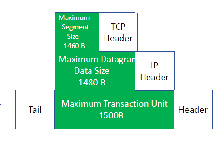

# 如何计算 TCP 中的最大段大小？

> 原文:[https://www . geeksforgeeks . org/如何计算最大 tcp 段大小/](https://www.geeksforgeeks.org/how-to-calculate-maximum-segment-size-in-tcp/)

[最大段大小](https://www.geeksforgeeks.org/overview-of-maximum-segment-size/)是指本地主机在单个数据包中接受的最大段的大小。它表示主机在单个 TCP 段中可以接受的最大数据量。

为了建立 TCP 连接，发送方和接收方都要指出它们可以接受的最大数据段大小。在通过 TCP 连接传输数据包时，发送方根据接收到的 MSS 减少数据包的大小。它对于内存量小的设备很有用，因为它允许设备设置接收数据包的大小限制。

网络驱动知道直连网络的[最大传输单元](https://www.geeksforgeeks.org/what-is-mtumaximum-transmission-unit/)。最大传输单元是可以跨数据链路层传输的最大帧大小。IP 向网络驱动程序询问最大传输单位的值，并将其用于以下关系来计算最大数据报数据大小:

```
MDDS = MTU - IP_HL

where,
MDDS = Maximum Datagram Size
MTU = Maximum Transmission Unit
IP_HL = IP Header Length
```

最大数据报数据大小是指 IP 数据包中可接受的最大数据量。

现在，TCP 向 IP 询问最大数据报数据大小的值，并按照以下关系使用它来计算最大数据段大小:

```
MSS = MDDS - TCP_HL

where,
MSS = Maximum Segment Size
MDDS = Maximum Datagram Data Size
TCP_HL = TCP Header Length
```

**示例:**假设最大传输单元的有效负载为 1500B，报头包含有关数据包数量的信息，尾部表示数据链路层中数据包流的结束，并且 TCP 和 IP 报头的大小各为 20B。因此，我们可以按照给定的步骤找到最大段大小:

1.  1500B 的有效载荷由网络层接收，网络层分为 1480B 最大数据报数据大小负载和 20B IP 报头。这意味着通过网络层传输的 IP 数据包可以存储多达 1480B 的信息，并有 20B 报头来存储数据包的信息，如 IP 版本、源地址、目的地址和生存时间。
2.  1480B 的有效载荷由传输层接收，传输层分为 1460B 最大段大小和 20B TCP 报头。这意味着通过传输层传输的 TCP 数据包可以存储多达 1460B 的信息，并有 20B 报头来存储源端口、目的端口、序列号、确认号、报头长度、校验和、窗口大小、紧急指针和保留位等信息。

因此，最大数据段大小将为 1460B，即在单个 TCP 数据包中可以接收 1460B 数据。



必须通过考虑以下性能问题来选择最大分段大小:

1.  **开销管理:**如果 MSS 太低，那么将导致带宽的低效使用，因为存储在数据段中的数据量将与效率不高的报头相比。
2.  **IP 分片:**如果 MSS 太大，那么它将导致大的 IP 数据报，这些数据报在传输之前需要分片。碎片会降低效率，增加部分 TCP 段丢失的机会，导致整个段需要重新传输。