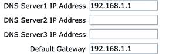
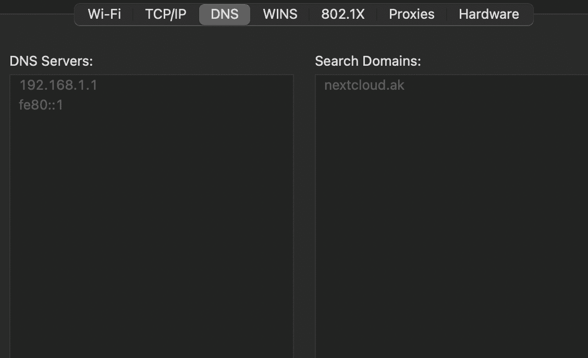
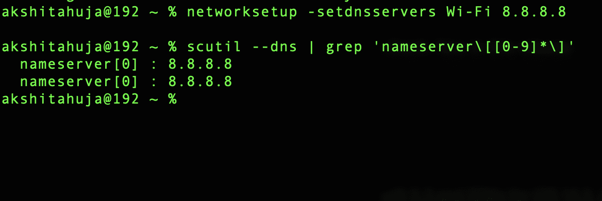
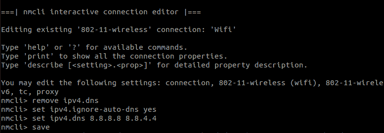
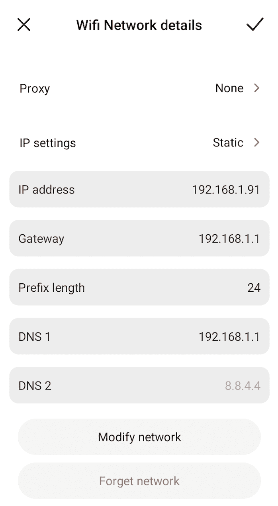

# 如何更改 Windows、Mac、Ubuntu、安卓的 DNS 服务器设置？

> 原文:[https://www . geesforgeks . org/如何更改-DNS-服务器-设置-windows-MAC-Ubuntu-and-Android/](https://www.geeksforgeeks.org/how-to-change-dns-server-settings-windows-mac-ubuntu-and-android/)

DNS 代表[域名系统](https://www.geeksforgeeks.org/domain-name-system-dns-in-application-layer/)。它是一种将域名转换成 Ip 地址的翻译服务。DNS 服务器是 DNS 的一种实现。每当您尝试访问任何网址时，浏览器都会向您的互联网服务提供商提供的域名系统服务器请求该网址的 IP 地址，而[域名系统服务器](https://www.geeksforgeeks.org/working-of-domain-name-system-dns-server/)会响应这一请求发送相应的 IP 地址。

**为什么要更改域名系统？**

有时候 ISP 提供的 DNS 服务器也没那么好。他们可能没有配置正确的缓存，这可能会导致连接变慢。如果您的网络上有些网站无法访问，那么更改您的域名系统可能会解决您的问题。一些域名服务提供商为您提供了阻止网络上某些网站的功能，因此将您的域名更改为这些服务提供商可以让您更好地控制网络。

**如何更改您的域名系统？**

有两种方法可以更改您的 DNS 服务器:

1.  更改整个网络的 DNS 服务器。
2.  更改特定设备的域名系统服务器。

**更改路由器的 DNS 服务器 IP 地址:**

可以通过更新路由器中的 DNS 服务器地址来更新完整网络的 DNS 服务器。以下是每台路由器的一般指南:

*   访问您路由器的登录页面，通常，登录页面的地址是 http://192.168.1.1，您可以在路由器的背面找到这个地址。
*   输入您的登录凭据并登录。
*   找到路由器的网络设置，转到局域网设置，然后搜索 DHCP 服务器设置，会有一个添加自定义 DNS 的选项。

**网络设置- >局域网设置- > DHCP 设置**



在本例中，默认的域名系统是 192.168.1.1，我们将其更改为开放域名系统地址，即 208.67.222.222。(请注意，这些是针对每台路由器的一般说明，因此针对您的路由器的说明可能略有不同)。

### **更改特定设备上的 DNS 服务器 IP 地址**

**在 Mac 上更改 DNS:**打开系统偏好设置搜索网络并点击 WiFi，转到高级设置，然后点击 DNS。在域名系统中，您可以选择输入您的自定义域名系统 IP 地址。

**系统偏好设置- >网络- > WiFi - >高级设置- > DNS**



您也可以使用终端更改 mac 上的 DNS。打开终端，键入以下命令，通过无线网络更改您的 mac 的域名系统。

```
$ networksetup -setdnsservers Wi-Fi <Ip Address Of your custom DNS Server>
```

执行此命令后，您的域名系统将被更改，您可以通过执行以下命令来验证您的域名系统是否被更改:

```
$ scutil --dns | grep 'nameserver\[[0-9]*\]'
```



**在 Ubuntu 上更改 DNS:**打开 WiFi 设置，点击与你的 WiFi 网络对应的设置，然后转到 IPV4，禁用自动 DNS，输入你的 DNS 服务器 IP 地址，点击应用。

**WiFi 设置- >你的 WiFi 网络设置- > ipv4**


您也可以通过键入以下命令在 Ubuntu 终端上更改域名系统–

```
$ nmcli connection show --active
```

这个命令会给你一个活动连接的列表。基本上，此命令用于获取网络的 ssid，此 SSID 将在下一个命令中使用:

```
$ nmcli connection edit <your wifi ssid>
nmcli > remove ipv4.dns
nmcli > set ipv4.ignore-auto-dns yes
nmcli > set ipv4.dns <your DNS Server Ip Address or Addresses>
nmcli > save
nmcli > quit 
```



执行这些命令后，您的域名系统将被更改，您可以通过执行以下命令来验证您的域名系统是否被更改:

```
$ nm-tool | grep DNS
```

请注意，您可能需要在 Ubuntu 上重新启动您的 WiFi 才能进行域名系统更改。

**在安卓上更改 DNS:**打开你的安卓手机上的 WiFi 设置，之后打开你连接的 WiFi 网络的设置，之后添加你的 DNS 服务器的 IP 地址。

**WiFi 设置- >您的 WiFi 网络详情**



**在 Windows 上更改 DNS**

*   从开始菜单打开控制面板。
*   单击网络和共享中心。
*   单击更改适配器设置。
*   右键单击活动网络适配器并选择属性。
*   选择互联网协议版本 4 (TCP/IPv4)，然后单击属性。
*   在“使用以下域名系统服务器地址”下的框中输入新的域名系统服务器。